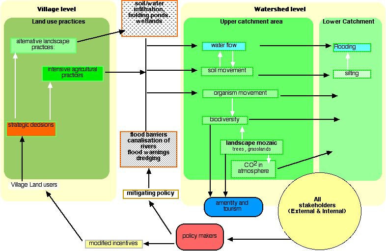

---
title: Agricultural Policies to Mitigate Flooding
author: John Plumridge
date: 2001-11-29
category: [cnrm] 
---

.. contents:: Table of Contents
   :depth: 1
.. sectnum::

*Advising the Welsh National Assembly*

Abstract
========
With the cost of flood damage and defense, loss of biodiversity and over-exploitation of soils, present intensive development of flood plains and drainage of wetlands is not sustainable. Moreover, livelihoods are threatened by over production in farming.

Agroforestry practices can be used to mitigate flooding, especially from upland run off. Integrating trees with agriculture is essentially agroforestry land use. Skilled integration of trees and woody shrubs enhance sustainability and productivity in agriculture.

Farm wetland management with agroforestry techniques can mitigate flooding and contribute to sustainable livelihoods. In this respect, conflicts exist with grants for woodland and for agriculture in existing policy levers. An integrated forest and agri-environmental policy is required.

Flooding, Current Perceptions and Objectives
============================================

From the submissions to the ICEP Presidential Commission (2001) to Review the Technical Approaches to Flood Risk Management, it is clear that the present intensive development of flood plains is not sustainable.

The creation of drainage systems which move water quickly off the land and away through deepened and straightened rivers has increased downstream flood risk and required the construction of further defences. The contribution of these wetlands to flood defence through the absorption and retention of flood water, has also been lost. Water that enters the ground will either travel very slowly into the rivers or remain in underground aquifers. Water that enters the drainage system will flow relatively quickly downstream.

Environment Agency Wales, is primarily concerned to provide for flood defences and warnings. Following recent severe flooding in excess of £10.0 million is to be spent.

   
   CAUSAL DIAGRAM: Policy leverage, local land use practices and landscape level alluvial flows

The cumulative effects of encroachments into flood plains and increased runoff from developments are massive. More water enters the rivers and the size of the flood plain increases. Properties that could once be considered outside the flood plain are brought into it. Reducing risks of flood in developed areas and its consequences fall into six main categories: Flood warning, Increased flood storage, Raised defences, Increased channel capacity, Diversion of flood flows. However, the construction of flood embankments can actually exacerbate flooding, with sudden releases through breaches, and, when river levels recede, flood waters can become trapped behind the banks.

Strategic Issues in Sustainable Land-Use
========================================
If a watercourse is left in its natural state, it tends towards a size which floods onto the flood plain in the order of once every one to two years.
There is a need for a change in attitude with greater emphasis on sustainable, preventative flood alleviation methods rather than the reactive post-flood alleviation measures generally practised today (CIWEM).

Pressure on urban flood defences can be eased by retaining rainfall in the upper catchment and so moderating the movement of water, by spreading peak flows over a longer period. Avoiding development in flood-risk areas allows flood plains to store water and control its movement. This can be done by the restoration of canalised streams, the re-creation of meadows, fens, pasture and wet woodland. Restricted drainage and arable cultivation in sensitive areas allows rivers to follow their natural course.

Trees on agricultural land provide long term environmental benefits to soil, biodiversity and, climate. Trees also allow for diversification of farming practices and product flows. Trees in a wet woodland landscape attenuate flows, and enhance the infiltration of water into soil through root penetration and control runoff with leaf litter.

The Environment Agency recognises the utility of catchment level flood strategies. Washlands may be created into which water can be diverted at times of peak river flow. In order to maximise the environmental benefits, land needs to be managed as wet grassland between flooding events, rather than arable land with compensation for loss of crops due to flooding. Restored wetlands receiving crop field drainage water are shown to lower concentrations of both nitrogen and phosphorus. Wetlands can remove up to 68% of nitrate-nitrogen and 43% of phosphorus from drainage water.

The creation of holding ponds on agricultural land would store water and improve water quality. They may provide ecological benefits through reduced sediment runoff, soil carbon loss, and loading of nutrients to surface waters. Runoff may be stored by the temporary plugging of ditches, drainage systems, and similar practices until the flood threat has passed. In return, farmers would be paid an amount covering the loss of potential net revenue and the opportunity cost.

To integrate trees at field and landscape levels, changes in land-use are needed. Policy levers are required to bring this about, even where farmers are already willing to make such strategic decisions.

English Nature commissioned a study into the use of washlands as flood defence (English Nature, 2001). The report concludes that a figure of £300 per hectare per annum provides a reasonable minimum that reflects the additional value of washlands to their flood defence function. They provide the same reduction in flood damage to the built environment as hard engineering options, but also provide additional benefits in terms of biodiversity, recreation, and water quality.

Integrating Agriculture With Policy to Mitigate Flooding
========================================================
Integrating trees with agriculture is essentially agroforestry land use, in place of intensive sheep farming. Agroforestry practices are skilled and integrate trees and woody shrubs to enhance sustainability and productiivity in agriculture.

From Woodlands for Wales - Report of Consultation 2001, objectives endorsed by various agencies seek integrated agriculture and environmental schemes. Tir Coed and the Forestry Contracting Association seek close linkages between woodlands and other land uses, particularly agriculture. The National Trust state "We are keen to see a shift in the CAP towards greater support for agri-environmental and rural development programmes.

The Royal Forestry Society point out that, "If forest expansion is to take place in rural areas this will be on agricultural land - hence the need to establish clear links with agricultural policy, and the CAP" This raises the issue of policy levers and funding.

Tir Gofal total budget was £13 million. for the 2001/2001. CCW administrates WGS funds under this scheme. (See appendices 2 a) - 2 c)). Compared to this, even the larger figure of £38 million on WGS, "Is small fry considering the objectives", according to Coed Cymru. Moreover, 

Available grant aid for forestry, particularly in the less favoured areas of Wales, 'has done little to encourage uptake by farmers of forestry production '(FUW). The reason for this lies in what is seen as competing policy levers, for agriculture and on the other hand, for woodland. The Farmers' Union of Wales (FUW)... "could not support a (woodland) strategy, which would effectively reduce agricultural support"

Farm incomes continue to fall. Conversion involves loss of income in the short to medium term.

Under the Woodland Grant Scheme (WGS), Agroforestry schemes applicants are not eligible for the farm woodland premium (FWPS) scheme to offset losses from reducing headage. Farmers fear loss of farm income under Common Agricultural Policy (CAP) Hill Livestock Compensatory Allowance payments; especially so concerning Less Favoured Areas (LFA). Stock densities are liable to be pushed towards a ceiling with fenced-off woodland plantings in small farms. Farmers are permitted a lower planting density of 1100 trees ha-1. This density is probably unrealistic.  

Conclusions
===========
It is clear that policy levers in the integration of agricultural policy and woodland has further to go, and can benefit the mitigation of upper alluvial flows, as wellas contribute to sustainable livlihoods. 

Significant opportunities exist for improved integrated soil/water/land management. 

Perceived divisions between forestry and agriculture present barriers to progress to integrated Land management. 

Insufficient funds/mechanisms are available to encourage farmers to manage their woodlands particularly on marginal agricultural land.

References, Flooding
====================
*Balanced decision making* (MAff FCDPAG1 Flood and Coastal Defence Project Appraisal Guidance Consultation Draft Version 1.0a 6 (Oct 2000).

Institution of Civil Engineers *Presidential Commission to review the technical approaches to flood risk management in England and Wales* (2001).

*Managing floodplains to reduce flood risk and enhance biodiversity* English Nature (2001).

CIWEM *Comments to ICE Presidential Commission on Flood Risk Management.* (April 200).

Woodlands for Wales *Report of Consultation* Crown Copyright 2001

Institution of Civil Engineers *Presidential Commission to review the technical approaches to flood risk management in England and Wales* Submission by English Nature

Sinclair F.L. (2001) *Professional Update on Agroforestry Deptartment for International Development* Natural Resources Advisors Conference

Manale A. *Flood and Water Quality Management through Targeted, Temporary Restoration of Landscape Functions: Paying Upland Farmers to Control Runoff* Journal of Soil and Water Conservation, 2000 Vol.55, No.3

C.J. Woltemade *Ability of Restored Wetlands to Reduce Nitrogen and Phosphorus Concentrations* in Agricultural Drainage Water Journal of Soil and Water Conservation, Vol.55, No.3

