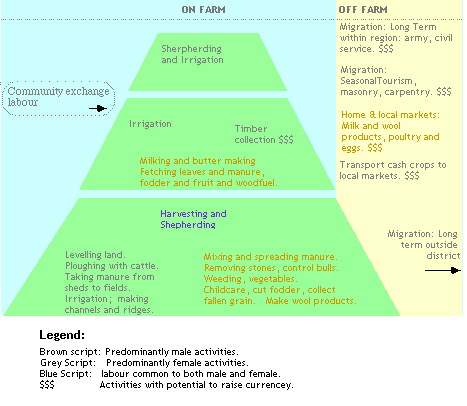

---
title: Representing Agroforest Systems Baltistan
author: John Plumridge
category: [cnrm]
date: 2001-11-02
---

.. contents:: Table of Contents
   :depth: 1
.. sectnum::

Baltistan is characterised by diversity in land use, self-sufficiency and sustainable agricultural practices in an environment constrained by short growing seasons, fragile mountain environment and small land holdings.

Movement of dung, produced by seasonal grazing of herds at higher altitudes, maintains fertility and structure of the lower cropland soils. Exhaustion or destabilisation of soils would take at least two hundred years to recover. As a largely subsistent farming economy, imports of external fertilisers would compromise overall sustainability.

.. Figure::  ../images/baltistanAltzones.jpg

   Diagram: Land Use, Altitude Zones

Representing the Livelihood System
==================================

Land Use at Community level
---------------------------
Rainfall is low, and crop irrigation depends upon constructed channels fed from ice melt-water of higher altitudes. This system depends upon communal effort in construction and maintenance of channels. A limited amount of pasture is shared to some extent amongst households. Communal rights of access exist.

Co-operation by both sexes between households contributes to a community labour pool, and enables more extensive community-wide work to be conducted, such as irrigation. Irrigation systems contribute to overall stability of the present soils and landscape, as well as to crop irrigation. Men and women have specialised, as well as overlapping tasks.

Land Use at Household level
---------------------------
Individuals within one household contribute to a  mixed farming system, with dispersed household crop fields situated close to village settlements. This presumably allows for their care. Irrigation and extends the growing season.
Sharecropping does exist, on behalf of elderly or absent. Owned land is passed on in a patriarchal lineage, possibly divided amongst brothers.

*Land use categories at household level:*

* Higher altitude common pasture, unowned
* Alpine grass after snow melts, for a short grazing season
* Agroforestry at intermediate altitudes:
    * Silvopasture, possibly owned
    * Silvopasture, unowned
    * Agroforestry, owned
* Crop Fields, owned
* Home Gardens, owned
* Settlements, owned

Analysis of Agroforest
======================

Silvo-arable Agroforest
-----------------------
* Trees on crop land; crop fields are surrounded by zoned trees, planted on boundaries, as windbreaks, timber belts and  for produce.
* Species are mainly temperate fruit trees and produce apricots, almonds, peaches and nuts. Fruits are dried.
* Grain crops such as wheat, barley, rice, millet and buckwheat are grown mainly for fodder.
* The trees act as  windbreaks and recycle soil nutrients. Leaves are composted.
* Traditional rice growing has been to some extent replaced by vegetable cash crops such as potatoes (cheaper rice bought in, since the advent of a modern link road).
* Maize is grown mainly for silage.
* Double cropping zones  exist, mainly as millet after wheat or potatoes.
* Dung is carried from stables and possibly pastureland above for spreading on the crop fields.

Trees on Cropland - Home Gardens
--------------------------------
* Vegetables such as tomatoes, spinach and spices are  grown in home gardens
* Home gardens are surrounded by trees of adjoining crop fields, and with dispersed trees  within.

Trees and Cattle
----------------
* Cattle forage on field edges as fodder banks,  in alleyways, and  on fodder cut from hedges.
* Caretakers, particularly women and children control the foraging cattle.
* All cattle return to the village for winter.
* A bull is retained all year for plough power.
* Sharecropped land shares these practices.

Analysis of Pasture, Silvopasture
=================================
High pasture is communal, arable land is owned: Owned land as crop land allows for crop growing decisions at the household level. These and home or vegetable gardens are situated relatively close to the households quarters, allowing their tending and, winter stabling, at a low altitude.

Land use is determined by altitude. Presumably, soil fertility and altitude are factors in a scattered spatial arrangement of land for crop use. Altitude is a factor of winter and summer pasture. Therefore spatial and temporal (i.e. seasonal) practices are according to altitude, as are land use categories, in the following diagram.

Pasture
-------
Grazing of cattle by shepherds in summer on unimproved grassland.

Silvopasture - trees and pasture
--------------------------------
Alfalfa grown on tree land. Trees dispersed, irregular, diverse. Trees for timber, fuel, and forage are intercropped with alfalfa for fodder, and with tare. Species include Russian Olive(*Eleagnus augustifolia*), willow and poplar. Indigenous Juniperus and Betula species are used for fuel wood. Some grazing occurs by cattle, sheep and goats.

Silvopasture - shrubs and animals
---------------------------------
Land predominantly characterised by *artemesia* on less fertile soil, lacking irrigation. Privately owned cattle, sheep and goats are grazed on common grazing land moving with the seasons. Milking and butter making are activities carried out here. Sheep and goats remain on the village border ranges in winter. Dung is removed to lower crop fields by women.

Household Activities On and Off-farm
====================================
Activities may be characterised by human role, and relate to land use practices.
   

   Diagram: Oda Causal Links

Sources of labour
-----------------
Community exchange is Integrated with common resources, but extends to privately owned land and harvesting. Conclusion: a co-operative and communal system of households, responsive to the environment.

Gender roles
------------
Migration is usually of young males. There is a pressure on available land. Fallow crop rotations are reduced.
Purdah prevents women migrating.

Division of labour according to gender in crop cultivation and in marketing less mobility to further markets of women, lower cash dealings. Young boys and girls may work with women.

Considerable overlap does exist between gender roles, when co-operation is needed. Separated activities include heavier work by men such as ploughing and channel digging, parenting roles, craft work.

