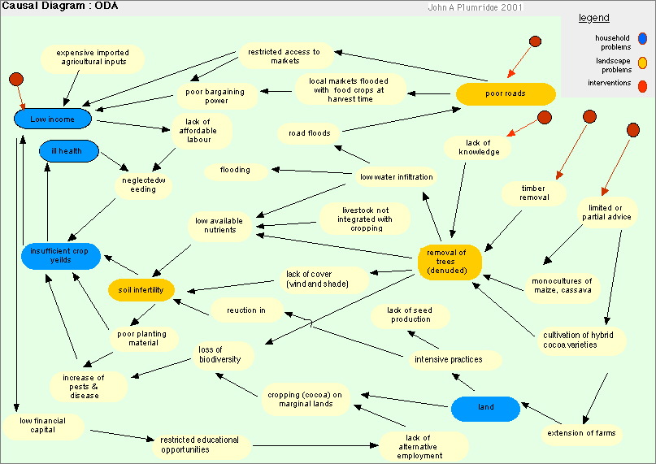

---
title: Enhancing ecosystem and productivity in Oda
category: cnrm
author: John Plumridge
date: 2002-02-02
---

:Subtitle: Key Issues from a Socio-economic perspective
:Designation: MSc.

.. contents:: Table of Contents
   :depth: 1
.. sectnum::

Enhancing the sustainability of natural assets to alleviate land-use problems, and thereby reverse decreasing financial and social capital.

Introduction
============
Householders report serious problems concerning land use and livelihoods in Oda. Causal analysis indicates poor cycling of nutrients and water with the consequences of soil infertility and flooding. A depletion of natural assets, particularly through removal of trees, threatens the Sustainability of many livelihoods there. This has led to insufficient food production, ill health, and worsening roads with attendant market problems in a cycle of deepening poverty. 

A depletion of financial and human capital has led to labour shortages, and weeding of food crops is neglected by men and women.
Crop pests are a problem, I assume more so with decreased biodiversity and predators, and a reported weakening of planting material. Hybrid varieties of cocoa are being cultivated without trees, and farms extended for the purpose. I assume this increases land shortages. 

Without financial resources, the young lack the education necessary for alternative employment. Instead, they turn to the planting of unsuitable marginal lands for planting cocoa as a cash crop. In a shifting agricultural culture, fallow is increasingly reduced with availability of food crop land.

The trend is for decreasing natural assets, including food production. Manufactured off-farm nutrients are expensive, really beyond reach, and not economically viable, even for the extended cocoa farms. 
Social cohesion is threatened between young and old, men and women, as it appears groups have conflicting separate agendas in coping.
Causal analysis of the problems shows that solutions lie in agroforestry interventions to enhance the sustainability of natural assets and alleviate land-use problems, and thereby reverse decreasing financial and social capital.

Causal Analysis
===============
Refer to the following causal diagram of Oda for analysis of the problems unsustainable livelihoods. he causal links demonstrate specific problems at household and landscape levels and the effective problems that emerge. From such an analysis, useful interventions are suggested.
 

Diagram: Oda Causal Links

Expected Benefits of Agroforestry Interventions
===============================================

Integrated biological control of pollination and pests through bio- and genetic diversity.
Increased marketing opportunities through control of flooding on road, 
Financial capital and health through enhanced food production and diversification of products.
More equitable availability of land for poorer and young through adoption of intensive, rather than extensive cocoa production methods.
Employment and educational opportunities through financial capital.

Adoption Methods for Agroforestry
=================================

- Advice upon the range of technologies to combat partial advice.
- Theses are dependent upon social context for transformation of natural assets. Methods are to include the whole range of stakeholders in community activities and organisation (i.e., collective action). Community and household level livelihoods and land use needs to be examined in a participatory meetings of local community, along with causal diagrams of stated problems. Education towards locally sustainable natural resource management is needed to combat lack of knowledge. Combine institutional agroforestry research knowledge with farmer field schools, farmer -to farmer dissemination and partnership with development NGOs.
- Consider enhancing social, human, physical and financial assets simultaneously (e.g. through community credit exchange system), without relying on external funding. Establish a tree nurseries. Encourage seed production. 
- Design policy implementation instruments at community and national levels.
- District/National law concerning prohibition of tree removal should be made known and enforced. 
- Encourage good management practices after establishment.

Follow up
=========
Follow up with impact assessments of the adoption of interventions, within natural capital and systems hierarchy framework. 

Adopt a learning approach towards knowledge, with support. 
Government extension agents need to be brought on board in partnership, fares paid for their. Increased local tax revenue or income might justify this.

    

