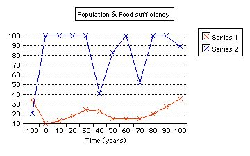
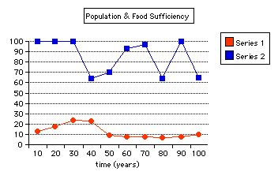
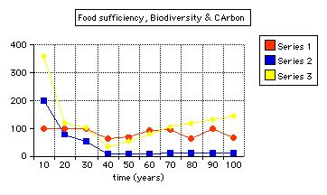
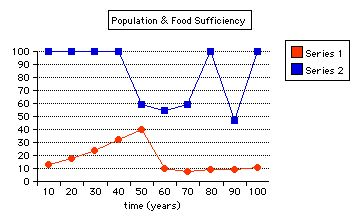
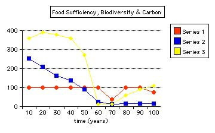
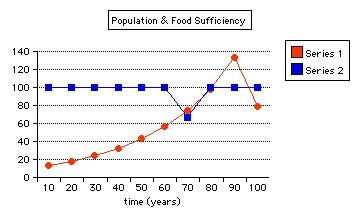

---
title: Modelling Interactions in Shifting Mosaics
category: cnrm
author: John Plumridge
date: 2001-11-02
---

:Designation: MSc. 531

.. contents:: Table of Contents
   :depth: 1
.. sectnum::

.. |Km2| replace:: K\ :sup:`2`
.. |Kfert| replace:: K\ :sub:`fert`

Investigation of the extent to which AF Interventions may allow for a higher population density whilst maintaining a food sufficiency of 100%.

Objective
=========
Using Van Noordwijk's *Crop Down Fallow Up* (CDFU) model, to investigate the extent to which interventions may allow for a higher population density whilst maintaining a food sufficiency of 100%.

Rationale
=========
Increased pressure on land is reflected in an intensification of crop fallow rotations, with shorter fallow cycles. In these circumstances, production will fall short of requirements, with increasing soil degradation (e.g. Ruthenberg, 1976). Decline in soil fertility, sometimes expressed as low crop yields, is one of the most frequent problems observed over a wide range of environments (Young, A. 1990).

This investigation was conducted with regard to cultivation systems, where a long tree fallow phase alternating with a few years of cropping can sustain crop production at acceptable levels and with favourable returns to labour.

The Crop Down Fallow Up Assumptions
===================================

Sustainable Use of Natural Resources
------------------------------------
Use of natural resources can be sustained if it balances the rate of replenishment. Use of most resources including fisheries, forestry, rubber tapping and soil fertility replenishment by natural vegetation in crop-fallow rotations, share the two dynamics of:

* A diminishing return ('asymptotic) to maximum resource availability when not harvested.
* Resource availability decreases due to harvesting, leading to decreasing returns for harvesting effort.

Up to medium level land use intensities, a negative trade-off exists between farmer's interest in crop productivity per unit area, and landscape ecological functions, which are related to the age of fallow.

Land use at intensities beyond a critical point, cause land degradation from both farmers and environmental perspectives.

## Trebanth's (1984, 1989) Model of Crop-Fallow Rotations and Soil Fertility ##
This algebraic model is based at field level. The consequences modelled are:

* A possible initial increase in crop yield per area under rotation, while reducing yield per cropped area.
* The impacts on returns to labour depend upon the ratio of labour costs for clearing fallow land and those for tending crops.

The model predicts the highest returns to land are obtained where soil fertility under fallow is allowed to return to around 55% of the maximum for a given soil.

## Van Noordwijk's Crop Down Fallow Up (CDFU) ##
Van Noordwijk (1999) believes the Trebanth model is not sufficient for judging transition periods in crop-fallow rotations when part of the landscape still has a relatively high fertility as a remnant of past fallow lengths. At the landscape level intensification would,

1.	Initially increase yields while decreasing terrestrial carbon stocks in soil and aboveground vegetation. Beyond the critical intensity, both would decrease.
2.	Diversity of vegetation may initially increase with fallow of various ages, and the simultaneous persistence of mature forest. At the field scale level average species richness may decrease. Further intensification is likely to reduce all aspects of biodiversity.

Thus non-linear relationships are expected between local productivity and both global (Carbon stock) interests, and biodiversity.

Global environmental interests, as ecological functions at the landscape level (i.e. productivity, biodiversity and carbon stocks) depend upon:

* Spatial variability and spatial patterns within the landscape
* Lateral flows and neighbourhood effects
* Impacts of 'actors' and agents'.

Structure of CDFU Model
=======================

Four main modules reflect the fate at plot-level :

1. Soil fertility
-----------------
Restoration is described by two parameters:

- Maximum level (at F-infinity) = F_inf_Avg
- Half-recovery time (y) during fallow = K_fert

Decline in fertility :

- Calculated as a simple proportion of F_infAvg and K_fert.

Variability between plots:

- Finf_Range Initial Variation= Init RFL-InitRFH (i.e. high and low).
- No of years cropping before fallow =TimeCrop

Soil fertility decreases during 1 year of cropping

- This fraction = FertDepletion

Conversion from soil fertility units to crop yields (mg ha-1 per unit), crop type 1, 2 or 3:

- Default values are 0.5, 0.8, 1.2, and 2.

Impacts of variable weather:

- Depends upon the power of crop sensitivity Default values are given for each crop type.

2. Crop Intensity (Fraction of Land Cropped in a Single Year)
-------------------------------------------------------------
Decisions are simulated on food in store, expected gain per field, relative to annual food requirement.

- Based on rice store only RegulMeth=1
- Based on rice store and consumption and yield estimates Regulmeth=2

3. The Rice Store and Consumption
---------------------------------
Rice is produced on the basis of soil fertility restoration during fallow, and consumed on the variable basis of:

- Population density PopDensInit (persons per KM square)
- Pro-capita food demand ProCapFoodReq (default = 0.5 Mg per annum).

All yields are added, including AF outputs.

Decisions on 'intensification' are based on the store relative to annual consumption, with thresholds defined by the model user:

* High RiceStTargH
* Low RicestTargL

Parameters here include Labour (person days) for growing (LabCrop) and clearing (LabClear).

4. Best_Field_Selector
----------------------
This represents spatial decisions of which fields to be used are based upon rules (determined by the user):

* Derived from current cropping intensity Field Rule=1
* Derived from Partial knowledge of the actual fertility of each field, simulating farmer's knowledge, and distance from the village. Field Rule=2.

Af Intervention
===============

*Three modules exist on consequences of farmers' land use at plot level:*

1. Biodiversity

  - changes through pioneer and early and late secondary vegetation into primary forest. This depends upon the influence (determined by the user) of the variables:

    - Degree of species overlap
    - The time frames for these transitions

2. Trade-Off Between Carbon Stock and Crop Productivity

  - This can shift by a factor of two. This depends upon the influence of one variable, Between-plot variation.

3. Food Security Sector

- Gives the degree to which annual food demand could be met during a simulation run.

Testing Interventions
=====================

Five runs of the model of 100 years in ten year increments were attempted.
*NOTE.* Numbers of the paragraphs in this section covering five runs correspond to the numbers given in 'Intervention No.' Column in results tables.

First Run
---------
A preliminary run for 100 years at default values, with a static populations of 34 per Km :sup:`2`, to test whether or not a higher population than 17 per Km :sup:`2` (the default value) with the same soil and crop conditions. At a higher population density of 34 Km :sup:`2` and not 17 Km :sup:`2`, growing crop type two, led to a crash scenario in which food sufficiency dropped to 21% (less than 100%). Such circumstances allow the influence of soil and crop parameters to be studied, through attempting interventions and running the programme.

Second Run
----------
Starting from a population density of 10 per Km :sup:`2`, a population growth rate was chosen to allow for growth and migration ( =0.3). The model was run for 10 year cycles. Crop type 2 was retained initially. The conditions should be sustainable over a time of ten years, but not with a sustained population increase. Conversion from soil fertility units to crop yields (mg ha-1) depends on selected crop type 1, 2 or 3, with conversion values of 0.5, 0.8, 1.2 and 2 respectively. Higher yields of type 2 supported a population growth to 24 per Km :sup:`2`, after which it could not support a further rise. Carbon stock was low.

A higher yielding Crop type =3 was selected to see if the constraint on yield was not due simply to returns to labour. Food sufficiency rises to 100% for a limited period, the population stabilises with the constraints of an initially low carbon stock, from which recovery was slow.

The same rational was employed in selecting crop 4. Food sufficiency rose to 100% again, and supported a higher population of 26.8 per Km :sup:`2`, before failing to support either a further population increase, or raised carbon stock.

**Table: Values For Inteventions at Second Run.**

===== ================ ========================= ========== ====== ====== ======== ======= =====
Graph Intervention No. Intervention Description  At Year    G.Rate P.Dens F.Suff.  C.Stock Bio 3
===== ================ ========================= ========== ====== ====== ======== ======= =====
2     2                Field Rule = 2             0         0.3    10     100
"     "                crop two                  10         0.3    13     100      "        "
"     "                crop two                  20         0.3    18     100      95       273
"     "                crop two                  30         0.3    24      41
"     "                crop two                  40         0.3    23      83      10         7
"     3                crop 3                    50         0.3    15     100      12        19
"     "                                          60         0.3    15      52      16        85
"     "                                          70         0.3    15     100      24       119
"     4                crop 4                    80         0.3    20     100      47       143
"     "                                          90         0.3    27      89      42       180
===== ================ ========================= ========== ====== ====== ======== ======= =====

**Graph 2: Values of Population and Food Sufficiency For Second Run.**

..

   Legend:

   Series 1: Population in persons per Km :sup:`2`.
   Series 2: Food Sufficiency (%)

Third Run
=========

5. A low yield crop type=1 was chosen at a low population density, assuming it could support only a modest rise in population, and to permit a possible increase in C.Stock. Carbon stock increased more than threefold as the population tumbled, and food sufficiency returned to 100% by the tenth year. But thereafter carbon stock fell as the population rose. Food sufficiency remained at 100%

6. 'Best field selector' is derived from knowledge of the actual fertility of each field; i.e. Field Rule = 2. This was chosen, because it selects fields for cropping based upon total cropping intensity required, according to highest current soil fertility. Carbon stock continued to decrease, and sufficiency remained at 100% with lowest yield crop 1, allowing for a 24 per Km :sup:`2` population density.

7. Field Rule = 1 (the default value): *Intensity decisions* of how many fields to be cropped, based on cycle length. This was selected to see whether food sufficiency would drop, or carbon recover. Food sufficiency and population dropped significantly within ten years.

8. A switch back to Field Rule 2 in order to observe the effects upon food sufficiency and carbon stock. Food sufficiency rises slowly over 40 years to 100% with just 8 per Km :sup:`2` population, but then food sufficiency falls.

9. A higher crop value of 2 was chosen in order to test yields under field rule 2 against a rising population. Population rises and food sufficiency returns to 100% within ten years. Population reaches 58 per Km :sup:`2` in 60 years. Carbon stock rises too, but has began to fall by the 50th year, and dramatically by the 60th year.

**Table: Values For Inteventions at Third Run.**

===== ================ ========================= ========== ====== ====== ======== ======= =====
Graph Intervention No. Intervention Description  At Year    G.Rate P.Dens F.Suff.  C.Stock Bio 3
===== ================ ========================= ========== ====== ====== ======== ======= =====
3a,3b 5                crop 1                     10        0.3    13     100      199     358
"     "                                           20        0.3    18     100       79     118
"     6                Field Rule = 2             30        0.3    24     100       53     102
"     7                Field Rule = 1             40        0.3    23      64       10      35
"     8                Filed Rule = 2             50        0.3     9      70        9      52
"     "                                           60        0.3     8      93       10      82
"     "                                           70        0.3     8      97       11     105
"     "                                           80        0.3     7      64       11     119
"     "                                           90        0.3     8     100       11     130
"     9                Crop 2                    100        0.3    10      65       11     144
===== ================ ========================= ========== ====== ====== ======== ======= =====

**Graph 3a: Population and Food Sufficiency For Second Run.**

Legend:
Series 1:Population in persons per Km :sup:`2`.
Series 2:Food Sufficiency(%)

**Graph 3b. Biodiversity, Carbon and Food Sufficiency For Third Run.**

Legend:
Series 1: Population in persons per |Km2|.
Series 2: Carbon Stock. Series 3: Biodiversity.

Fourth Run
==========

10. Crop intensity (fraction of land cropped in a single year), was reduced (i.e. RegMeth =1). Decisions in the model are simulated relative to annual food requirement. Parameters here include Labour (person days) for growing and clearing. The default value, based on rice store, consumption and yield estimates (RegMeth = 2), permits a more intensive practice would therefore increase yields and reduce labour. Based on rice store only (RegMeth = 1), a higher population might not be supported. The population growth slowed over ten years. Carbon continues to fall.

11. |Kfert| = 2 years was selected. Within the model structure, a higher population density could possibly be sustained with sufficient food, depending on type of fallow vegetation or soil restoration capacity (Kfert), and inherent soil qualities (Kinf). An improved fallow of two years cover crop restores food sufficiency to 100% and the population remains stable, but with population growth at less than 2%, and carbon growth of 25%.

12. 'Improved' fallow vegetation plus Crop Cover = 4; yet higher yields might be possible with this combination, to support an even higher population, but for how long? A more intensive crop maintains food sufficiency of 100% for ten years, at a slightly raised population density, after which it falls dramatically by 83%. Initial slight Carbon stock rises remain the same until the population falls, after which carbon stock rises by 729%.

**Table: Values For Interventions at Fourth Run.**

===== ================ ========================= ========== ====== ====== ======== ======= =====
Graph Intervention No. Intervention Description  At Year    G.Rate P.Dens F.Suff.  C.Stock Bio 3
===== ================ ========================= ========== ====== ====== ======== ======= =====
4a,4b                                             10        0.3    13      100      253     360
  "                                               20        0.3    18      100      210     390
  "                                               30        0.3    24      100      164     377
  "                                               40        0.3    31      100      137     360
  "                                               50        0.3    43      100       90     271
  "   10               Reg Meth=1                 60        0.3    58      100       26      12
  "   11               Fallow Cover crop=2        70        0.3    61       37       12      11
  "   12               Crop 4                     80        0.3    62      100       15      59
  "   "                                           90        0.3    65      100       17      90
  "   "                                          100        0.3    74       75       17     110
===== ================ ========================= ========== ====== ====== ======== ======= =====

   Graph 4a. Population and Food Sufficiency For Fourth Run

   Legend:

   +----------+---------------------------------------+
   | Series   | Chart                                 |
   +==========+=======================================+
   | Series 1 | Population in persons per Km :sup:`2` |
   +----------+---------------------------------------+
   | Series 2 | Food Sufficiency(%)                   |
   +----------+---------------------------------------+

   Graph 4b. Biodiversity, Carbon and Food Sufficiency For Second Run

   Legend:

   +----------+---------------------------------------+
   | Series   | Chart                                 |
   +==========+=======================================+
   | Series 1 | Population in persons per Km :sup:`2` |
   +----------+---------------------------------------+
   | Series 2 | Carbon Stock                          |
   +----------+---------------------------------------+
   | Series 3 | Biodiversity                          |
   +----------+---------------------------------------+

                                  
Fifth Run
=========

13. No of years cropping before fallow (Time crop = 2). The restoration period may be reduced, whilst increasing yields. Food sufficiency returns again to 100%. Carbon stock continues to rise, as does the population density.

14. An improved fallow=1 (using fertiliser), gives high returns for labour, and should give further room for prior intensification decisions, including time crop = 2.

15. A yet higher population than with Crop 4 than before (see intervention No. 9) might be supported. The population rises to a high of 133 per Km :sup:`2`. Carbon stock falls considerably over 70 years, though not smoothly.

**Table: Values For Inteventions at Fifth Run.**

===== ================ ========================= ========== ====== ====== ======== ======= =====
Graph Intervention No. Intervention Description  At Year    G.Rate P.Dens F.Suff.  C.Stock Bio 3
===== ================ ========================= ========== ====== ====== ======== ======= =====
5a,5b 13               Time Crop = 2             10         0.3     13    100      124     210
"     "                "                         20         0.3     18    100      224     388
"     14               Fallow, fertilizer = 1    30         0.3     24    100      148     375
"     "                Fallow, fertilizer = 1    40         0.3     32    100      117
"     "                "                         50         0.3     43    100       82     239
"     "                "                         60         0.3     57    100      107     248
"     "                "                         70         0.3     74     67       91      97
"     "                "                         80         0.3     98    100       36      21
"     "                "                         90         0.3    133    100      131      11
"     "                "                         100        0.3     79    100       17      44
===== ================ ========================= ========== ====== ====== ======== ======= =====

   Graph 5a. Population and Food Sufficiency For Fifth Run
   
   Legend:

   +----------+---------------------------------------+
   | Series   | Chart                                 |
   +==========+=======================================+
   | Series 1 | Population in persons per Km :sup:`2` |
   +----------+---------------------------------------+
   | Series 2 | Food Sufficiency(%)                   |
   +----------+---------------------------------------+

.. figure::  ../images/cdfuafmodel7.jpg

   Graph 5b. Biodiversity, Carbon and Food Sufficiency For Third Run

   Legend:

   +----------+---------------------------------------+
   | Series   | Chart                                 |
   +==========+=======================================+
   | Series 1 | Population in persons per Km :sup:`2` |
   +----------+---------------------------------------+
   | Series 2 | Carbon Stock                          |
   +----------+---------------------------------------+
   | Series 3 | Biodiversity                          |
   +----------+---------------------------------------+

Conclusions CDFU Model
======================

Low yield crops can support only lower population densities and not a growing population. Thus, carbon stock does not build up.
Shifting cultivation tends to be degrading where fallow is shortened by pressure of population on land.

Field rule 2, allowing for choice of fields according to fertility, with low yield crop 1, demonstrated the complexity. When soil fertility remained low, a low yield crop supports as many as a higher yield crop. Field rule=2 contributed to the regeneration of the soil when fertility was low, allowing for considerably more intense practise and higher productivity, when higher yielding crop=2 was used, though for a limited time of sixty years, by which time the carbon stocks had fallen dramatically.

According to Trebanth's algebraic model of fallow, higher yielding crops will reduce the need for reducing fallow lengths and so contribute to the maintenance of higher soil fertility levels. If the soil can recover to levels of around 55% (rather than more), a higher return to labour from more intensive practices can be supported. Van Noordwijk (1999) argues that when part of the landscape still has a relatively high fertility as a remnant of past fallow lengths, at the landscape level intensification would initially increase yields while decreasing terrestrial carbon stocks in soil and above ground vegetation. Beyond the critical intensity, both would decrease. That is what appears to have happened in this simulation.

By reducing the threshold of intensity practices at this point (i.e. decisions made according to rice store and not consumption and yield), carbon stock and food sufficiency fell. Following this, improved fallow vegetation led to significant improvement in food sufficiency at a high population, though here with only slight increase in carbon stock, probably because the Carbon Stock = 15 is about the critical limit for the model.

Still higher yielding crops, in combination with the improved fallow, maintained food sufficiency and permitted a slight rise in C stock for only ten years in these circumstances, when the population could no longer be sustained. Increasing the number of years of cropping at this point, allowed for an increase in C stock and population, with restored food efficiency. I assume this is so, because improved fallow leads to a more rapid restoration of the soil fertility. The application of fertiliser quickly allowed for intense practise to continue and support the largest growth in population so far, for over 80 years in all, before falling again along with carbon stock, somewhat erratically.

Soil degradation not only lowers the crop yields on the basis of intrinsic soil fertility; it can also substantially reduce the response to fertilisers or other inputs.

Land productivity is not a product of soil alone. Complex physical, erosive and biological influences, cannot easily be predicted. I do not suppose the model in any way simulates these processes. Chemical degradation of soil fertility, as lowering of nutrient content is mainly used in the model. Again, a critical limit had been reached.

References, Shifting Mosaic Models
==================================

Trenbath BR (1984) *Decline of soil fertility and the collapse of shifting cultivation systems under intensification.* AC Chadwick and SL Sutton (eds.) *Tropical Rain-Forest:* the Leeds Symposium, Leeds Philosophical and Literary Society, Leeds. pp 279-292.

Trenbath BR (1989) *The use of mathematical models in the development of shifting cultivation.* In: J. Proctor (Ed.) *Mineral Nutrients in Tropical Forest and Savanna Ecosystems*, Blackwell, Oxford. pp 353-369.

Van Noordwijk, M (1999) *Productivity of intensified crop fallow rotations in the Trenbath model* Agroforestry Systems (in press).

