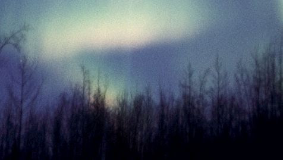
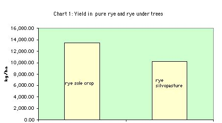
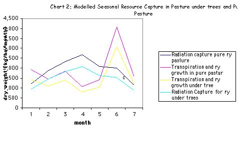
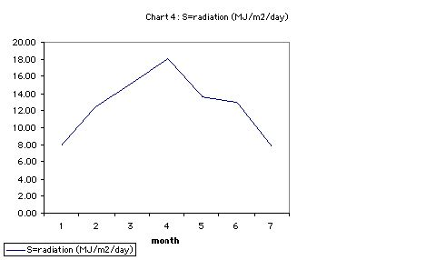

---
title: Modelling Silvopasture Light, Water and Growth
category: cnrm
author: John Plumridge
date: 2001-12-02
---

.. contents:: Table of Contents
   :depth: 1
.. sectnum::

Objective
=========
To investigate light and water availability in interactions, facilitatory or competitive, in growth of silvopasture. 

Design
======
Silvopasture with monocrop control conditions, at the Henfaes Research centre, N. Wales. 

* Specifically, Sycamore (*Acer Pseudoplatinus*) and Rye (*L. Perrene*) in 10 x 10 meter spacing./ 
* Rye undercrop, grazed by sheep and Rye pasture only.
* Atmospheric variables were measured the period of March to September, in 2001.    

Introduction & Background
=========================
Plant growth depends upon characteristics of plant, climate and soil. The relationship of dry matter production to transpiration and radiation capture can be used to examine how availability of water or light may be limiting to plant growth, where specific trees are grown with specific crops. (e.g. Squire et al. 1987). Complementarity, and competitive interactions between species rest on plant abilities to to capture the most limiting essential growth resources.

Composed of 95% water, plants rely on the water transpiration from soil to leaves for support, transport of metabolic sugars and minerals, and cooling.

The influence of environmental factors can be quantified. Plant responses are manifest in growth and development. By the modelling of plant growth, using data from actual plantings, it is hoped to asses priorities, pinpoint gaps, and increase our understanding of interactions. This process underlies the objectives of agroforestry as an answer to unsustainable monocrop agriculture, within economic constraints.

In a holistic model, where species do not grow in monocultures, plant interactions modify individual factors of the environment.    

Models
======

Parameters
----------
* S  radiation (MJ/m2/day) 
* es	saturated vapour pressure
* e	rate of change of latent heat content of air
* ea	vapour pressure of air

The Modelling equations
-----------------------

1. Capture of light
...................
Light capture as dry matter production (kg/ha/year) depends upon interception of photosynthetically active radiation (PAR) and the conversion efficiency. (see Corlett et al. 1992)

* Using *Lambert-Beer Extinction Law, W = Sfet*:
  * S represents means incident daily solar radiation (MJ m -2 / day)
  * e = the light conversion efficiency coefficient
  * t = canopy duration in days. 
  * f= Mean seasonal Fractional Light Interception
     
2. Fractional interception
.......................... 
When water is freely available fractional interception is related to leaf area index (L):
 
* f = 1 - exp(-kL),
  * Where k is an extinction co-efficient for leaf angle and distribution

3. Penman's model of water use and dry matter produced
......................................................
The ratio of dry matter produced to water transpired is known as the water use ratio (ew). The quantity produced is often linearly related to the quantity of water transpired.

* Dry matter production *(W) = e w Et*,
  * e w = uptake of CO2/transpiration from a leaf
  * Et = actual transpiration.
   
Once the radiation intercepted by the component canopies is known, we can use this to calculate transpiration using a modified version of the Penman-Montieth equation: 

* E0= (0.622/P) x (rga(es - ea)) x (1/e + 1)) mm/sec,
  * E0 = potential evaporation 
  * P = the atmospheric pressure = 97 locally.
  * p = the density of air = 1.2 locally.
  * ga = the boundary layer conductance = 0.04 in the absence of trees/ 0.03 under trees. 
  * es = the saturated vapour pressure at the surface (measured seasonally see table 1 in appendix)
  * ea = the vapour pressure of the air at standard height above the surface (measured seasonally see table 1 in appendix)
  * e = the rate of change of latent heat content of the air with respect to the sensible heat content (measured seasonally see table 1 in appendix)   

Results and Analysis
====================

Overall results in dry matter production
----------------------------------------
Rye dry matter production is > for sole Rye condition throughout the seven month period. 

The LER is may be an effective tool to assess the light interaction in mixed canopies. Marshall & Willey (1983), demonstrate how temporal sharing of resources is a cause of higher productivity in intercropping groundnuts and millet. 

LER Yield in sole cropping/ component crop yield in intercropping 

* = 13,419.97/10,258.11 = 0.76

The LER evaluates the effectiveness of intercropping
----------------------------------------------------
When LER > 1, there is no advantage to intercropping over sole cropping. 

The conversion efficiencies el and ew predict this growth pattern, modified by light interception (f), and water use efficiency. Water use efficiency depends upon actual measured atmospheric conditions, through their effect on boundary layer conductance (ga).
Whether or not the values for these factors employed in our models are valid is a subject for discussion. 

Limits to growth 
----------------
Pure pasture and silvopasture follow the same trends in limits to growth. 

Seasonal differences in growth trends are observed due to the effect of the two factors, transpiration and radiation. A unique value for each factor of boundary layer conductance (ga), water use efficiency (ew), and light conversion (el) is employed for each condition (refer to Appendix 1, table 1a). 
Thus transpiration growth and radiation capture in each condition run in parallel.

* Months 2 to 5: transpiration appears to limit growth
* months 5-7 and 1 radiation appears to limit growth. 

Are the limiting factors availability of light and water or not? Saturation vapour pressure deficit (D) is expected to influence growth because of its influence on transpiration. Stomatal conductance may have a part to play, in micro-climatic fluxes. Plant growth responses to temperature in maintaining equilibrium may also be involved.

It is likely that water is not limited in the present circumstances. The 1 meter high water table at Henfaes offers a plentiful supply of water to all soil horizons. Water availability in the sense of proximity should not be limited. 

A closer look at the atmospheric and seasonal variables could be fruitful.

Conclusions, Silvopasture light and water
=========================================
(ga) can be used to predict water, heat and carbon transfer assuming the conductance for all three are equivalent. However the specific monocrop conditions are rarely found in agroforestry systems with complex canopy structures, and (ga) would be in constant transition between agroforest and surrounding vegetation in small systems.

Direct measurement of (ga) are needed, and can be done using a saturated blotting paper replica of the leaf and exposing it to air, or measuring the cooling curve of a metal replica. Direct measurement of production would assist our observations.

Competition for water need not be to the detriment of either plant. Instead, niche differentiation may be enhanced. Roots show great plasticity, and crown/root management is an issue here. The planting of trees into mature pasture may facilitate niche differentiation. Pruning can stimulate roots to shed when nutrients are most needed, or to offset canopy demands from water. 

The species of tree considered has its own characteristics, and these may vary seasonally. Research can guide us in choice combinations and planting regimes of species, particularly where micro-climatic factors are observed. 

In the case of silvopasture, the desirability of maintaining a monocrop on the ground layer in pursuit of livestock nutrition, is questionable.

Modelling constitutes a valuable exercise in applying our knowledge. It is discovered that there are limitations to models drawn from monocrop studies in face of micro-climatic change through tree-crop interactions. However, they are useful and constitute a starting point. Caution is needed in drawing conclusions from LER in silvopasture. There are less visible outcomes and potential benefits in resource exploitation. In addition there is the benefit of more stable soil fertility.

Competition and facilitation in micro-climatic adjustments is likely to be occurring and could be enhanced. We need to continue to develop our ability to perceive signs in already established systems.  

Interpretation & Discussion of AF SP Model
==========================================
In August saturation deficit of air (D, = es - ea) is high,  radiation average, and I presume the air temperature is relatively hot.
How the plants would respond to such atmospheric changes is not predicted by the component models.

Microclimate, Transpiration, Conductance and Growth
---------------------------------------------------

Actual evaporation (Et)is smaller than potential evaporation (Eo). Atmospheric conditions determine Eo, but vegetation attributes, such as stomata closure determine (Et).

Shading
-------
Shading by overstoreys reduces (D) and leaf temperature (Tl), causing changes in (gs). Sub-canopy heat  fluxes  arise from both crop and soil (Wallace et al 1995), and may be important in agroforest interactions. So plants growing under trees can have different conductances from those in monocultures, changing their evaporation and photosynthetic rates. When a vegetation canopy is dry evaporation is under the control of the plants.

Shelter increases daytime vapour pressure, so reducing boundary layer conductance,  yet vapour deficits may increase or decrease. (gs) may modify the boundary layer conductance. Higher and lower values of (gs) are reported for sheltered crops. Where (D) decreases in shelter, (gs)  increases for bean, turnips and sugar beet and wheat under irrigation. With an Increase in (D) at the understorey surface, (gs)  generally decreases causing a decrease in plant carbon fixation.

In August transpiration appears to rise with a decrease in  (D),  according to the model.

If there is a decrease in (D) then (gs)  generally increases, and the mass of carbon fixed per unit water transpired increases.
There is a close interdependence of CO2 and water vapour exchange during photosynthesis and transpiration.

Partial Stomatal Closure
------------------------
Stomatal closure may not reduce transpiration though, because of corresponding increasing leaf temperature.

Plants must lose the same amount of energy they absorb to keep constant temperature, mainly by evaporation and convection. Stomata respond to various factors, including  pressure deficits, leaf water status (y), leaf temperature (Tl) and internal CO2 concentration (Ci).

At low stomatal conductance, decreasing ga causes a larger decrease in heat transfer than water transfer. The leaf heats up until a new equilibrium is established and  the conductance, dominated by stomata (gs),  stays the same.
In months 3-4 and 1-2, transpiration decreases with D according to the model, and radiation is not a limit to growth. In months 2-3 transpiration rises with D with no limit to radiation capture.

In a similar way to  evaporation and vapour pressure deficit (D),

* uptake of CO2 (Al) = (Ca - Ci) / r
  * where Ca - Ci are the atmospheric and intercellular CO2 concentrations and r is the diffusive resistance to CO2 uptake.

Therefore:

* ew = Al / El = (Ca-Ci) / &szlig;(vi-va)
  
  * where &szlig; is the ratio of the diffusive resistances for  CO2 and water vapour ( approx. 1.6:1), and Et = actual transpiration from a leaf.
  * vi  and va are the intercellular and atmospheric water vapour concentrations

(ew) does show change. Water use efficiency may vary with shade and climate. Drought studies indicate that (ew) and (D) may not be conservative, decreasing possibly due to stress-induced photosynthetic inhibition (e.g groundnut, Ong et al 1987).

It is possible that shading may be beneficial at times in the season, with certain species combinations, enhancing the growth rate of pasture under trees through efficiency in transpiration and Co2 under hot conditions.

Given a plentiful supply of water, prediction of growth according to transpiration based on generalised boundary layer conductance, may not be accurate where micro-climatic modifications  occur.

Water Use and Availability
--------------------------
Availability of water to crops in drying soil depends on the rate at which roots extend through the profile. Grasses possess a dual root system with the ability to cope wit changing conditions of water supply. Seminal roots give low conductivity, and adventitious roots  which grow rapidly in the surface horizon following re-wetting. The idea that annual crops cannot utilise available water and that agroforest systems can improve productivity by using a larger proportion of the annual rainfall has much support.

Water and nutrients can be stored or lost before absorbed. Agroforest offers increased infiltration of the soil and better water retention. If established and managed sympathetically, trees exhibit root plasticity and  have the ability to exploit water reserves from deeper horizons. Adaptive responses include increasing root:shoot ratio.

The wind break and shading effect of taller plants in AF systems tends to reduce air temperature and wind speed and increase atmospheric humidity, and so decreasing evaporative demand for the ground species. Soil evaporation may account for 30-60% of rainfall in semi-arid areas. Reduction in soil evaporation, run off or deep drainage resulting from increased shading, reduced soil surface temperature, physical barriers on slopes, increased abstraction in the surface horizons, deeper reserves and off season rainfall are potentials offered by agroforest to increase water used for transpiration. Rainfall intercepted by the canopy may range from 10-30% (Ong &Black 1994).

Shelter can bring about an increase in leaf area as well as increased transpiration per unit leaf area. Rapid early growth of sheltered plants may stimulate increased rooting with increased soil water availability.

Wind Pattern
------------
Wind is also a consideration in comparing agroforestry to monocultures. Dixon & Grace, (1984) report 3 tree species' transpiration rates decreased with increasing wind speed due to a reduction of D in consequence of reduced leaf temperature. Our Intuitions might invite surprise, thinking the opposite. (ga)  depends on surface roughness, extent of surface, speed and turbulence of air flow. Trees change the speed and turbulence. The resultant airflow profile influences the boundary layer  and so affects the fluxes of energy and mass.

It seems in agroforestry turbulence would be expected to increase. Sparse canopies in dry land Spain show temperature variants (0.6 C) and vapour pressure deficit variants (0.2 kPa) between open areas and within canopies.
Changes in air turbulence affect the ga in cereal leaves.

Direct Measurement of (Ga)
--------------------------
Whole Sitka spruce canopies showed that (ga) per tree increased with spacing from 2-8m (Teklehaimanot et al 1991). In the case of agroforestry,  particular local microclimate needs to be assessed, below and above canopy, at various levels of the vapour pressure gradient in order to model  light and water in regulating growth.

Radiation (LAI) and Sub Canopies
--------------------------------
The  assumption that  the canopy is spatially homogeneous is not suitable for agroforestry. Trenbath's agroforestry model of  1974 takes account of varying solar angle and foliage distribution. Sinoquet & Andrieu 1993 describe the gap frequency concept, fundamental to models of radiation penetration and interception by discontinuous canopies. The more simple models require information on leaf inclination and light scattering properties as well a fraction of leaf area in each canopy. This is rarely available. Wallace 1995 requires only individual values of K and LAI  for each species along with their relative heights this applies to horizontally uniform species mixtures. Nielsen 1971, requires the distribution and leaf area index, (non random distribution).

Thus, figures for (LAI) in the present study would could be adjusted seasonally. The quality of light might be taken into account.
Overall measures of dry matter production in the same study would be particularly useful in interpretation.

Soil Temperatures and Understorey Leaves
----------------------------------------
These may be reduced by shading, may increase or decrease productivity depending on temperature relative to a specific plant optimum. For example, winter cereals respond to shelter more than spring cereals (Kort, 1988).

Soil temperature particularly effects germination and early growth. The season of rye growth may be altered, with earlier cropping.

Positive  interactions influencing growth under shelter include temporal sharing of light resources. The late leaf production of Ash facilitates the early season rapid growth phase of pasture grasses.

Shading also reduces the risk of frost because of increased downward flux of longwave radiation, and it reduces energy available for evaporation from soil and crop.

For alley-cropped millet e  was 32% greater than sole crop, possibly because the reduced light saturating photon flux density for photosynthesis associated with drought was reduced under conditions of partial shade.

Extinction Coefficient
----------------------
Strong gradient in  light interception exist across alleys for crops. A unique value for k is often limited in Agroforestry systems with rows or clumps. An influence of drought on extinction coefficients within specific crops has been reported (Azam-Ali et al. 1993). For same species differences between sole and intercrops, little information exists.

The assumption that the light  passed on to the sub canopy is unaltered in PAR constituents is unfounded. In fact, shade varies throughout the day, seasonally, and with lattitude. Such variation may have species specific effects on the value k.

Productive Silvopasture
-----------------------
*Diversity* is increased by a simple introduction of trees. Micro-climatic changes are diverse, and  may favour growth of mixed grass communities and increased complexity for niche differentiation. This can have advantages for the nutrition of livestock, and reduce losses to the system through pest and disease. *L. perenne* sward with 35-year-old *Populus Serotina* at 200 stems/ha had been grazed continuously. *L. perenne* had been largely replaced by a mixed sward of indigenous grasses (mainly *Agrostis, Poa and Holcus* species).
The seasonal pattern of production had been altered due to increased mid-season shading.

Fattening Grazers
-----------------
Lamb growth rates on silvopasture with sycamore have been unaffected by the presence of sycamore trees (J. McAdam and G. Hoppe, 1997). This could be due to comparable pasture growth or, change in quality. More palatable pasture, and less fibrous oats with higher protein content, higher sugar content in beet, and in  citrus, (Baldwin 1988) are improvements noted with shelter on crops. Thus, the incorporation of sub-models such as the two under consideration, into agroforest trails, must be done with care. In particular, the (ga) data and dry matter production assessed should be direct gained, and so the particular plant-environment interactions  described.

References, Silvopasture Light, Water
=====================================
Avery M. et al. (1991) *Biophysical Research for Asian Agroforestry* Winrock International, USA

Fukai S. (1993) *Intercropping-bases of productivity* Field Crops research 34 239-245

C.K.Ong,&P. Huxley (1996) *Tree-Crop Interactions A physiological Approach* CAB International: Oxford. 

L.D. Incoll et al (1997) *Temperate silvoarable agroforestry with Poplar*  Agroforestry Forum Dec. Vol 8 No.3

Jim McAdam and Gerry Hoppe (1997) *Sheep performance and production from a lowland silvopastoral system* Agroforestry Forum Vol 8 No.3

Hoppe, G. M.; Crowe, S. R.; McAdam, J. H. (1999) *Changes in pasture composition in establishing and mature silvopastoral systems.* Proceedings of the International occasional symposium of the European Grassland Federation, Thessaloniki, Greece.

Schalitz, G.; Behrendt, A.; Fischer, A. (1999) *Advantages of trees and shrubs contribute to fen pasturelandscapes*. Folia Universitatis Agriculturae Stetinensis, Agricultura No.75.

Olff, H.; Vera, et al (1999) S*hifting mosaics in grazed woodlands driven by the alternation of plant facilitation and competition.* Plant Biology Vol.1, No.2, pp.127-137, 64 ref.

Sinclair F. (1993) *Ecological Interactions in Agroforestry Systems* Agroforestry Abstracts CAB International 

Young A. (1997) *Agroforestry for soil Management* ICRAF/ CAB International 

             
