---
title: Soil Changes Under Agroforestry
category: cnrm
author: John Plumridge
date: 2001-12-12
---

:Designation: M.Sc. 532

.. contents:: Table of Contents
   :depth: 1
.. sectnum::

.. |Esystem| replace:: E\ :sub:`system`
.. |Etree| replace:: E\ :sub:`tree`
.. |Atree| replace:: A\ :sub:`tree`
.. |Ecrop| replace:: E\ :sub:`crop`
.. |Acrop| replace:: A\ :sub:`crop`
.. |Eproportional| replace:: E\ :sub:`proportional`

Objective
=========
Compare soil erosion, loss of top soil, and nutrients (N and P) between *Glyricidia* hedgerow inter-cropped with maize, and maize mono-cropping systems in Lampung, Indonesia.

Agroforestry can enhance nutrient cycling when compared to agriculture, and minimise losses to the system.

Introduction
============
 "Balanced ways go on and on, unbalanced ways disappear in harmonious times." ~ From the *I Ching* (hexagon No.11) 

Sustainable practices of agriculture are not perpetual practices. Population growth has put pressure upon traditional crop-fallow land-use systems, to cause declining soil fertility an soil erosion with reduced fallow periods.

Being unsustainable, such practices must eventually be abandoned. Yet timely interventions may alleviate suffering brought about by failing crop yields. 

To this end, study of crop interactions and soil changes is important in assessing the likely impact and sustainability of interventions upon land-use systems. Scuaf is a model developed as an aid to prediction in agroforest intervention, the effect of introducing trees on agricultural soils. Data is limited. The model demonstrates that trees can improve soil.

A more immediate effect of soil erosion than loss of soil quantity is loss of organic matter and nutrients. Soil fertility is the capacity of soil to support plant growth, in the given environment. By reducing soil erosion and runoff, trees are viable as agroforestry if acceptable to farmers in terms of yield and competition. A high degree of internal recycling maintains fertility towards equilibrium,in the manner of natural ecosystems of diverse vegetation communities.

Inter-cropping may increase yields through facilitation, or by mutual interactions, as well as prevent soil erosion.

Decline, as opposed to low soil fertility caused by natural soil conditions, is brought about by past land use. Shifting cultivation is sustainable provided that the fallow periods are of adequate length. The necessary rest-period requirement 'R-factor', (i.e. years under cultivation/ years under cultivation plus fallow), depends upon the type of soil under consideration. 
Estimates of rest periods required are difficult to make, particularly if it is not known to what extent soils are e degrading under current land use. However, with intermediate inputs, one and two years under fallow are required.

Renewal of nutrients by minimum tillage, fertiliser, green manuring, fallowing, return of crop residues, manures/composts and flood irrigation may have constraints in type or extent of land, and supply. Naturally sustainable soils are those derived from nitisol rocks that have the capacity to renew fertility by weathering. They are of limited extent and carry high populations.  

Modelling Intercropping with SCUAF
==================================

Inter-cropping is considered to have a crop cover total of 1.0 (100%). In the model the cover can be higher, which represents a multi strata system, as opposed to discrete inter-plantings. Crop cover affects soil erosion by protecting soil from exposure.

17 elements are considered essential to growth. C, H and O are obtained from the air. 1 to 6% of plant composition is the 14 essential elements of the soil.

Other macro nutrients essential to growth, (i.e. sulphur, calcium and magnesium, as well as the micro nutrients of Zen, Fe, Cu, Mn, Cl, and Co, are not modelled. They may in some respects be expected to follow a similar pattern cycling as the nutrients under observation, with exceptions under special circumstances, beyond the scope of the model, or the present study.

Based on studies of forest, savanna, and semi-arid ecosystems, the Scuaf model has been developed so that trees-only give a steady-state soil. 
The model sets default values based on the user-defined land Use system and environmental conditions as a whole. Unless specified, default values were accepted. Default values for temperate climate are provisional.

Plant composition in Kg DM per/ha/yr was calculated and specified for each species, from the fraction of NPP. 

* Leaf, wood and fruit 66%, 33% and 1% for Glyricidia.
    * NPP for Glyricidia = 10650 Kg DM per/ha/yr.   
* Leaf and fruit 67% and 33% from maize. 
    * NPP for Maize = 555 Kg DM per/ha/yr.

Annual rainfall was set at 3200 mm. Climate; lowland humid

Two soil horizons were set 0-20 a, and 20-40 cm, forming the lower boundary of the soil, or the approximate depth reached by the crop roots.

All wood and fruit were removed for fuel and human consumption. 
Changes in status of soil and plant components are calculated as end of year values, and are applied to stores and flows, in kg/ha or kg/ha/yr, or fractions. 

How the Model Works in the Simulation
=====================================

Carbon & Nutrient Flows
-----------------------

* The model adds plant residues to the soil according to removals as prunings, harvest, conversion losses, and standing biomass. No additions of fertiliser or manure to soil were entered in this simulation. Non-harvested tree prunings, are returned to soil.

* It is assumed that erosion losses of C,  N and P come from labile humus; the soil mineral fraction is assumed to be below the soil surface, unaffected by erosion.

* The rates of gains and loss in the cycling process were left in default values, proposed by the model according to the land use system.

Soil Carbon Cycle
-----------------

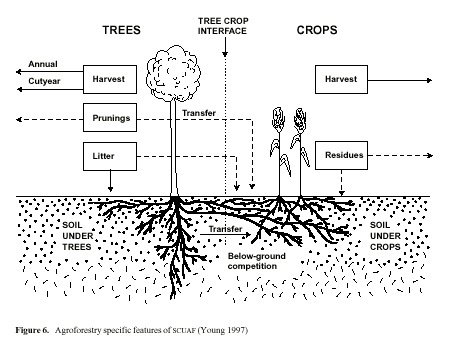

* Nutrients are stored in soil and plants, minerals are in addition stored in soil solution.
* Carbon in the soil is gained through humification.
    * Losses through oxidation: 'active fractions' of elements present in soil  meso- and micro-fauna, are subsumed within litter-to-humus conversion losses through oxidation.

    humification = litter* (1-fractional LITTER TO HUMUS OXIDATION)

* Initial values are 67% humus in stable form. Stable humus annually transformed as 1% of labile.
* Decomposition of humus is 0.03 under trees and 0.04 under crops by default.
* labile  carbon is given a life of 10 years in the specified temperate soils. Stable carbon: Has a half life > 50 years. 

Inputs SCUAF
============
Plant composition was specified for each species.

* land Use systems area under trees and crops:
* Area under tree = 0.20; Area under crop= 0.80
* Area under trees = 0; Area under crop = 1.0

Initial rates of growth (NPP) were input as:

* Glyricidia: 10560 kg DM per ha/yr.
* Maize: kg DM per ha/yr.

   
Universal Soil Loss Equation
============================
Erosion (A) = R * K * L * S * C * P (kg/ha/yr)*, WHERE:

* R =  The power of rainfall to cause erosion by amount and intensity (less intense in temperate climates). Kinetic energy, though measurable through drop size, it is an expensive machine, and it is approximated by taking half the local annual rainfall; 1/10 in temperate areas.
* K is Soil erodibility factor, and represents type of texture and structure; it is lowered by improving these. It represents also, the soil's  water holding capacity. Measured by taking the ratio betweeen erosivity and  erosivity representative factor soil.
* Li, and Si, are Slope length and Slope gradient taken in relation to 'standard plot gradient'.
* C is cover or, management of land under consideration / bare soil .
* P is erosion control practice. Compared with land ploughed against contour, without structures.
                                    

Erosion & Fertility
===================
Leaching rates are generally higher for lowland humid climates, as are rainfall, decomposition rates, atmospheric input of nutrients, and supply of phosphorous by soil parent material (i.e. felsic, in this case). These varibles are factoredinto the model.

Trees can protect soil from erosion. With slope, trees as permeable barriers prevent runoff where aligned to contours. Tree roots promote infiltration of water and hold soil in place. Tree prunings will check raindrop impact and runoff .

The advantages given by trees may be determined by the tree proportionality factor, which may be user-defined. Intercropping is a spatial design, and this was modelled by, 

* *Area under tree (TPF) = 0.20 Area under crop (ie. 0.80)*

Erosivity can in fact sometimes increase with the cover of trees, due to raindrop splash. This depends upon leaf characteristics. In intercropping with multi-stemmed pruned trees, the raindrop velocity would be checked.

Soil texture affects the leaching of nutrients, is improved by root infiltration. Below ground influences of tree roots upon adjacent soil under crops (default= 0.1), are calculated.

It has been reported that depression in crop yields are found to be competition for water close to the hedgerow, although effects are sometimes positive. Glyricidia sepium has been reported to reduce potential evapotranspiration in crop alleys for most of the season. Prunings help to conserve water too, as well as reduce weed biomass and competition.

Labile carbon is given a life of 10 years in the specified temperate soils. Stable carbon has a half life > 50 years. Long term formation would add stability or equilibrium to the cycle of nutrients, under constant input. However availability of nutrients is mainly from the active fractions (1-2% of soil OM) in the fine litter,and some from labile humus, or from minerals. In temperate climates some may be carried over to the next year.

Crop cover reduces exposure and hence erosion and gaseous escape of nutrients, including carbon dioxide. The greater the soil cover the less the cover factor in the Universal Soil loss Equation. 

There is a high tree-crop interface in intercropping due to the spatial design. This is considered in the input data which allows the system to be defined as 'alleycrop&hedgerow'. The percentage cover by components doesn't specify inter-row distances, and I assume single rows are an assumption of the model.

Generally between hedgerow spacing should be at 4-8 m; at greater than 10 m then there is insufficient biomass production.
     

Analysis of Results
===================
Interpretation of the Graphs 1a-10 in Appendix 1: Refer to Appendix 2 for Raw data Tables. Discussion of results follows.

Soil and Carbon Erosion (A)
---------------------------

A sustained decrease in soil depth in both conditions: 

    agroforestry (Af) < maize only (MO). 
    

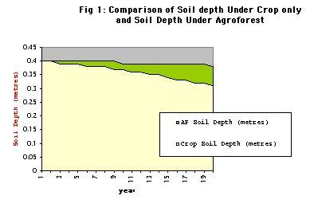

*Fig.1* shows the soil losses. The soil loss is explained by the Soil erosion factor (K) which has a sustained increase, and is grater for Af than MO.

*A = R x K x L x S x C x TPF x 1000 (kg/ha/yr)*

* Where R = The power of rainfall to cause erosion by amount and intensity (less intense in temperate climates);

* K = Soil erodibility factor; LxS = slope factor (length and slope)

    * these are less than the original USLE values;

* C = cover factor, treated separately for tree and crop.

* (L x S) and R are fixed for climate and physical conditions.

* K and C are themselves modified by the simulation of changes in plant and soil.

*|Esystem| = (|Etree| x TPF) + (|Eproportional| x (1-TPF)*

|Eproportional| = (|Etree| x |Atree|  (+ (|Ecrop| + |Acrop|)*
    
* Where, E = erosion, and A = fractional area under cover.  

* Erosion under trees is usually less than under crops: The trees may exert an influence greater than area they cover, an effect covered by the tree proportionality factor (TPF, Young & Mayura 1990), (default=0.8).

* K represents type of texture and structure, and is lowered by improving these. It also represents the soil's water holding capacity. The model decreases K by 0.069% with each 1% increase in soil organic matter content (based on Wischmeier and Smith 1978), and hence soil erosion.  

*Cn = Co x (NPPo/NPPn) where n = year n, 0 = year 0*

* The model decreases crop cover factor (C) with increase in plant growth, to reduce erosion. Default values of 0.006 and 0.300 for tree and crop respectively, reduce erosivity for agroforestry (Af). 

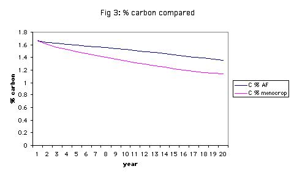

From Fig. 3, 

* % carbon decreases, and more for monocrop maize.

* Erosive loss of soil organic matter (OM), represented by carbon, is based on topsoil content, with an added enrichment factor for eroded sediment (This is true for and nutrient cycling too). It is assumed that erosion losses of C, N and P come from labile humus; the soil mineral fraction is assumed to be below the soil surface, unaffected by erosion.

*Losses of C, N, P: = erosion rate x proportion present in soil x enrichment factor.*

* Decrease in carbon is followed by a rise in agroforestry. A high loss from the start in Mo continues at a declining rate along with declining carbon content. (See the raw data table 1b, erosion in MO).

* There are losses through oxidation. The model's decomposition factor of humus is 0.03 under trees and 0.04 under crops by default; reduced erosivity in agroforestry by comparison.

* Crop cover for both conditions shows an initial decrease in the first three years; greater sole crop. Subsequent increases are observed in agroforestry only. This modifies the crop cover factor.

* Organic matter (OM) in the soil is gained through humification of the plant residues ( ie. 'litter').

* The model adds the plant residues of non-harvested as prunings to the soil. No additions of fertiliser or manure to soil were entered in this simulation. In maize-only, the leaf was returned to soil, being a 'non-harvested crop pruning'. In agroforestry both maize and tree leaf prunings were returned to the soil. Favouring the monoculture, maize roots are returned to the soil, as they do not remain as standing biomass. Root turnover in trees is not explicitly considered, and may be underestimated. Pruning may increase the root turnover.

* There are conversion losses through oxidation, in which 'active fractions' of elements present in soil meso- and micro-fauna, are subsumed. Losses are alsao through leaching in addition to erosion.

*humification = litter x (1-fractional LITTER TO HUMUS OXIDATION)*

* Harvests, conversion losses, and standing biomass are losses to the internal flows of the system.

* Conversion losses differ between above ground and root residues, and so prunings are not equivalent in nutrient status to additions as tree fodder through manure. Default values suggested by Nye & Greenland (1960).

* For the top soil horizon, initial carbon and nitrogen status (1.7% and 0.14%) were set from field data.

* Dynamically, the proportion of OM present includes additions to the soil. (See, Soil carbon cycle, Appendix Figure 4). Soil carbon changes in the model are sensitive to rates of conversion loss. (Young 1997).

Nutrient Cycle
==============
*Generally - Refer to Charts of Results, in Appendix,* 

* Generally, soil organic N changes run in parallel with carbon. Short and medium-term changes to occur within the topsoil where most of the carbon is in the labile form.
* Elements arising from decomposition of plant residue are added to labile humus and mineralised fractions.
* A substantial loss in N occurs at the star of the model run. It is assumed that only 0.1 of the mineralised nitrogen is carried over to the next year, and the pool must be reformed each year. The model proposes no nutrients arising from litter mineralisation in the first year, as in a shifting cultivation system. Thus substantial nitrogen deficiency occurs at the start of the model run, by default.

*Soil Organic Phosphorous (Charts 4 A-B),*

* Change is roughly parallel with carbon, with the addition of rock weathering as a mineral source of phosphorous. Immobilisation onto clay causes loss to the cycling system.

*Humification of N and P (Chart 2A-B, Charts 4A-B),*

*  Both rise then fall to similar levels in both crop conditions by year 19, and at a greater rate in agroforestry over first five years.
* N & P formation shows a sustained decrease, greater in maize only than agroforestry.
* Mineralisation of stable and labile N shows no change for agroforestry, a slow sustained decrease in monocrop maize.
* Stable P remains at the same level in both conditions.
* Labile N shows a sustained decrease, greater for monocrop than agroforestry * C:N ratio shows a sustained slow decrease in agroforestry and a zero value for crop only. Nitrogen may also be leached.
* Erosion of organic P and N is greater in MO, and reaches the same level after 19 years.
* If growth is nitrogen limited, all is taken up by the plant (after losses), in the simulation.

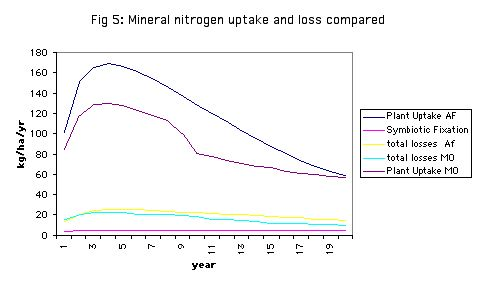

* *From Fig 5 Above,*
    * plant uptake of N is is greater in agroforestry, though declines to reach same level as declining N in monoculture in year 20.
    * Losses are less, and there is additional symbiotic fixation in agroforestry.

                                                
* *From Chart (5A-B),* 
    * Available soil mineral phosphorous is much greater in agroforestry (after an initial decline), with less leaching, increased litter mineralisation, and fixation in the long term.
    * Litter content falls below humus content of N in both conditions, indicating reduced availability for growth.
    * Labile organic N and P decline at a faster rate in maize-only. P in littermineral form is available only in agroforestry.
    * Nutrient availability (figure 5, Appendix 1) is calculated for soils under trees and under crops.
    * Symbiotic fixation with Glyricidia only, favours agroforestry conditions.
    * Flows of N and P through plants return to soil though humification and mineralisation of litter, throughfall and stemflow, which are greater for trees.
    * N and P are gained by the soil and trees through atmospheric deposition (rain and dust), non-symbiotic fixation (N), symbiotic fixation (N), deep capture by trees, from below the modelling depth, and rock weathering.
    * Losses through humus decomposition are less for trees, by default.
    * Gains of phosphorous are not greater for trees by weathering.
    * N and P loss by leaching is less under tress, but not clay fixation and gaseous loss, according to the model. Additionally, there are losses due to soil removal, which is greater in maize only soils.
    * Phosphorous immobilisation onto clay minerals is known higher in strongly acid soil. By default,this is the same for both conditions, However, trees can regulate acidity.
    * Root infiltration is known to aid aeration and hence, productivity of the soil.
    * There are two paths for transfer of nutrients to to crop via the soil, through mineralisation and trough humification; mineralisation is faster, and prone to leaching.
    * For organic matter to increase, prunings would need to humify. 

Plant growth
============
Growth rates are modified in the simulation by the effects of changes in nutrients, carbon, and soil depth. Rates may be higher or lower under trees.

Requirements are estimated from initial growth rates of composition and growth. If either N or P is deficient plant growth is reduced proportionally (i.e. availability/requirements), using the law of the minimum.

High fertility favours growth of herbaceous plants, but may be offset by competition for resources such as light or water.

Tree-crop competition is calculated on the basis of relative root densities specified. I calculated these as a fraction of NPP before entering as initial annual root growth; 40% for trees, 25% for maize.

OM facilitation of root development and water holding-capacity is modelled through a feedback factor.

Trees and Phosphorous and Micorrhiza
------------------------------------
Trees had a clear ability to assist in the cycles of phosphorous. Phosphorous has poor solubility. P organic pool, as sugars, acids, DNA is unavailable. Acquisition of P can is by solubilizing through change in ph, or by chelating. Examples include ALFeP and H+ exchange, or through release of organic acids (citrates, malates, oxalates), the ability to take up phosphate in the area which the plant can exploit (rhizoshpere) is 2-3 mm.

Acquisition of nutrients, such as phosphorous, is aided by tree root micorrhiza. Organic phosphatase enzymes have greater reach than trees themselves. Thus higher yields are maintained or aided, through greater uptake with low soil P. They exploit a much larger soil volume through hyphae spread. The phosphorous is taken up, stored in chains and transported to the xyloplasm in the hyphae. This is passed on to the plant in amounts to allow increased plant growth. Although micorrhiza have a high P need themselves, hyphal turnover is expected. Carbon is requested from the plant in exchange. Again, the higher bulk growth, and stores, contribute to higher root turnover.

Micorrhiza contribute to 10- 30% of total photosynthesis. Thus they can help to add total carbon biomass to the system. Pathogen resistance and drought resistance are further plant benefits. It has been reported that michorrhizal plants may grow at the expense of non-michorrizal plants, which is issues for management and selection.

Conclusion
==========
The simulation compares two systems as a nutrient cycling system.
*Gliricidia sepium* is fast growing, and known to be less competitive than N-fixing *Leucaena leucocephala*, and so the results concerning crop cover are reasonable.

Losses to the system were at a slower rate in agroforest than monocrop, indicating longer term sustainability of soil fertility. This is due to the k erosion factor of the model. Many advantages or disadvantages are subsumed in the TPF. Trees have the capacity to reduce erosion through maintenance of higher biomass and cover, reflected by the model. Trees in agroforest are able to contribute atmospheric and soil nutrients to plants directly, and through the soil, as well as prevent leaching. This is due in part to symbiotic associations with bacteria.

Where data can be specified from the trial under consideration, the model becomes more useful. User defined variables are its strength,as a research and educational tool. It is not designed to give simple answers. Scuaf may also help to refine our assumptions, in the use of ecophysiological models.
Observed results of agroforest systems have been checked by simulation, and SCUAF's calibration has been adjusted accordingly.

Given an unprecedented and worrying scale of soil degradation in our times, inter-cropping may be useful in a range of alternative practices. Particular combinations and micro-climatic effects, and long term equilibrium need be examined. 

Data input may now be used to calibrate factors in less well known conditions, such as temperate climates. Default values may be adjusted against observed soil changes under experimental conditions, until the model simulates the results. For example, root to shoot ratio increases with low nutrient supply and root hairs promote P uptake. The additional factor (P), for erosion, representing erosion control practice could be added to the model by comparing with land ploughed against contour, without structures.

Scuaf does not represent competition for water. This is a shortcoming. However, water availability is dependent upon seasonal climatic variations.  

References SCUAF
================
C.K.Ong,&P. Huxley *Tree-Crop Interactions A physiological Approach CAB International:* Oxford. 1996.

C.K. Ong *A framework for quantifying the Various efects of Tree-Crop Interactions.*

C.K. Ong, C.R. Black, F.M. Marshall and J.E. Corlett *Principles of LIght Resource Capture and Utilization of Light and Water.*

A.J. Brenner *Microclimate Modifications In Agrofoestry.*

J.S. Wallace *The Water Balance of Mixed Tree-Crop Systems.*

M. Avery et al.	*Biophysical Research for Asian Agroforestry*	Winrock International, USA 1991.

Fukai S. *Intercropping-bases of productivity  Field Crops research*, 34 (1993) 239-245.

C.K.Ong,&P. Huxley *Tree-Crop Interactions A physiological Approach CAB International:* Oxford. 1996.

C.K. Ong *A framework for quantifying the Various effects of Tree-Crop Interactions*.

C.K. Ong, C.R. Black, F.M. Marshall and J.E. Corlett *Principles of Light Resource Capture and Utilization of Light and Water.*

A.J. Brenner *Microclimate Modifications In Agrofoestry.*

J.S. Wallace *The Water Balance of Mixed Tree-Crop Systems.*

L.D. Incoll* et al*	Temperate silvoarable agroforestry with quality hardwood timber species.* Agroforestry Forum Dec. 1997 Vol 8 No.3.

L.D. Incoll* et al	*Temperate silvoarable agroforestry with poplar* Agroforestry Forum Dec. 1997 Vol 8 No.3.

Jim McAdam and Gerry Hoppe	*Sheep performance and production from a lowland silvopastoral system* Agroforestry Forum Dec. 1997 Vol 8 No.3.

Hoppe, G. M.; Crowe, S. R.; McAdam, J. H.*Changes in pasture composition in establishing and mature silvopastoral systems.* Proceedings of the International occasional symposium of the European Grassland Federation, Thessaloniki, Greece, 27-29 May, 1999.

Schalitz, G.; Behrendt, A.; Fischer, A. *Advantages of Trees and Shrubs Contribute to Fen Pasture Landscapes.* Folia Universitatis Agriculturae Stetinensis, Agricultura, 1999, No.75.

Olff, H.; Vera, et al*Shifting mosaics in grazed woodlands driven by the alternation of plant facilitation and competition.* Plant Biology, 1999, Vol.1, No.2, pp.127-137, 64 ref.

F. Sinclair	*Ecological Interactions in agroforestry systems*	Agroforestry Abstracts CAB International, 1993.

M. Avery et al.	*Biophysical Research for Asian Agroforestry*	Winrock International, USA 1991.

A. Young	*Agroforestry for soil Management*	ICRAF/ CAB International 1997.

                                       
Appendix 2
==========
Charts 1-10 
-----------

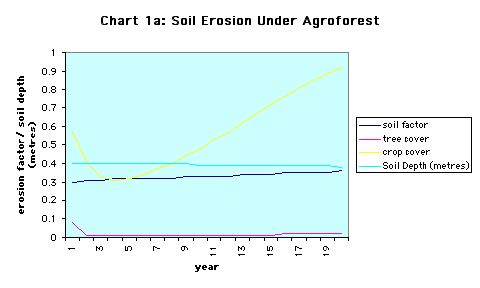

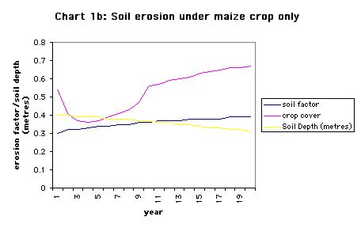

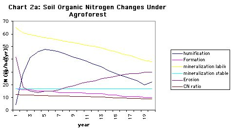

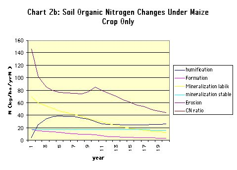

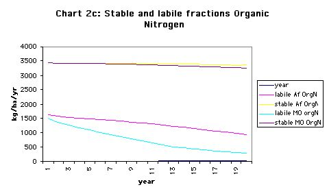

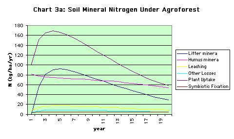

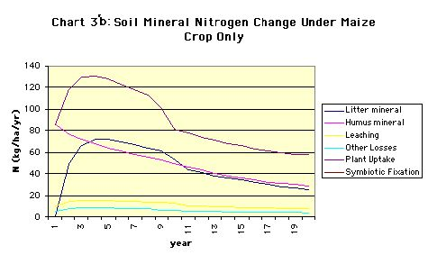

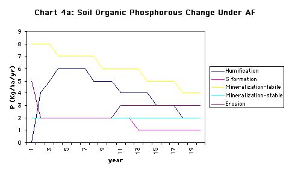

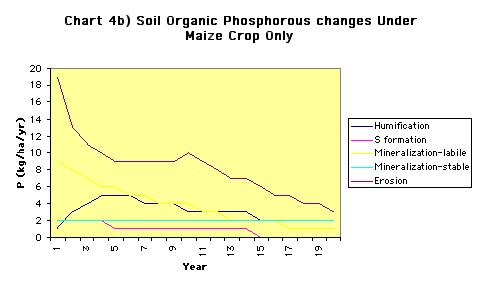

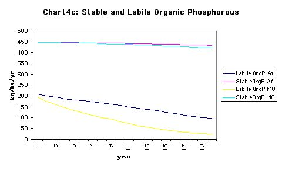

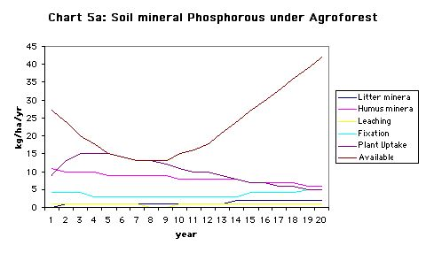

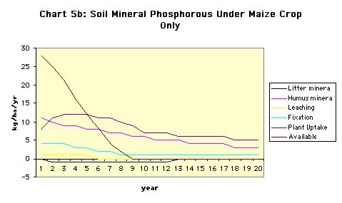

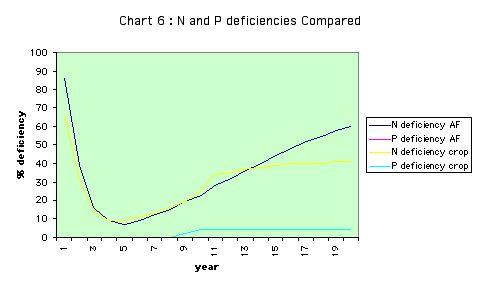

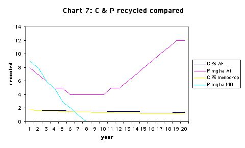

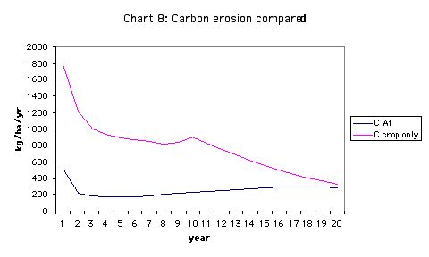

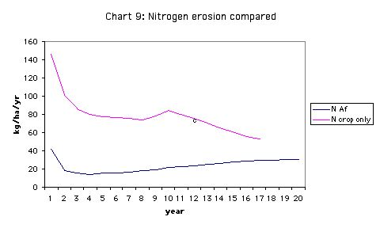

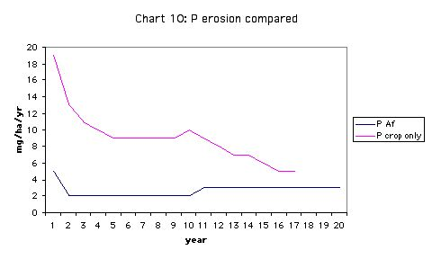

