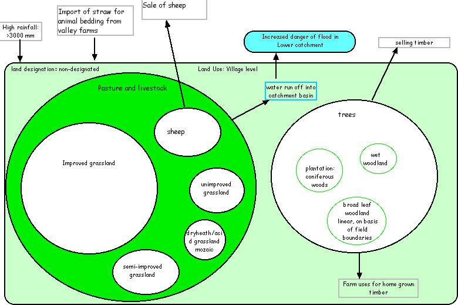
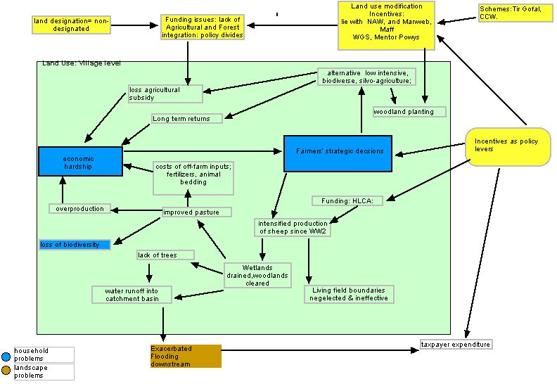

---
title: Agroforestry Upland Farm Diversification, Wales
category: cnrm
author: John Plumridge
date: 2002-10-29
---

.. contents:: Table of Contents
   :depth: 1
.. sectnum::

Diversification of Agriculture
==============================
Integrating trees with agriculture is essentially agroforestry land use. Agroforestry practices are skilled and, integrate trees and woody shrubs to enhance sustainability and productivity in agriculture.

Broad Objectives & Constraints
==============================

1. Land Use Changes 
    * To enhance the natural capital and ecosystem functions.
    * Best available specification and expertise required. 
    * The farms are specialised, unlikely to posses the skills without self training.

2. Cultural Constraints
    * Farmers and locals think new woods should not restrict views to the higher ground. Conservationists favour planting on improved land. Farmers are reluctant to turn over better land to woodland.

3. Uptake and Management
    * Support farms in change financially. Involve farmers in participatory and adaptive approach for effectiveness.
    * Construct timed management plans with view to seasons and local labour, and co-operative initiatives.
    * Support adaptive farm research in spacing, inter-cropping and selection of germ plasm for local provenance. Includes possibility of unusual species.

     
Land use, Rural Poverty Problems
================================

Location
--------
* Pontbren O.S. Map Coordinates 305.200 305.850
* Designation: non-designated land. LFA.
* Elevation: Upland 300m.
* No of Farms: 10. 
* Average age of Farmers: nearly all over 50. 

Landscape
---------

Dry heath:

* Some small pieces.

Pasture

* Mix of improved, semi-improved and acid wetlands. Much draining taken place since 1960's. 

Wetland

* Much drained. Some remaining. Trees dry out the bog, since drainage works on mires.Riverine strips.

Size, Type and Connectivity of the Woodland
-------------------------------------------
* Planting is on basis of field boundaries. Have been able to carry out work with the help of the Countryside Council for Wales's hedgerow renovation scheme. 
* Some linear broadleaf planting. 
* Some small coniferous plantations.

Field boundaries
----------------
* No longer effective (neglected boundary trees). 

Pontbren Land Use and Economics
================================

Tradition of sheep grazing with policy inducements for high stocking levels, and concomitant clearance of trees for open pasture and management of monoculture. Situation is now one of hardships in the current markets of over-production. Face losing precious agricultural grants if more trees are planted. Pontbren received financial support from Menter Powys and Manweb Rural Care, and has also been approved for the Forestry Commission's Woodland Grant Scheme.

Diagram: Land Use and Flows, Pontbren.

Inputs
------
* Cost of straw from valley farms approximately £5,000 p.a. without transport. 
* Cost of farm-produced wood chips approximately the same to transporting the straw. 
* Costs of inputs to improved pasture.

Markets
-------
* Has sold a variety of hardwoods. Manweb, the energy company, is interested in biomass fuels.

Farmers Interests and Land Use Objectives
-----------------------------------------
* Desire to rationalise their traditional activities and expand the woodlands on their upland hill farms to provide shelter for their livestock. 
* Decided the solution was to farm less intensively and in a more sustainable manner
* Improving livestock welfare and productivity (exposure and shelter).
* Interested in wood chips as alternative bedding for winter housed livestock. Increased production. Diversity in non-timber products. 

Technical Support
-----------------
* Enlisted Coed Cymru for help with the management of existing woodlands and the use of home-grown timber.

Home Productivity
-----------------
* Put wood to good use around the farm. 

Desired Outcomes
================

On-Farm Processing of Products for Local Markets
------------------------------------------------
* Boost annual income
* Boost long term viability

Options for New Diversification Practices
-----------------------------------------
* On-farm production of litter, mulch
* Diversification of stock
* Trees for fruit
* Trees for timber
* Complement existing biodiversity habitats
* Products for on-farm use
* Diversification of crops
* Trees for forage
* Biodiversity plans
* Improved shelter for livestock
* Improved water retention
* Improved soil formation
* Unusual products

Ongoing Technical Advice
------------------------
* On-farm adaptive trials
* Ground plans for new practices
* Grant assistance
* Plans for maintenance schedules
* Help with establishment of trees
* Help with maintenance of trees
* Help with finding suitable stock
* Economic appraisals of options

Local farms co-operative production
-----------------------------------
* Planning to include local farms level
* Help with local farmer's action (in policy Influence and community)
* Community-wide consultations

Objective Strategies, Land Use Changes
======================================
 
Silvopastoral Agroforestry
--------------------------
Woodland grazing provides over-wintering for livestock. Forage species include hazel, willow, beech, ash elm, alder, oak. Example is given by Dehesas (Spain) an extraordinarily high biodiversity land practice in Spain. The traditional use is characterised by mixed livestock raising at low stocking densities, employment of hardy regional breeds, and an elaborated maintenance and exploitation of holm oaks (*Quercus ilex*).

Livestock production has traditionally been accompanied by arable crops with long rotations and closed nutrient cycles without external inputs. Wooded grassland landscapes increase biodiversity in intensive pastures, are found visually attractive, and improved the image of agriculture in society. Quality hardwood timber species suitable for the locality include, ash cherry sycamore. Also, Poplar.

The effect of competition with crops is likely to extend the period before the final harvesting of trees but possibly no more than that of minimally managed poplar in farm woodland plantings. Planting trees in established crop may help bring about niche differentiation. Trees and crops root very heavily where nutrients are likely to be, in the surface. Trees already with an established root system may have a competitive advantage.
 
Acid Heathland Soils
--------------------
Open pastures provide little shade, and they also lack sufficient wind protection during the winter. The development of a diversely structured pasture positively impacts the well-being of the pasture animals, as well as the biodiversity of the ecosystem. 30% maximum of unimproved pasture/heath containing grasses such as *Molinia caerulea* is utilised.

*Action 1. Trees:*

* Trees as fodder to increase yield

*Action 2. Pasture Herbs:*

* Under trees, herbs like birds foot trefoil, burnet, sheep's parsley are exceptionally rich in nutrients, and would develop in succession.

*Action 3. Unimproved acid grassland / Semi-improved acid grassland:*

* *Betula pendula* for useful shelter, winter and UVB, up to 18 metres, fast growing.

*Action 4. Mildly Acid Drier Soils:*

* Clumps of Hornbeam densest of all wood.
* To be coppiced, for fuel and timber for butchers blocks, crafts.
* Use indicator species to determine ph and suitability (e.g. bell heather).

Improved Pasture
----------------
*Action 1: Dispersed Trees*

* Ash, bird cherry; larch, poplar on lower areas. Fix with Individual guards.
* Bird cherry has good form for widely spaced tree planting in open exposed sites. Provides shelter.
* Poplar: 35-year-old *Populus 'Serotina'* at 200 stems/ha with *L. perenne* sward can be grazed continuously. *L. perenne* has been shown to be largely replaced by a mixed sward of indigenous grasses (mainly *Agrostis, Poa and Holcus* species).
* The seasonal pattern of production will be altered due to increased mid-season shading.
* Root distribution of poplar seems to respond to crop intensity, suggesting that its cultivation could reduce competition between tree and crop roots .
* Larch gives no heavy shadow and so benefits grasses underneath.

*Action 2. Tree Clumps:*

* Southern slopes - The aspect to sun offers possibilities

    * Terracing for fruit trees, on pasture.
    * Propagation of surviving on-farm fruit trees: Pear, Apple, Damson.
    * Fenced to allow growth amongst livestock.
    * Trials for selection of germplasm; Soft shell almond (*prunus*).
    * Mixed species clumps to provide timber and cash crops on shorter rotation. 3m spacing in 25 x 25 m plots = 60 trees.

* Commercial broadleaf mixture:

    * Oak - 120/150 years rotation - at 2m spacing.
    * Ash, cherry - 50 to 90 years rotation - at 2m spacing.

* Native species and conifer mixture:

    * European larch with oak and ash. Larch to be thinned and removed after 30 years.
    * Timber interplanted with Norway spruce and noble fir on a 5 to 10 year rotation.
    
* Native species mixture:

    * Oak ash, birch and hazel, all of local provenance, at 2m spacing.
    * Thinning and pruning to favour a final crop of oak and ash.
    * Deadwood retained as habitat for invertebrates.
* Protective fencing against livestock.

*Action 3. Inter-Planting With Cash Crops:*

* Christmas trees, fruit, farm timber and foliage is possible.
* Apple plum and pear rootstocks grafted with Newton Wonder.
* European Walnut and Black walnut.
* Norway spruce, noble fir and holly inter-planted with the fruit to provide an early cash crop. Several rotations of 5 to ten tears are possible.
* Near tree rows in silvo-arable agroforestry may encourage slugs. 14m wide rows preferred, containing a 12 metre wide strip.
* Cultivation kills slugs. The tree row understorey is not cultivated. The understorey could be mulched, alder leaf-mulch, or sown with clover sward to provide nitrogen and less cover for slugs.
* Forestry spacings develop less faults.
* Winter wheat, threshing peas, winter barley give good returns, less closer to the tree alley.

Semi-Improved Pasture
---------------------
Action 1. Dispersed Trees:

* Ash: tree comes into leaf in late May, and maximum grass production peaks in May (temporal differentiation in resource capture).

*Action 2. Shelterbelts:*

* pear trees, crab apple trees, geans wild cherry (*Prunus avium)*, hazel.
* On exposed slopes, groups to form an A-shape, may be browsed occasionally. Young trees and saplings to be protected.
* Trials and for germ plasm selection: chestnut. Doesn't mind heavy rainfall.
* Turkish Hazel (*Corylus colurna*); filbert edible nut and timber.

*Action 3. Woodland Blocks:*

* Larger linked blocks to provide continuous cover. Good tree growth form is associated with higher planting densities.
* Pruned sessile oak under-planted with hazel.
* Oak and beech. The beech lures squirrels away from more valuable from oak, perhaps, and provides some shade for oak saplings. Beech mast for fodder. Oak acorns for fodder.

*Action 4. Rotational Coppice:*

* Timber trees to remain as stands.
* Rotational basis of compartments on a ten year rotation. Provides habitat for dormouse, nightjar, and diverse range of understorey plants, and fauna. Provides fuel for local biomass plant.  

Wetlands
--------

Species:

* Poplar, Alder; alders (*Alnus spp*.) and willows (*Salix spp.*) Grey willow traditionally in welsh uplands. Leaf mulches from nitrogen-fixing trees maintain yields (i.e. alder).

* Action 1. Riverine:

* Mixed species groups of trees on the edge of the river terrace.
* Elders (*Sambucus nigra*), snowberries (*Symphoricarpos albus*), *Euonymus latifolius* and wild roses (*Rosa* spp.) show good development as undergrowth.
* Some to be coppiced in flood plain.

* Action: 2. Flood Plain:*

* Individual grassland trees on the flood plain. Alder. Willow
* Action: 3. Mire:*
* Individual grassland trees on the flood plain. Alder. Willow

Field Boundaries
----------------
*Action, Hedgerow trees:*

* Oak and ash transplants raised for timber in a layered hedgerow with Elder berries, Hawthorn, Field Maple, Holly.
* Trials  of willow leaf buckthorn (*hippophae salicifolia)*, imported from Himalayas*.* Combats erosion. Likes sun and is a nitrogen fixer.
* *Euonymous augustifolia* for forage, and fruit.

Controlled Woodland Grazing
---------------------------
Free-ranging large grazers, such as cattle and horses, are increasingly reintroduced into agricultural areas. Large grazers induce and maintain structural diversity in the vegetation (mosaics of grasslands, shrub thickets and trees).

A spatial association of unpalatable plants enables palatable plants to establish in grasslands maintained by large grazers. They in turn shade the species that facilitate their recruitment. Established trees can, therefore, not regenerate under their own canopy. This contributes to shifting mosaics at the landscape scale for temperate flood plain and heathland ecosystems. Such shifts include the effects on nutrient transport within grazed landscapes, in the alternation of positive (facilitation) interactions between plant species at one life cycle stage, and competitive displacement at another stage. Grazing thus causes directional successional sequences to shifting mosaics.

The uplands produce hardy stock and their role is important in the overall sheep farming system, though considered to be overstocked by conservation bodies.

*Action, Controlled Grazing:*
* Welsh Black cattle for butter and meat
* able to over-winter outside.
* BSE -free and productive.
* Good foragers, even in riverine areas.
* Cattle may be increased
* as the grazing opportunity permits.
* A  suitable grazing regime is sought
* density and timing of grazing are critical in creating optimum conditions for seedling establishment and subsequent development.

Upland Diversification Options
==============================

General Aims
------------
1. Review Continuing Practices

    * Land use problems continue with unsustainable livelihoods.

2. Enhance productive flows
 
    * Product diversity, plant density and water use efficiency. Reduce yield variance due to monocultures (including livestock diseases). Pest reduction through biodiversity. 

3. Introduce Sustainable practices 

    * Maintenance of resources (sustainability). Production diversity. Enhance landscape for tourism and biodiversity.

Agroforestry
------------
*Agro-silvopastoral systems may be incorporated into current practices:* 

* Trees on farms allow for considerable diversification in production and management. 
* Sustainable practices, flexibility and local production capability are enhanced. 
* Lessons are drawn (worldwide) from tree crop interactions including facilitation and competition, nutrient cycling. 
* Uptake from deeper layers of nutrients is enhanced. 
* Recognition that plants and environment modify one another has implications for management. 
* Inter-specific competition may enhance niche differentiation. 
* Productivity may be enhanced through niche differentiation with inter-plantings, making a more efficient capture of limited resources (Monteith et al 1991). 
* Roots show plasticity, a response to competition and management. E.g. Ash in response to *L.perenne*, a competitive grass sward, and the less aggressive *trifolium repens*. (Tomlinsons, H. PHD thesis).
* Reductions in pest losses are associated with inter-cropping systems.
* The importance of Agroforestry for controlling insect predators of livestock is less clear.
* Tree root-soil infiltration improves infiltration of water into soil. Reduces risk of floods in lower catchment area from run off. Aids flow into underground storage systems.
* Pruning has variable effects according to tree species, possibly enhancing niche differentiation. Implications for management.
* Experience, for example from Nigeria,  makes clear that demand for cuttings, as in fuel wood, enhances the uptake of such management practices.

Management for Biodiversity
---------------------------
Management for biodiversity enhances flows and ecosystem function. It attracts various grants in accordance with policy, and is attractive for tourism. Opportunity exists to affiliate with Regional Biodiversity Action Plans. 

Significant wildlife requirements exist whose solution lies in the provision of silvopastoral systems of agroforestry:

* Mixed woodland.....for kite, pied flycatcher, pearl fritilliary, 
* Continuous cover marsh tits (25 ha hedgerow and thickets). 
* Nuthatch 50 hectare completely arboreal, preferring mature woods
* Dormouse 100 hectares woodland, including rotational coppice. 
* Open farmland Lapwing and marsh fritilliary.

The nature of tree crop interactions in an agroforestry system will change with the life stage of the tree components, with implications for management.

Finance Tools and Policy Levers for Change
==========================================
Advise governemnt on the examination of the structure of agricultural and woodland grants on behalf of the farmers.

Schemes
-------
* Join schemes and associated campaigns to benefit, and improve them: 
* Tir Gofal is a whole farm scheme. 
* Countryside Commission for Wales Administers Woodland Grant Scheme (WGS), Common Agricultural Policy (CAP).

Important Considerations Concerning the Schemes
-----------------------------------------------
* WGS requires minimum planting densities 2250, normally, and that natural regeneration is established. 
* Fencing off favours the natural regeneration of woodland, but has disastrous effects on bryophytes. 
* Stocking densities are liable to be pushed towards a ceiling with fenced-off woodland plantings in small farms. 
* CAP structures and associated livestock headage payments and, Hill Livestock Compensatory Allowance payments; especially so concerning Less Favoured Areas (LFA) (within which category is Pontbren I assume, given its altitude and location). 
* Agroforestry scheme allows for a density of 1100 trees per hectare: however, not eligible for the farm woodland premium scheme. 

Conclusion
----------
There is need for further integration of woods with farms at policy level to enable expansion of practice involving trees.  

