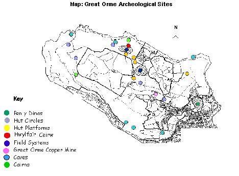

.. contents:: Table of Contents
   :depth: 1
.. sectnum::

Designation
===========

* Scheduled Ancient Monuments: (No.= 6) 
* Regional and Local importance: (Numerous, > 70).

Description
===========
There is much of archaeological interest here. Artefacts spanning from the Upper Paleolithic period to the Bronze Age have been recovered from caves. 
A megolithic burial chamber remains at Llety'r Filiast;
 
The Pyllau Valley site has been excavated to reveal a prehistoric open cast bronze mine. Underground prehistoric workings have been excavated to reveal the largest known Bronze Age mine in Europe; over four miles of tunnels dating between 1860 B.C. and 600 B.C. have been surveyed.
 
A hill fort and hut circles remain from the Iron Age. Cairns, and bronze mines date from the Bronze Age, which the Romans are said to have later exploited. 65 undated, isolated huts and groups of long and round huts have been recorded on the headland. Just one piece of dating evidence exists, a shard of Samian ware. Burial mounds and megalithic tombs, and possibly other remnants in stone exist.

Signs of strip farming and associated settlements and cart tracks from the prehistoric/mediaeval period exist, close to the twelfth century church of St. Tudno.

The industrial history of the Great Orme is dominated by the copper mines. Victorian mineworks leave evidence of a pumping house and associated pits for water (spring) -operated 'brammock rods', to clear the mines of water. Fine underground Victorian mine tunnels exist, with supported roofs. Two quarries exist, which share wildlife, fossil and geological interests (refer to feature: Quarries and Minespoil). 

Remains of WWII artillery school and defence emplacements exist on the N.Western corner of the headland. An early radar station was located on the summit.

*Maps: refer to: Gt Orme Country Park: Archeological Sites on facing page.*

Current condition and status of feature
=======================================

* Total No. of sites: within LACs 
* All archaeological deposits in site: within LAC
* Condition, all sites and their routes: within LAC

Current Status: 

* Favourable Maintained, as of Dec. 2001. Based upon the 2000/2001 survey.

Attributes selected as performance indicators
=============================================

 
Extent
-----------------
* All sites, total number known to exist.
* All archaeological deposits in site; signs of those removed.

Quality/Condition: All sites and their walkways/routes,

* At high risk from erosion.
* Damaged irreparably.
* Obscured.
* Under active threat of severe damage.
* Under active threat of moderate damage.
* Registering continued deterioration (low harm).
* Considered dangerous to visitors.

Attributes and Operational Limits
=================================

Objective statement
-----------------------
Existing archaeological resources will be safeguarded and retained in favourable condition; conflicts with land-use objectives will be reconciled, WHERE:

Extent
-----------------
* All sites, numbers remain or increases at 2000 level.
* Lower Limits: Target level.
* All archaeological deposits in site remain.
* Lower Limits: All attributes = target levels.
* Monitor: extent all sites and archaeological deposits

Quality/Condition
-----------------

All sites and their walkways/routes:

* Target 1: Sites at high risk from erosion: Sites= None by years end, (exception of water/sea erosion).
* Target 2: Damaged irreparably: Sites=None
* Target 3: Obscured: 10% reduction in cover.
* Target 4: Under active threat of severe damage: Sites=None by years' end.
* Target 5: Under active threat of moderate damage: Sites=20% < year 2000
* Target 6: Registering deterioration (low harm): Sites=20% < 2000
* Target 7: Considered dangerous to visitors: Sites=None to remain open. Closed sites to reopen within two years. 
* Lower limits all attributes :=target levels.
* Monitor: Condition all sites and their routes

Management Rationale and Projects
=================================

Policy and Protection
---------------------
Scheduled monuments are protected by law. Sites classified as being of local or district importance will be protected in the same manner. 

Guidelines of the Heritage Management Section of Gwynedd Archaeological Trust.

* Access to underground caves is forbidden unless with the The National Caving Association, which has also published a National Cave Conservation policy (1995) in association with the statutory conservation agencies. 

The Great Orme Copper Mine is under Licensed Private Commercial Management.

General management
------------------
Threats to the overall condition and extent are identified and the sites will be protected from those threats. Threats vary according to the degree of damage threatened, from mild to severe.
 
The favoured approach towards positive management takes into account the archaeological site and all the elements of its landscape.

Parallel land use interests of nature conservation, farming, employment, and rural identity will be complemented where there is room. Archaeological remains, along with a recorded history of past land use, provides guidance for land management. 

Priorities will be set according to the nature of threat a site faces. This includes active or potential threats. Whether a threat is shared by sites, as is low grazing density, is a further consideration. 

Active Leisure pursuits
-----------------------
* Threats vary according to activity. Novel threats may emerge. Rock climbing and caving are self- regulated by club agreements. Currently little damage. Orienteering poses potential threats in hiding targets.
* Orienteering to be permitted with prior agreement only.
* Monitor impact of leisure activity, including access, upon sites.

Erosion of earth banks and walls
--------------------------------
Earth structures may quickly erode, with severe damage.

* Earth structures will be maintained/rebuilt under expert advice.

Drainage/water abstraction from boreholes
-----------------------------------------
Severe damage threatened because of risk of causing soil/strata instability,including damage to caves.

* No drainage or water abstraction to be carried out without prior archaeological consultation 

Removal of archaeological material
----------------------------------
Damage potentially severe. Stone robbing for hardcore or walls may occur by accident and not by design. Repositioning limestone boulders for car parking restriction may affect sites. 

* Development to be supervised,
* Advice to be sought when identifying boulders for parking restriction.

Development and Coastal defence
-------------------------------
Previous housing developments caused severe damage. Planning restrictions in force should prevent this, given sufficient knowledge.

* Expert assessments to be sought, regarding possible development impacts, including those upon the wider archaeological landscape.
* Proposed developments to be monitored. 
* Coastal Protection works will require prior archaeological consultation.

Heavy machinery
---------------
Heavy machinery has the potential to easily cause severe damage to land and structures.
 
* No heavy machinery shall move on the Great Orme without consent.
* Care will be taken with the movement of heavy machinery on the area.

Storage/dumping
---------------
May cause damage. It obscures and devalues the site anyway.

* No materials will be allowed to be put or left upon sites.

Ploughing and Reseeding
-----------------------
Reseeding of Parc farm destroyed ridge and furrow visible in the 1940s. Ploughing damage is severe.

* No land will be permitted change of use, to be ploughed, or cleared for improval and reseeding, without archaeological approval, and then only in accordance with the aims of management of the Gt Orme as a whole. 

Water erosion
-------------
*Threat: severe damage.*

Surface run-off and blow-outs forced the landslides in 1993, following heavy flooding after a great downpour, which caused damage to two sites.

Coastal erosion is active on the south side of the Orme, resulting in the loss of mediaeval remains at Gogarth. 

* Monitor sites of potential blowout.
* Inspect sites of former blowout for stabilisation works.

Vehicle Erosion
-----------------------
Threat: severe damage due to landscape scars and erosion. 

* Refer to Feature: *Recreation; vehicle congestion.*

Path erosion
-----------------------
*Threat: is mild to severe damage.* 

Conflict: in encouraging visitors and conservation, with high visitor numbers, an unknown threshold. It is compounded with vehicle access and erosion. 

Increasing numbers of visitors may present new levels of damage or destabilising erosion. On the other hand, scrub invasion may be kept in check. 

In a few places, footpaths cross archaeological features, causing minor erosion. Concentrations of people at sensitive areas may be deterred, in managing high numbers.

* Trails, footpaths and sites will be monitored for visitor erosion. 
* A central information board will be constructed with alternative sites of interest. 
* Archeological trail leaflets will be made available.
* Roads tracks and footpaths will be designed to avoid areas of archaeological significance.

Bracken, Scrub and Trees
------------------------
Uprooted trees threaten severe damage to strata. Bracken and tree roots can disrupt the strata of sites and dislocate stone. Bracken poses a mild threat in the short term. Cairns and banks provide well-drained environments which correspond to bracken preferences (whose roots penetrate between 0.2m to 0.6m in depth). 

Potential conflict: 

* Trampling of bracken by stock, and grazing of vegetation is preferred to spraying poison including 'Azulux', which is poisonous to orchids and fungi. Furthermore, without nutrient stripping and repeated spraying, the effectiveness of spraying bracken as a long term control is questionable. 

* Scrub management as a valuable wildlife resource may conflict with management for Archaeology. 

Solutions:

* Re-establish grass cover. 
* Trees will be lopped to allow more light to encourage grasses.
* Vulnerable trees will be felled before they fall. 
* Tree planting on the Orme will be assessed for impacts. 
* Woody growth or bracken will be treated without disturbing the ground. 
* Control of scrub will be undertaken, gradually.
* Bracken will be removed, controlled by stock trampling and grazing, and cutting, wherever possible.

Grazing
-----------------------
Archeological earthworks are best maintained under grass cover, which prevents erosion. Controlled grazing is a desirable means of maintaining a grass cover, and removing threats from bracken and scrub. Permanently fenced-of sites will be avoided, unless there is good reason for archaeological conservation purposes. Excessive grazing could cause erosion. 

A recent reduced grazing intensity means that scrub may spread and colonise sites where it once did not. Rank grasses and blackthorn are spreading. Fenced grazing regimes will be used to restore the grass cover.
 
Artificial feed and licking blocks will not be allowed to be used on sites. 
Seek suitable grazing agreements, in conjunction with other grassland and heath objectives.

Animal Burrowing
-----------------------
Many remains are fragile enough to be vulnerable to animal burrowing; subsurface archaeological deposits may be damaged, sites may be destabilised, or disfigured. Field banks are particularly attractive to rabbits, which pose a great threat, should colonisation be allowed. Fox and rat pose a relatively low threat, while badger and mole pose an intermediate threat. 

* Monitor activity of burrowing animals.
* Burrowing activity will be kept under control.

Metal detecting
-----------------------
Archeological significance of unreported and translocated finds is lost. Digging for finds may cause damage. It is an offence to use metal detectors on a Scheduled Ancient Monument without prior consent from the Secretary of State for Wales to whom written application must be made.

* Metal detecting will be monitored; local prohibition will be enforced.

Lack of maintenance to buildings
--------------------------------
Un-maintained, old buildings with bricks/stone and mortar will quickly deteriorate, beyond repair. 

* Maintain buildings in good condition
* Seek expert advice on repair
* Repair/renovate carefully and sympathetically 

Use of structures including caves
---------------------------------
Empty structures may be used for recreational, cultural or religious purposes.
The archaeological marks and deposits within the caves may be damaged. 

Visitors may be discouraged; access to caves is dangerous. On the other hand, users are not known to intend damage, and may be good guardians. All users are not the same. Forbidding use may be impossible.

Conflict exists: 

* The caves may have always been used by local people, and access is free. Caves are limited in availability, and their use may not and perhaps should not, be denied. Otherwise, permission to build a new cave may have to be be found, or goodwill lost. Goodwill is important factor in conservation. 
* The geological heritage may be threatened by building a new cave. It is unlikely that funds for the work could be easily found. 

Solutions:

* Discourage public entering caves along dangerous routes.
* Permit easy access to one cave, following excavation.
* Ensure structures are safe, or issue warnings.
* Co--operate with local/cultural use, extend conservation practices. 

Safety of archaeological remains
--------------------------------
Artefacts may pose threats to the health and safety of the public, who have free access. Their stability and access routes can pose dangers.

* Monitor all sites and routes for danger.

  

