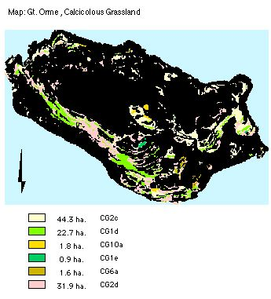

.. contents:: Table of Contents
   :depth: 1
.. sectnum::

Designation
===========
Grade I SSSI, Candidate SAC, UK BAP Key Habitat status (1995).

Size:

* 108 ha. 	(note: area discrepancies exist from GIS calculations and ground surveys. This is expected due to ground undulations missed by GIS.

Description
===========
Lowland calcareous grasslands are developed on shallow lime-rich soils generally overlying limestone rocks, including chalk. The semi-natural calcicolous grassland lies unfenced, mainly on sloping ground, adjoining lowland heath, scrub and woodland, dense bracken, and other grassland types. Generally on the Gt. Orme, strongly calcicolous grassland CG1d and CG2d lie south facing on the steeper slopes. More mesophytic CG2c and CG6 lie on gentler slopes. CG10 lies on moderate, north facing slopes. CG2 sub-communities are extremely rare in Britain.

Current condition and status of feature
=======================================
* Total Area: 108 ha.
* Frequency of constant and frequent species: within LACs.
* Species indicative of change: within LAC
* Species indicative of quality: within LAC

Current Status:

* Favourable Maintained, as of December 2001. This assertion is based upon the 2000/2001 survey.

Attributes Selected As Performance Indicators
=============================================
The calcicolous grasslands will be considered to be in favourable condition provided the following attributes are within LACs:

Extent
-----------------

* All calcicolous grassland
* Component plant communities (NVC classification); Largely governed by edaphic and climatic conditions. These are relatively static factors and so no area limits need to be set.

Quality
-------
* All sub-communities (NVC): These are likely to remain fairly consistent under continued grazing  pressures. Quality will be confirmed by presence of the range of typical species within each sub-community types, which are:

* CG1 Festuca ovina- Calluna vulgaris, 23 ha .
* CG1d: Helianthemum canum sub-community .
* CG1e: Koeleria macrantha sub-community.
* CG2: Festuca ovina-Avenula pratensis, 77 ha
* CG2d Dicranum scoparium, 	32 ha.
* CG2c  Holcus Lanatus- Trifolium repens, 44ha.
* CG6 : Avenula pubescens grassland,  6 ha.
* CG6a: Dactylis glomerata- Briza media co-dominant sub-community
* CG10: Festuca ovina- Agrostis capillaris - Thymus praecox, 2 ha.
* A minimum cover of bare ground (soil or rock), lichens and bryophytes.
* A target set of associated vegetation species of high conservation value; i.e. according to Red Book data.
* Continued downward trends for the listed species may be early indications of a negative factor's influence, effects of management strategy.
* A target set of vegetation species which have little power to spread. Plants which are largely restricted to centuries-old turf, having little power to spread.

Attributes and Operational Limits
=================================

Objective statement
-------------------

* To maintain the calcicolous grassland a rich herb sward and its full range of biodiversity WHERE,

Extent
----------------------------

All grassland:

  * Total area remains at the target level.
  * Target level: 108 ha. of 323 ha (33% of SSSI)
  * Upper limit: None set
  * Lower limit: 97 ha. (30 % of SSSI)
  * A 10% decline in extent is permitted only if it is lost to a grassland community, or 3% to dense scrub.

Monitor/surveillance:

* Extent of NVC plant communities, by aerial and ground surveys, fixed-point photography, continuously by eye.

Condition: All existing all component NVC plant communities:

* Targets:  The following conditions are met in 95% by extent
    * Lower limit: 70%
    * Upper limit: none set.   
                                  

CG1 Festuca ovina- Calluna vulgaris
-----------------------------------
British Xerobromion grassland  

Size: 23 ha.

*Constant species:* 

* Calluna vulgaris. Dactylis glomerata, Festuca ovina, Hieracium pilosella, Lotus corniculatus, Plantago lanceolata, Sanguisorba minor, Thymus praecox.

CG1d: Helianthemum canum sub-community

* Target level: None set
* Upper and lower limits: As stated in NVC floristic tables
* Monitor:
    * frequency of Festuca ovina, Calluna vulgaris and Helianthemum canum

CG1e: Koeleria macrantha sub-community

* Target level: None set
* Upper and lower limits: 	As stated in NVC floristic tables
* Monitor:
    * frequency of Festuca ovina, Calluna vulgaris and Koeleria macrantha,

CG2: Festuca ovina-Avenula pratensis
-------------------------------------
British Mesobromion grassland:

* Size: 77 ha.

CG2d Dicranum scoparium

* Size: 32 ha.
* Target level: None set
* Upper and lower limits:   As stated in NVC floristic tables
* Monitor:
    * frequency of Festuca ovina, Avenula pratensis and Dicranum scoparium

CG2c  Holcus Lanatus- Trifolium repens

* Size: 44ha.
* Target level: None set
* Upper and lower limits: 	As stated in NVC floristic tables
* Monitor
    * frequency of Festuca ovina, Avenula pratensis, Holcus Lanatus and Trifolium repens.

CG6 : Avenula pubescens grassland
-----------------------------------

CG6a: Dactylis glomerata- Briza media co-dominant sub-community,

* Size: 6 ha.
* Target level: None set
* Upper and lower limits: 	As stated in NVC floristic tables
* Monitor 
    * frequency of Avenula pubescens and Dactylis glomerata- Briza media co-dominants.

CG10: Festuca ovina- Agrostis capillaris - Thymus praecox grassland
----------------------------------------------------------------------

CH10a: Trifolium repens-Lazula campestris sub-community, 

* Size: 2 ha..
* Target level: None set
* Upper and lower limits: As stated in NVC floristic tables
* Monitor frequency of Festuca ovina, Agrostis capillaris, Thymus praecox, Lazula campestris.

* Indicator set 1: associated plants as indicators of changes:
  * Upper limit: None Set
  * Lower Limits: None set.
  * Monitor:
  
    * frequency of : Scabiosa columbaria, silene nutans, veronica spicata, Potentilla neumanniana, Hypochocris maculata, Cerastium pumilum, Helianthemum canum.

* Indicator set 2: vegetation species which have little power to spread
  * Upper limit:    None set
  * Lower limits:   Continued annual flowering of 3 out of 4 species at 50% current frequency.
  * Monitor:
  
    * frequency of Hippocrepis comosa, Thesium humifusum, Gentian amerella and Polygala calcarea.

Bare ground
-----------
Is 10% cover, i.e. soil or rock, lichens and bryophytes

Monitor:

* Extent of bare ground in samples.

Management Rationale and Projects
=================================

Grazing Trials
--------------
The continued presence of calcicolous grasslands, and Xerobromion especially, is in part dependent upon the existing exposed conditions. Almost continuous unfenced sheep grazing prevents succession to woodland, so sheep grazing is to be continued, in the e short term. Effects of grazing depends on method; rotational, continuous, seasonal or spasmodic; grazing animal and, intensity.  

Summer grazing by cattle or ponies enhances structural diversity, and so supports species that require diverse habitats, as well as increasing overall biodiversity. It is better for invertebrates and poaching the ground, than grazing by sheep. Cattle may be difficult to manage with open visitor access; then ponies are to be preferred. Milking cows especially have educational value also. Native pony breeds are good at opening up rank vegetation and browsing scrub that cattle and sheep have left . Cattle grazing can be used to reduce the dominance of Upright Brome and False Oat grass on grassland.

Sheep bite close to the ground which, with low densities, can result in combination of under-and over-grazing, to produce varied sward structure which is good for invertebrates, including many warmth loving species.

Adaptive trials (variations in grazing)
.......................................
* Initiate with aims to better determine optimal grazing levels for sward structure and biodiversity.
* Mixed grazing regimes will be tried and grazing variations monitored .

Monitor/Surveillance Projects:

* Conduct local research to establish past stock grazing history on the Gt. Orme, including cattle and horses.
* Initiate adaptive trials of seasonal and mixed-grazing where existing stone walls allow.
* Explore possibility of summer pony trekking with local enterprise agencies, in conjunction with restorative grassland and heaths.
* Explore long term possibility keeping a small number (two to four) hardy milking cows with the farms, which might serve the local community.

Grazing intensity and succession to scrub
-----------------------------------------
At high grazing levels, except on tussocky grassland, sheep produce a tight springy sward, poor for invertebrates, and which can encourage bracken invasion (Pteridium aquilinum). Ponies and cattle can open up rank vegetation and browse scrub. Cattle grazing can be used to reduce the dominance of Upright Brome and False Oat grass on CG and break up litter. 

Signs of succession will be monitored, and controlled by grazing. Hill breeds can cope with more coarse vegetation, better at preventing succession, and cope better with exposed conditions throughout the year. Sheep grazing produces the short conditions preferred by Stone Curlews, Woodlarks and Wheatears. Sheep grazing at current levels will be continued in the short term. At night sheep often congregate on areas of short sward, causing nutrient enrichment which may be harmful to flora, and lead to succession of rank grasses, avoided by sheep.

Operational limits:

* Target 1: Maintain limits to grass height
    * Upper limit:  12 cm.
    * Lower limit:  2 cm
* Target 2: No decline in current stocking levels
* Target 3: No additional rank swards, unless specified as borderzones.
* Target 4: No additional spread of bracken and over-tight swards.
* Target 5: No new stands of dense scrub exceeding 10 m across.
* Target 3: No existing small stands of scrub will exceed 1 ha.

Monitor/Surveillance:

* Congregation of sheep for areas of nutrient enrichment, with changing plant composition.
* Height of grass.
* Ensure compliance with existing stocking levels.
* Distribution and density of Tor-grass, (Brachypodium pinatum), Upright Brome (*Bromopsis erecta*) and False Oat-grass.
* Spread of bracken in tight swards.
* Overall structural mosaic.

Projects:

* Reduce dominant rank grasses with targeted grazing by cattle or ponies, with temporary fencing.
* Control spread of bracken by relaxing sheep grazing in patches by use of electric fencing or flexi-netting. 
* Cut bracken, trample by cattle and ponies. (refer to feature: Bracken)
* Liaise with owners/occupiers, concerning grazing agreements.

Grazing by wild animals
-----------------------

Rabbits
.......
Rabbits make significant contributions on grassland grazed by other stock, feeding only within 30 m boundary zones of cover, and concentrating on areas of short vegetation, ignoring rank swards. These are suitable conditions for butterflies. The actions of rabbits and moles (*Talpa europae*) in disturbing the soil can help maintain continuity and diversity. Rabbits can be be beneficial on grassland that receives little under cutting, or on sheep grazing regimes, and can be beneficial to invertebrates on thin, sandy, acid or calcareous soils. Their populations fluctuate, large populations overgraze and will be controlled.

Goats
.....
Their feeding preferences are not well known. They are able to browse scrub, and consume coarse grasses, such as Tor-grass (*Brachypodium pinnatum*). Goats may help to keep down any invasives which seed in the protective company of juniper. The goats potential for benefit and harm may depend upon population density, and their contributions will be precisely determined. Their numbers have increased substantially in recent years.

Operational Limits: Non set.

Monitoring/Surveillance:

* Monitor grazing habits by fixed-point (hidden) camera, and observation of vegetation.
* Monitor feral Goat feeding habits to be determined by faecal analysis.
* Monitor populations.
* Monitor rabbit feeding areas.

Projects

* Seek the continual advice of a local warrener
* Control populations
* Ensure adequate levels of cover for rabbits.

Erosion
-------
 Sheep cause little trampling except on very loose soils. Where trampling by visitors and livestock is excessive, flowering herbs become lost and are replaced by invasive coarser grasses such as Yorkshire Fog (Holcus lanatus) and White Clover (Trifolium repens). Trampling on slopes in winter or wet conditions is especially erosive. It will destroy nests and young birds in spring. Vehicle Erosion can scar grassland. Thus motorcycle scrambling, is prohibited and will be guarded against.

Operational Limits:

* Target 1: No additional trampling; permit recovery.
* Target 2: No new footpaths, no increase in footpath width.

Monitor/surveillance:

* Level of erosion of vulnerable calcicolous grasslands, using quadrats.
* Trails and footpaths will be monitored for visitor erosion.

Projects:

* Casual parking of cars will be prevented.
* Restrictions will be enforced.
* Restrict visitor access on eroded areas, livestock in areas of loose soil, particularly in wet months.
* Encourage visitors to follow waymarkers.
* Restrict visitor access to vulnerable/eroded areas on slopes by extending walls,or roping off .
* Employ the restoration areas in the educational and interpretative processes.

Non-native Invasive plants
--------------------------
 In certain areas the grassland has been invaded by non-native shrubs and trees including *Cotoneaster integrifolius*, *C. horizontalis, C. simonssi,* Strawberry Tree (*Arbutus undo*), Buckthorn (*Rhamnus alaternus*), Corsican Pine (*Pinus radiata*) and Scots Pine (*P. sylvestris*). These alien species, in particular bird sown *C. integrifolius*, have smothered some areas and the grassland communities and rare species; Xerobromion grasslands are considered to be under threat being smothered.

Operational Limits:

* Target: complete elimination
* Upper limit: Target level
* Lower limit: Present level

Monitor/surveillance:

* Distribution, especially exotic Cotoneaster spp.

Projects:

* Community education to contain the bird sown dispersal of Cotoneaster spp. by seasonal de-budding, and replanting with native alternatives in local residential areas.
* Eradication by containment of dispersal and uprooting.
* Research restorative grazing regimes where invasive species are present, possibly with ponies.

Artificial fertilisers, pesticides
-----------------------------------
The grasslands are nutrient poor, and fertilisers would be a threat. Pesticides may poison vascular plants, bryophytes or fungi. Local use is forbidden in the Bylaws. The Orme is fortunate in lying exposed, and isolated by the sea, minimising risks of spray carryover.

Operational Limits:

* Target: None used within 10 kilometres.
* Upper limit: As present
* Lower limit: Target level.

Monitor/surveillance:

* Use of artificial fertilisers by local farmers, (none as per agreement).

Projects:

* Campaign for farmers in the nearby district to join sympathetic land-use schemes.

Supplementary feeding
---------------------
Supplementary feeding of animals causes local nutrient enrichment, to the detriment of grassland by encouraging invasive competitive grasses.

Operational Limits:

* Target: No supplementary feeding in situ
* Upper and Lower limit: None set.

Monitor/surveillance:

* Use of supplementary feeds in situ.

Projects:

* Obtain information and consult with farmers, seeking co-operation.

Fly-tipping
-----------
Adjacent habitations spur fly tipping from time time. Damage is to plants. The activity is illegal. Damages and fines may be imposed.

Operational limits: none set.

Monitoring/Surveillance:

* Monitor land for fly tipping.

Projects:

* Publicise any incidents in local newspapers in order to discourage repetition.

Ant-parasitic drugs
-------------------
Concerns for persistent use of Ivermectin, anti-parasitic drugs, excreted in dung; residues can reduce insect fauna. Alternative drugs for internal nematode parasites exist (Madsen et al., 1992).

Operational Limit:

* Target:		No use of Ivermectin
* Upper limit:	None set
* Lower limit:	None set.

Monitoring/Surveillance:

* Monitor use of ant-parasitic drugs used by local farmers.

Projects:

* Bring notice of concerns to local farmers, and report the existence of alternatives.

Management Options
==================
* A3:   Active management to maintain calcicolous grassland.
* E4:   Open access. Request walkers stay on paths.
* MS00/01:  Manage species, tree/shrub- Control Exotic Cotoneaster.

