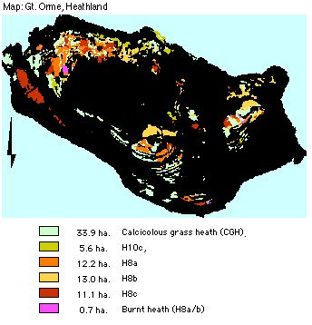

.. contents:: Table of Contents
   :depth: 1
.. sectnum::

Designation
===========
* Grade I SSSI, Candidate SAC, UK BAP/LBAP Key Habitat status (2001)
* EU Habitats Directive Annex 1 types; Dry heaths (all sub-types) Southern Atlantic wet heaths

Size:

* Lowland Heath; 48 ha.
* Calcicolous grass Heath mixture: 33.9 ha.

Description
===========
 The heathland on the Great Orme is of international importance occupying approximately one quarter of the site. Traditional heathland was once covered by limewoods, hazelwoods or oakwoods at 6 000 BC. Some Mesolithic clearings develop into heath. Heaths may support rich assemblies of plants, insects, birds and reptiles.

About one third of the heathland is species-rich, of short stature (35 cm height or lower), another third of the heath is of intermediate height (20-45 cm) and less species-rich,, supporting herbs such as Tormentil and Harebell indicative of more acidic conditions possibly due to leaf litter accumulation and leaching. A third area is species-poor heath approaching 50 cm in height, entirely dominated by dense stands of the three dwarf shrubs.

A transitional calcicolous grass heath (CGH) community occurs. It comprises grassland similar to the short closed sward of the species-rich Sheep's Fescue (Meadow Oat-grass), grassland and a high proportion of Heather and Bell Heather, with the absence of Western Gorse.

Current condition and status of feature
=======================================
* Total area: 42 ha.
* Frequency of constant and frequent species (all communities): within LACs
* Species indicative of change: within LAC
* Species indicative of quality: within LAC

Current Status:

* Favourable Maintained as of December 2001.  This assertion is based upon the 2000/2001 survey.

Attributes selected as performance indicators
=============================================
The heathland will be considered to be in favourable condition provided the following attributes are within LACs:

Extent
-----------------
* Extent of heathland and of CGH.
* Component plant communities (NVC classification)
* The extent and distribution of heathland type and CGH are largely governed by edaphic and climatic conditions. These are relatively static factors and therefore no area limits need to be set.

Quality
-------
All sub-communities (NVC):

* These are likely to remain fairly consistent under continued grazing  pressures. Quality will be confirmed by presence of the range typical species within each sub-community type, which are:

    * H8a	Ulex gallii and Calluna vulgaris without other indicators
    * H8b	Danthonia decumbens is frequent with Calluna vulgaris, Ulex gallii heath
    * H8c  Sanguisorba minor with Calluna vulgaris, Ulex gallii heath
    * H10c 	Festuca ovina and Anthoxanthum odoratum is frequent within Calluna vulgaris, Erica cinerea dwarf heath.
    * CGH	a mix of dwarf shrubs and chalkland grassland species 

All communities, growth phase of Calluna V

* A set of associated herbacious species of value as indicators of change.
* All communities, growth phase of Calluna vulgaris:.
* A set of associated plants as indicators of change.

Attributes and Operational Limits
=================================

Objective statement
-------------------
To maintain the Lowland Heath and CGH in favourable condition, with a full range from bare ground and pioneer Calluna through to mature and degenerate phases, WHERE:

Extent
-----------------
Total heath area remains at the target level:

* Target level:	42 ha. (13% of SSSI)
* Upper limit:	None set.
* Lower limit: 	38 ha (12% of SSSI). A 10% decline in extent is permitted only if it is lost to a grassland community, or to dense scrub.

Total CGH area remains at target level:

* Target level:	33.9 ha. (10.4% of SSSI)
* Upper limit:	None set.
* Lower limit: 	30.5 ha (9.4% of SSSI)
* Tolerate expansion or change of 10% cover to calcicolous grassland or heathland only.

Monitoring Projects:

* Monitor extent of NVC communities, and CGH, By aerial /ground survey and GIS interrogation, continuously by eye.

Quality
-------
Following management by burning or mowing, in short time species such as nettles and thistles may develop. The following objectives therefore apply to any areas of heath that have not been burnt or mown for five years:

Targets: all component heathland NVC communities and CGH

* Lower limit: 90%
* Upper limit: none set.

H8a Ulex gallii, Erica cinerea and Calluna vulgaris
---------------------------------------------------
Without other indicators.

* Upper limit and Lower Limit: As stated in NVC floristic tables.
* Monitor:

    * Ulex gallii, Erica cinerea and Calluna vulgaris.

H8b	Danthonia decumbens
---------------------------
Frequent with Erica cinerea, Calluna vulgaris, and Ulex gallii.

* Upper limit and Lower Limit: As stated in NVC floristic tables.
* Monitor: 

    * Danthonia decumbens is frequent with Erica cinerea, Calluna vulgaris, and Ulex gallii.

H8c  Sanguisorba minor with Erica cinerea, Calluna vulgaris, and Ulex gallii
----------------------------------------------------------------------------
* Upper limit and Lower Limit: As stated in NVC floristic tables.
* Monitor:

    * Sanguisorba minor with Erica cinerea, Calluna vulgaris, and Ulex gallii.

H10c 	Festuca ovina and Anthoxanthum odoratum is frequent within Calluna vulgaris, and Erica cinerea
----------------------------------------------------------------------------------------------------------
* Upper limit and Lower Limit: As stated in NVC floristic tables.
* Monitor: 

    * Festuca ovina and Anthoxanthum odoratum, frequency within Calluna vulgaris, and Erica cinerea.

CGH	Calcicolous Grass Heath
-------------------------------
* Upper limit and Lower Limit: As stated in NVC floristic tables.
* Monitor:

    * Festuca ovina, Calluna vulgaris, and Erica cinerea, with the absence of Western Gorse

All communities, growth phase of Calluna vulgaris
-----------------------------------------------------

There is limit to C. vulgaris in the degenerate growth phase.

* Target level: 6% in degenerate stage (2.5 ha).
* Upper limit:  6% in degenerate stage
* Lower Limit:  4% in degenerate stage
* Monitor:

    * Growth phases of calluna in each compartment.

Indicator set: associated plants as indicators of change:

* Target level: None set
* Upper limit:  None set
* Lower limits: Continued annual flowering.
* Monitor:

    * Frequency and distribution of: Helianthemum nummularium, Thymus praecox, Lotus corniculatus, Potentilla erecta, Campanula rotundiflora, Lobelia urens, Viola canina, Viola lactea.

Management Rationale and Projects
=================================

General Management of Calluna
-----------------------------
There is a concern that some areas are in decline in the regeneration and growth of Calluna, brought about through under-management and uncontrolled burning. Heaths have a limited lifespan, and must be rejuvenated through cutting, burning or grazing combinations. Heaths on the Gt. Orme have been maintained through the continual practice of low intensity grazing. Generally, heather and bracken were traditionally cut for use, which also removed nutrients. Cutting or burning in rotated patches can help prevent conversion of species-rich heath to species-poor heath through nutrient build up. Management will aim to maintain a poor nutrient status, by preventing build up.

A full range from bare ground and pioneer Calluna through to mature and degenerate phases is required in order to preserve the full spectrum of heathland species. The pioneer phase of Calluna v. is 3-10 years, building 7-13 years, mature phase 12-30 years, degenerate phase over 30 years.

Compartmentalising the heathland will assist this task. It will also assist with heterogeneous practices to maintain conditions for a wide range of fauna and flora. An appropriate long term plan of 40 years rotation will be developed, in map form, with attention to monitoring factors of a heterogeneous regime. The proposal will introduce an element of adaptive research and surveillance into management and recovery.

Projects:

* Research past heathland management.
* Identify and map current growth phases of heath.
* Compartmentalise, the heathland with zones for rotational management of four distinct phases of Calluna growth, taking into account existing growth stages.
* Block, size number shape and rotation will be identified within a long term plan of 40 years rotation.
* Repair and extend walls in stone or, consider post and rail fences.

Burning and cutting
-------------------
Calluna regeneration by seed amongst degenerate plants is important, but is slow, leaving bare ground and may allow invasion. It is because of this that short burning rotations have been advocated to keep Calluna in the early to mature phases. Burning has been prohibited by the Local Authority. Skilled assistance is required to manage and plan burns. Firebreaks may be created by cut or rotovated strips.

On older Calluna burning frequently kills plants. Alternatively, single-cut forage-harvesters cut cut and remove cuttings. On rougher ground, swiping or flailing may be only practicable method.

Projects:

* Identify areas of calluna that would benefit from a first round of burning.
* Campaign locally and within the Management Committee, for limited burning of heath.
* Identify areas where cutting is is feasible and desired

Rotovation
-----------
 Rotovation of old Calluna, after stripping litter to avoid nutrient build up, aids seed regeneration and creates areas of open ground.The practice must be restricted to 7-31 May to minimise risk to hibernating or egg laying reptiles. Suitable areas may be used as firebreaks for burns. Sites for rotovation must not contain archaeologically valuable old field sites; they will be damaged by rotovation.

Projects:

* Identify areas of old calluna that may be useful as firebreaks.
* Identify small areas of old calluna that may be regenerated by rotovation.

Grazing Intensity
-----------------
Undergrazing does not maintain Calluna in the building phase, allowing it to over-mature. Calcicolous plants become overwhelmed by coarse grasses, and succession to woodland. Relaxation of grazing intensity favours litter accumulation and possibly development of more complete heath and shrub cover.
If more than 30-40% of the annual growth is grazed, it may be replaced by poor-species grassland or Bracken.

Operational Limits:

* Target 1: Limit the amount of annual growth that is grazed
* Upper limit: no more than 35% of the annual growth is to be grazed.
* Lower limit: no less than 20% of the annual growth is to be grazed in each compartment.

Monitor: 

* Growth increments of calluna.
* Grazing pressure will be monitored in situ. for zones of overgrazing and undergrazing by animal selective feeding.
* Existing stocking levels.
* Population of goats, annually.

Projects: 

* Limit grazing mainly to autumn and winter; liaise with farmer/landowners.

Grazing season
--------------
Calluna is susceptible to grazing damage during Sept-Oct and is least vulnerable in winter. Winter grazing favours wildlife.

Projects:

* Seek agreement with farmer to graze Calluna mainly in the winter, turning stock to grass in summer.
* Examine walls and possibilities of compartmentalising heath and grassland.

Grazing animals
---------------
Hill breeds can cope with more coarse vegetation, and cope better with exposed condition throughout the year. Moderate trampling by ponies or cattle of degenerate stands favour Calluna regeneration by regrowth layering and seedling.

Monitoring/Surveillance:

* Breeds of sheep.
* Conversion of heath to grassland or bracken by sheep grazing.

Projects:

* Graze ponies to increase poaching on soils and remove rank grasses and purple moor grass (Molinia caerulea).
* Liaise with local farmers whom may provide hill cattle for restorative grazing episodes.
* Identify old leggy stands of calluna, and restore by grazing ponies within temporary fencing.

Wild Animal grazing
-------------------
Rabbits tend to graze only within 30 m. from cover. Rabbits create a mosaic of micro-habitats including areas of disturbed soil they can create Lichen-rich heath with many annuals and winter annuals. Effective in suppressing regeneration of Gorse.
Goats are useful as they browse Birch and Pine, and Purple Moor Grass. They may kill old leggy bushes of Calluna  Goats may ring bark young Pine and Birch.

Operational Limits: None set

Monitoring/Surveillance 

* Wild animal grazing habits (rabbits and goats), by fixed-point (hidden) camera.
* Goats for their possible feeding on old calluna.
* Rabbit predators.

Projects:

* Provide cover for rabbits (refer to factor 7. Mature stands for flora and fauna).

Mature stands for flora and fauna
---------------------------------
Grazing will also be excluded from some areas to allow development of tall untrampled Calluna, to provide habitat for reptiles and ground-nesting birds. Mature stands of heather provide thick litter, mosses and lichens, Cover, feed, temperature and humidity for reptiles.

 In the absence of a shepherd, wall extension is required, in stone, post and rail, or temporary fences.

Projects:
* Calluna which is left to over-mature, will be separated to minimise loss through accidental fire, by rotovated strips.
* Two or three strips of tall calluna to be left untrampled by fencing off (total = 2.5 ha.)
* Examine possibilities of (re)introducing shepherding on the Great Orme.

Scrub and trees
-------------------
Patches of scrub and scattered trees are also an integral part of heathland, though without management these spread to the detriment of the open heath. Control of their spread is necessary in areas not subject to burning or cutting, or with low grazing levels.

Nightjars will occur where bracken and scrub forms a mosaic with lowland heath. Birch is valuable, as it particularly supports invertebrate fauna, and its mature roots of scattered trees serve as passage and hibernation of reptiles. Different species are associated with scrub of different ages, others specialise on isolated trees (Kirby, 1992). Sheep may graze Birch, and declining stock levels may permit an increase of birch scrub.

Operational limits:

* Target 1: 	Scattered birch trees limited to 3 per ha.
* Upper limit: 	3 per ha.
* Lower limit: 	1 per hectare
* Target 2: 	Dense Scrub is to be limited to 1% in open heath.
* Upper limit: 	1% in open heath
* Lower limit: 	0.3%.
* Target 3:		There will be no new stands of dense scrub exceeding 10 m across.
* Upper limit:	As for target.
* Target 4: 	No existing small stands will exceed 1 ha.
* Upper limit:	As for target.
* Lower limit: 	None set.

Monitor/Surveillance: 

* Distribution of Purple moor grass
* Encroachment of trees, and shrubs for density and species.
* Spread of scrub frontier.
* Goat browsing of emergent scrub.

Projects: 

* Leave isolated birch and scattered scrub; protect with guards if necessary.
* Coppice Birch on 15 year rotation.
* Manage emergent scrub by cattle/pony browsing or cutting sections in rotations of 15 years.
* Bracken/scrub mosaics to be encouraged on borderzones of heath.

Dense Bracken invasion
--------------------------
Bracken may invade burnt or overgrazed heath. Young bracken is able to colonise base-rich ash. Existing dense stands may be cut, trampled or grazed to control spread. Deep litter removal;/nutrient depletion is advisable following cutting, or nitro-filous species such as Yorkshire Fog, Wavy-Hair Grass, False Oat Grass and Rosebay Willow Herb may establish themselves.

Operational limits:

* Target 1:		There will be no new stands of bracken.
* Target 2: 	Dense Bracken is to be allowed no extension to its front.
* Upper limit: 	No extension of bracken fronts.
* Lower limit: 	None set.
* Target 3: 	Smaller stands of bracken will not exceed 1 ha.

Monitor:

* Bracken

Projects: 

* Control invasive bracken by cutting twice annually, when not burning.
* Control invasive bracken with stock (ponies or cattle) for restoration trampling.
* Strip deep litter accumulation.

Non-Native Invasive species
-----------------------------
Control of invasive vegetation, particularly non-native cotoneasters and rhododendron.

Operational Limit:

* Target: complete elimination
* Upper limit: Target level
* Lower limit: Present level

Monitoring & Projects:

* Monitor presence of invasive species
* Control invasive species

Atmospheric pollution and climate change
------------------------------------------
Air pollution increases nitrogen concentration in rain, and thus nutrient enrichment, Leading to replacement by grassland; e.g. Wavy-hair Grass (Deschampsia flexuosa), especially on heathland adjacent to roads.

Monitor/Surveillance:

* Volume of motor vehicles.
* Idling engines.

Erosion
---------
Areas of heath are prone to trampling and compaction by visitors. Fences may protect eroded areas from further damage and permit recovery. Use of existing accepted walkways limits damage.

Operational limits: 

* Target:   No additional trampling of heath. Existing areas to be allowed to recover.
* Upper limit:  As present
* Lower limit:  Target level

Monitoring/Surveillance:

* Monitor level of erosion of heath community.

Projects:

* Erect fences to protect existing badly eroded areas.

Illegal and accidental burning
------------------------------
These may lead to uncontrolled and over-frequent burning, and so lead to a decline. Uncontrolled burning is dangerous to fauna, and to old heather, causing reversion to grassland, or domination by Ulex Gallii.

Operational limits:

* Target: No illegal fires on heathland.
* Upper limit:	No fires.
* Lower limit:	No fires

Monitoring/Surveillance:

* The heathland will be patrolled by staff on Halloween, as a deterrent.
* heath for fires.
* areas of mature Ulex Gallii

For the following four threats and their Management, refer to Feature: Calcicolous Grassland, Threats: 3-6, which equally apply here.

* Artificial fertilisers
* Ant-parasitic drugs
* Supplementary feeding
* Fly-tipping

.. image::  ../images/pesticide.jpg

Management Options
==================

Continuous:

* A3 Active management to maintain and regenerate heathland, including initiating rotation of burning.

Access: 

* E4: Open access. Request walkers stay on paths.

