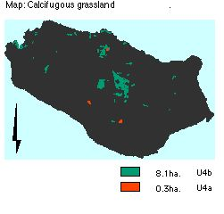

.. contents:: Table of Contents
   :depth: 1
.. sectnum::

Designation
===========
* Grade I SSSI, Candidate SAC, UK BAP Key Habitat status (1995).

Size: 8.4 ha.

Description
===========
Lowland acid grassland, managed as pasture, on nutrient-poor, free-draining acid soils with (pH 4 to 5.5) overlying superficial deposits. They are dominated by Sheeps' Fescue and Common Bent (*Agrostis capillaris*), with some acid loving plants such as Tormentil (*Potentilla erecta*), and without the herbs typical of the calcicolous grasslands. Dwarf shrubs such as heather Calluna vulgaris and bilberry *Vaccinium myrtillus* can also occur but at low abundance. Acid grassland is variable in terms of species richness .

Many of the invertebrates that occur in acid grassland are specialist species which do not occur in other types of grassland.

Current condition and status of feature
=======================================

* Total Area: 8.4 ha.
* Frequency of constant and frequent species: within LACs.
* Species indicative of change: within LAC

Current Status: 

* Favourable Maintained, as of December 2001. This assertion is based upon the 2000/2001 survey.

Attributes selected as performance indicators
=============================================
The calcifugous grassland will be considered to be in favourable condition provided the following attributes are within LACs:

Extent, All calcifugous grassland
---------------------------------
 Component plant communities are largely governed by edaphic and climatic conditions. These are relatively static factors and so no area limits need be set.

Quality
-------

Target: All sub-communities (NVC): 

* These are likely to remain fairly consistent under continued grazing pressures. 
* Quality will be confirmed by presence of the range of typical species within each sub-community type, which are:
    * U4a: *Festuca ovina- Agrostis capillaris-Galium saxatile* grassland, 0.3 ha.
    * U4b: *Holcus lanatus- Trifolium repens* sub-community, 8.1 ha.
        * Acidity largely governed by edaphic conditions, so no limits need be set.
        * A set of associated plants as indicators of change.
        * A minimum cover of bare ground (soil or rock), lichens and bryophytes.     

Attributes and Operational Limits
=================================

Objective statement
-------------------
To maintain the calcifugous grassland with its typical plants in favourable condition, WHERE:

Extent
-----------------
All calcifugous grassland.

* Total area remains at the target level.
* Target level: 8.4 ha. of 323 ha
* Upper limit: None set
* Lower limit: 7.6 ha.
* A 10% decline in extent is permitted only if it is lost to a grassland or heath community, or 3% to existing dense scrub.

Monitor/surveillance:

* Extent of calcicolous grassland.

Condition
--------- 

All existing plant communities.

* Target:	The following conditions are met in 95%
* Lower limit: 70%
* Upper limit: none set.

U4a: Festuca ovina- Agrostis capillaris-Galium saxatile grassland
--------------------------------------------------------------------

Size, 0.3 ha.

* Target level: None set
* Upper and lower limits: 	As stated in NVC floristic tables
* Monitor frequency of Festuca ovina- Agrostis capillaris-Galium saxatile

U4b: Holcus lanatus- Trifolium repens sub-community
------------------------------------------------------------------

Size, 8.1 ha.

* Target level: None set
* Upper and lower limits: 	As stated in NVC floristic tables
* Monitor frequency of Holcus lanatus- Trifolium repens

A set of associated plants as indicators of change:

* Limits: none set
* Monitor frequency of:

    * *Potentilla erecta. Rumex acetosella, Deschampsia flexuosa, Vaccinium myrtillus, Agrostis curtisii*.

There is a minimum cover of bare ground: soil or rock, lichens and bryophytes, of 10%

Monitor:

* Extent of bare ground in samples.

Management Rationale and Projects
=================================
At present, almost continuous unfenced sheep grazing prevents succession to woodland scrub, and will continue. Relaxed grazing may lead to changes towards successionary species. We shall maintain the typically close-cropped sward, by grazing. The acid grassland exists in close association with lowland heathland and calcicolous grassland, and it is well advised that acid grasslands are taken into account during implementation of their plans.

1 - 8. Calcicolous Grassland Projects
-------------------------------------

The feature Calcicolous Grassland Management Rationale and Projects 1-8 are relevant, and refer equally to Calcifugous grassland. The one exception is monitoring the succession of rank grasses (Tor-grass, Upright Brome and False Oat-grass), which is expected perhaps, to follow a different course.

Burning
---------
Acid grasslands can have a high cover of bryophytes and parched acid grassland can be rich in lichens. Burning of these areas will be guarded against.

Monitor/Surveillance Projects:

* Guard against burning

Litter stripping
----------------
Litter stripping may counteract acid conditions, and will be prohibited.

Monitor/Surveillance Projects:

* Prohibit litter stripping

Surveys of rare plants
---------------------------------
Detailed surveys of rare vascular plants shall be continued.

Monitor/Surveillance Projects:

* Survey vascular plants.

Management Options
==================

* Continuously:

    * A3: Active management to maintain calcicolous grassland, (according to grazing pressure).
    * E4: Open access. Request walkers stay on paths.

