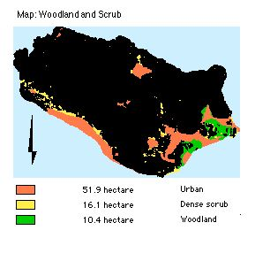

.. contents:: Table of Contents
   :depth: 1
.. sectnum::

Designation
===========
NVC: W23/W21c

* Grade I SSSI, Candidate SAC, UK BAP Key Habitat status. Identified in Annex 1 of the EC Habitats Directive as a priority habitat and will form part of the Natura 2000 Network.
* Scrub: Conwy HAP
* Juniper: listed as Endangered on the GB Red List and is protected under Schedule 8 of the WCA 1981. LBAP; UK SAP .

Size:

* 16.1 ha. Total (SSSI = 14.5 ha)

Description
===========
There are three main areas of dense scrub, the south-western tip, and south-western slopes.

On the hard northern limestone, Crateagus monogyna-Hedera helix (NVC = W21) scrub replaces fern-dominated communities, heath and grassland in primary succession. This scrub community has a large range in composition and thickness, and includes a canopy of hawthorn, blackthorn and bramble. Mixed calcareous scrub may include rose, hawthorn, buckthorn, privet, dogwood, roses, whitebeam, and wayfaring tree. Scrub provides shelter for invertebrates, feed and roosting for birds, and scrub edge conditions. Gorse scrub (W23) exists in intimate mosaics with acid grasslands (U4, MG6), heaths and understorey communities. Though of low botanical diversity, it is integral in the formation of heath on calcareous soils, and it has temporary value for small birds, providing habitat for the stonechat, UKSAP (*Saxicola torquata*).

Bracken-scrub is a characteristic feature of sheltered combes on un-enclosed heathland, associated with European gorse and hawthorn, blackthorn, hazel or, birch.

Hazel scrub also exists in pockets of soil, valuable for its lichen assemblies.

Juniper is found scattered, rarely attaining to true scrub.

Current condition and status of feature
=======================================
Dense/Scattered Scrub:

* Total Area 16.1 ha.
* Indicators of quality: all within LAC
* Species indicative of change: within LAC

Current Status: 

* Favourable Maintained, as of December 2001. This assertion is based upon the 2000/2001 survey.

Attributes selected as performance indicators
=============================================
The Dense/scattered scrub and communities will be considered to be in favourable condition provided the following attributes are within LACs:

Extent
-----------------
All Dense/scattered scrub: Component plant communities are communities of dynamic seral succession and so area limits need be set.

Quality
-------
* Mixed age structure
* Presence of scrub seedlings, suckers, or saplings.
* Complex vertical and horizontal structure
* Tree canopy cover
* High boundary/area ratio
* Well-developed marginal vegetation.
* Scattered juniper
* A set of associated plants as indicators of change.

Attributes and Operational Limits
=================================

Objective statement
-----------------------
To maintain the Dense/Scattered Scrub with its usual plants in favourable condition WHERE,

Extent
-----------------
All Dense/Scattered Scrub:

* Total area remains at the target level.
* Target level: 16.1 ha. of 323 ha
* Upper limit: 20.1ha.
* Lower limit: Target level.

Quality
-------
All Dense/Scattered Scrub:

* Mixed age structure
* Maintain a balanced, mixed age structure through management techniques.
* Target level:	Balanced, mixed age structure
* Upper limit:	none set
* lower limit:	All age classes represented in each O.3 ha. compartment.
* Monitor:	Age range of trees within each hectare

Presence of scrub seedlings, suckers, or saplings:

* Target: Non set.
* Lower limit: One per 10 sq. metre stand
* Monitor: Monitor regeneration on the ground.

Complex vertical and horizontal structure:

* Target: Complexity both dimensions in each stand.
* Limits: non set.

Canopy cover:

* Target level:	 	50% of extent of scrub.
* Upper limit:		80%
* Lower limits: 	 	20%
* Monitor: Extent of canopy by aerial photos every 50 years; by eye annually.

High boundary/area ratio:

* Target level:	 	8:1
* Upper limit:		non set
* Lower limits: 		3:1
* Monitor: boundary/are ratio

Well-developed marginal vegetation:

* Aerial structures of plants and grassland litter is allowed to develop.
* Target level: 50% of boundary distance.
* Limits: Non set.
* Monitor: marginal vegetation.

Scattered Juniper:

* Target 1: Number of patches remain at current levels, or increases.
* Target 2: Both male and female plants exist.
* Target 3: There is a continuity of growth of Juniper
* Limits, All 3 Targets: non set.
* Monitor/survey:
  
  * Number of occupied sites.
  * Age structure of plants
  * Number of seedlings.
  * Male and female plants
  
    * Being dioecious, Juniper's persistence depends upon the presence of male and female plants.

A set of associated plants as indicators of changes:

* Limits: non set.
* Monitor:	frequency of Birch (Betula spp.), Oak (Quercus spp.)

Management Rationale and Projects
=================================

Regenerating Scrub
------------------
Characterisation of the age structure of lowland seral scrub will inform decisions for its management. Mixed age structure promotes diversity. Hawthorn scrub can be rich in insects and birds in early and middle stages of growth, and warblers and nightingales live in the earlier stages of growths. Presence of seedlings, suckers or saplings, indicates whether a patch will succeed to woodland or degenerate to herbaceous communities.

Degenerating and dense scrub patches will be positively managed: Uniformly dense canopies will be opened up to permit light; A varied vertical and horizontal structure, and a mixed age structure will be the aim of any intervention. Scrub will be restored with cattle to knock down vegetation, poach the ground, and open up areas to light, and graze,  in conjunction with cutting.

Monitoring & Projects:

* Identify scrub patches without natural regeneration, of uneven age structure, and over-dense
* Graze and cut to achieve balance in age, structure and density.

Marginal vegetation
-------------------
Balanced site management will include maintenance of boundary zones, important for associated scrub and grasslands.

Competitive grasses will be allowed to dominate in these boundary zones, so favouring invertebrates which depend on aerial structures of plants and those found in grassland litter, including some rare species where the litter is mature. This also provides suitable conditions for small mammals. To prevent succession to scrub, the marginal vegetation will be cut in rotations of 5-10 years.

Projects:

* Fencing off small areas from grazing to permit marginal growth by excluding grazing.
* Cut or graze marginal vegetation annually, if necessary.

Juniper Scrub (UK BAP/LBAP Priority species)

* Juniper may be seen as climax vegetation at high altitudes, but here, except in exposed conditions, it is a primary seral community towards woodland, protecting other trees with its prickles.
* Grazing by feral goats, sheep or rabbits may hinder Juniper's regeneration, or succession to woodland.

Monitoring & Projects:

* Monitor grazing by goats, and sheep upon juniper, by observation, and by faecal analysis.
* Monitor presence of saplings amongst Juniper.

Non-Native Invasive species
---------------------------
Invasive vegetation, particularly non-native cotoneasters, rhododendron, and sycamore may inhibit regeneration of native communities. Such invasives will be controlled.

Operational Limit:

* Target: complete elimination
* Upper limit: Target level
* Lower limit: Present level
* Monitoring & Projects:

    * Monitor presence of invasive species
    * Control invasive species

Controlling Scrub Advancement
-----------------------------
A balance between scrub and grassland needs to be attained. With low grazing levels scrub may advance. Since 1947  Calluna-Ulex scrub and heath has coalesced and expanded, partly over old ridge-and-furrow cultivation. It shows transition to blackthorn or hawthorn scrub in places. Onward succession to woodland (birch, oak) will be prevented by grazing or burning.

In removing gorse by cutting, the possible colonisation by rhododendron of acid litter will be monitored. Bracken finds refuge amongst gorse, protected from grazing, from which it might spread. Advancing fronts will be repelled (refer to Feature: Bracken).

Goats feed upon gorse. Blackthorn and gorse may benefit from cutting,or targeted burning, where encroachment has occurred. Cattle and ponies will graze and trample scrub.

Operational limits:

* Target 1:There will be no new stands of dense scrub exceeding 10 m across.

Projects:

* Restorative grazing
* Cutting and burning
* Monitor/Surveillance Projects:

    * Advance of Scrub by aerial photographs every five years.

Management Options
==================

* A3:   Active management to maintain the Dense/Scattered Scrub
* E4:   Open access. Request walkers stay on paths.

