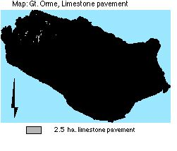

.. contents:: Table of Contents
   :depth: 1
.. sectnum::

Designation
===============
* Grade I SSSI, Candidate SAC, UK BAP Key Habitat status (1995).
* Identified in Annex 1 of the EC Habitats Directive as a priority habitat and will form part of the Natura 2000 Network.
* Regionally Important Geological Site (RIGS) within Gwynedd for its Limestone Pavement and soils around Bishop's Quarry.

Size:

* 2.4 ha.

Description
===========
Limestone pavement is a globally rare habitat. Gt. Orme has exposed pavements consisting of bare clints and unusual combinations of plants in between. Shade tolerant and woodland species in sheltered, shaded grikes grow alongside plants of more open environments.

Limestone pavement here exists as part of a grassland/heath mosaic. The pavement is not species rich and no mammals or reptiles have been recorded on the site.

Current condition and status of feature
=======================================

Limestone pavement:

* Total Area: 2 .5 ha.
* Species indicative of change: within LAC

Current Status: 

* Favourable Maintained, as of December 2001. This assertion is based upon the 2000/2001 survey.

Attributes selected as performance indicators
=============================================
The limestone pavement and communities will be considered to be in favourable condition provided the following attributes are within LACs:

Extent
-----------------
Component plant communities are largely governed by edaphic and climatic conditions. These are relatively static factors and so no area limits need be set.

Quality
-------
Plant communities vary even within separate grikes. There are no limits of defined component species.

A set of associated plants as indicators of change.

Attributes and Operational Limits
=================================

Objective statement
-----------------------
To maintain the limestone pavement with its usual plants in favourable condition, WHERE:

Extent
-----------------
All Limestone pavement:

* Total area remains at the target level.
* Target level: 2.5 ha. of 323 ha
* Upper limit: None set
* Lower limit: target level.

Monitor/surveillance:

* Extent of limestone pavement

Condition
------------------
A set of associated plants as indicators of change:

* Monitor: frequency of,

    * Hoary Rockrose (*Helianthemum canum*) and Dark Red Helleborine (*Epipactis atrorubens*), Spring squill (*Squilla verna*), Black Spleenwort (*Asplenium adiantum-negrum*), Wall-rue (*A. ruta - muraria*), Maidenhair Spleenwort (*A. trichomanes*), Sanicle (*Sanicula europea*), Dogs Mercury (*Mercuralis perennis*) and occasional Brittle Bladder Fern (*Cystopteris fragilis*), Low blackthorn (*Prunus spinosa*).

Management Rationale and Projects
=================================
 Threats of enrichment by fertiliser application and supplementary feeding on or around open pavement, but these are prohibited according to tenancy land use agreements.
 The local use of 'asulam' herbicide for bracken control may kill any ferns in the grikes, and such use will be discouraged.

Monitor/Surveillance Projects:

* Prohibit use of 'asulam' herbicide for bracken control nearby.

Grazing
------------------
Grazing pressure will be monitored and controlled. The optimum long term stocking level to maintain the conservation interest of open pavement will be maintained at less than one ewe per hectare (or cattle equivalent based on 5 ewes=1 cow), and temporary fencing considered if this conflicts with other grazing needs on the Gt. Orme. Rehabilitation of heavily grazed pavement may occur with present reduction in stocking rate, and change will be noted.

Spring squill (*Squilla verna*) is associated with *Festuca ovina*, and may be colonising in response to past excessive grazing pressure. Existing dwarf *Prunus spinosa* may be indicative of invasive scrub, or an endemic species. Trials of variation in grazing pressure of one area by total removal of grazing animals, for a period of five to ten years, will be carried out.

Monitor/Surveillance Projects:

* Monitor density and distribution of Prunus spinosa, festuca ovina
* Monitor grazing habit of wild animals on the pavement.
* Monitor stock densities
* Initiate research into rehabilitation and grazing pressure immediately
* Monitor use of supplementary feeds in situ.

Erosion
------------------
Trampling by visitors causes significant wear and prevent growth of plants, and occurs in hot spots where visitors are attracted, by its appearance. This is not harmful to the pavement as a whole, and prohibition is neither considered necessary nor well advised, given the function of a Country Park.

Monitoring and Projects:

* Monitor erosion.

Management Options, Continuous
==============================

* A3 Active management to maintain limestone pavement, (according to grazing pressure).

* E4: Open access. Request walkers stay on paths.

