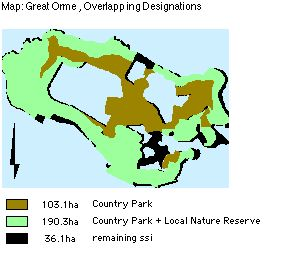
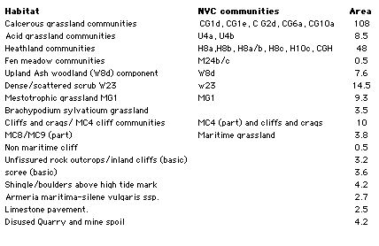
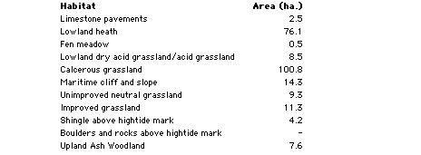
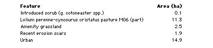

.. contents:: Table of Contents
   :depth: 1
.. sectnum::

Summary of the Functions of the Plan
====================================
- To identify the objectives of site management.
- To identify the factors which affect or may affect the features.
- To resolve any conflicts.
- To identify and define the monitoring and surveillance requirements.
- To identify and describe the management required to achieve the objectives.
- To maintain continuity of effective management.
- To obtain resources.
- To enable communication within and between sites and organisations.
- To demonstrate that management is effective and efficient or appropriate.

Introduction to the Gt Orme Management Plan
===========================================
The Plan's standard format is approved at organisational level. The Plan has been prepared for the entire site, and is no larger than the site requires. The plan meets, as far as resources allow, the requirements of the site and your organisation. Brief maps accompany the text. Ordnance survey maps are useful. Full plans may be referred to, held at the Countryside Council for Wales (CCW) offices.

Management planning has been regarded as a continuous, adaptable, long-term process. The adaptable process enables conservation managers to:

- Take account of, and respond to, the varying factors that affect the features.
- Continually develop or refine management processes.
- Demonstrate whether or not management is appropriate.

A confirmed list of features for management purposes has been drawn up with due regard to previously recognised conservation features, according to designations of a local, national,or international, kind. The plan also includes Country Park features in order to meet Country Park objectives. Appropriate management is implemented with respect to each feature
The features are monitored in order to determine whether or not the current condition meets the required condition. Shortfalls are recorded. Where objectives are not being met, the management processes are reviewed, and if necessary modified. Occasionally, it may be necessary to modify the objectives. The cycle is repeated at appropriate intervals.

No one individual possesses sufficient expertise in all areas, and opinion is sought. The plan is produced with team effort and overall responsibility for the production of the plan rests with the site manager. Where consultants are employed, this is in consultation with the site manager.

Description
============================================

Summary Description
-------------------------
National Grid Reference:

* SH 767 833

The Great Orme is a headland surrounded by sea, connected to the mainland by a causeway, situated in the community of Llandudno in the county of Conwy The site is bounded by cliffs, farmland, municipal gardens, residential developments and the sea coast.

The Great Orme is a syncline of Carboniferous Limestone comprising 314 ha., its cliffs rise from sea level to 207 m. (679 ft.) at its summit, and of sufficient interest to be included in the national Geological Conservation Review (GCR).

There are a number of freshwater springs and wells on the headland, which is characterised by intricate inter-grading zones of mainly calcicolous grassland and heath. Areas of limestone pavement and scrub also occur, in addition to two areas of mixed ash woodland, which are probably ancient. The site is rich native in flora and fauna of conservation interest. There are also underground mines.

Designation
-------------------------

The vast majority, 321 ha. of the site, is included within the SSSI and Nature Conservation Review (NCR). 309 hectares are candidate Special Area of Conservation (cSAC) Natura 2000 site. A Local Nature Reserve (LNR) boundary of 151 hectares was defined in 1981 in order to include all prime sites of biological or geological importance and, as far as practical, match that of the Country Park boundary of 291 hectares. 7 km is defined as Heritage coast.

Some independent businesses on the Gt. Orme, for example the Summit Complex and Rectory Tea Gardens, are situated outside the designations of Country Park and Local Nature Reserve, but within the same area boundaries: Refer to Map: *'Great Orme, Overlapping Designations').*

Past Land-Use History
-------------------------
Archaeological evidence of human occupation dates back to the Upper Palaeolithic. The Viking influence that spread throughout the Irish Sea is evident in the name Orme (Norse: ' Great serpent'), and in coinage of King Cnut found in the church.

Enclosure had advanced by the Mid 18th century. Un-enclosed land (218 ha) in 1840 was held in common by the Bishop of Bangor, transferred to private ownership by a parliamentary enclosure award in 1848.

Sheep rearing has been prevalent agriculture on un-enclosed land for over 2 centuries prior to the Great Orme becoming a Victorian recreational area. With the decline of the copper industry, after 1843. A golf course after WWI, the land became farmland in WW2. The site had been used by a small number of local people for hunting and shooting.

Present Use
-------------------------
There are no common rights on the Country Park. The County Borough Council, as manager of the land, has rights of access to all parts of the site. Management of the Country Park and Local Nature Reserve since 1980 has sought to promote conservation, public recreation or enjoyment and education. The Great Orme's head, a resort since Victorian times, attracts a large number of visitors. The site is open access to the public. Visitors can gain access to the summit of the site by motor vehicle, a cable car, Victorian tramway, or public footpath.

Great Orme's Head is of low agricultural quality, with a little arable land. The majority of the site is sheep grazed by Mr. J T Jones of Parc Farm (Great Orme). The grazing density, now 1.4 sheep per hectare, has declined over the past 20 years from the order of 1,000 down to 416 sheep. The sheep are grazed all year round, with about nine weeks of gathering onto the improved pasture land for weaning (August), shearing (June), tupping (October) and lambing (March). There is a herd of grazing feral goats.

Private land on the headland is mainly used for either residential (nearer the town of Llandudno) or agricultural purposes, these lie outside the Country Park and LNR boundaries.

Zones
-------------------------
Zones, according to usage, may be geographic or seasonal, determined by management compartments of habitats, and positions of paths and and boundaries; zones will be identified, mapped, and monitored for management purposes.

Zones are not easily separated for grazing purposes, and therefore may need to be combined for the purpose. In the past it is likely that shepherds exercised 'management options' by targeting the grazing.

Policy
=========================

Land Ownership and Policy
-------------------------

The majority of the land is owned by Mostyn Estates Ltd and the remainder of the land is in the possession of Conwy County Borough Council.

Policy Statement
-------------------------
Within the Landscape Conservation Area, including the Heritage Coast, the (Site of Special Scientific Interest) SSSI's, Local Nature Reserves (LNRs) and Country Park, it is the policy [1]_ of the two major landowners, Mostyn Estates Ltd and Conwy County Borough Council, to:

* Ensure co-ordination of conservation objectives of the two major landowners guided by a comprehensive management plan agreed with the Countryside Council for Wales (CCW).
* Safeguard and conserve the scenic beauty, relative remoteness, the wild flora and fauna, and geological features.
* Safeguard the interests of farming, and nearby residents.
* Retain and protect a representative selection of of regional, local or academically important archaeological sites and monuments, including their settings.
* Withhold planning consent until provision has been made for an appropriate archaeological response .
* Resist development proposals if this conflicts with nature conservation interests of SSSI or LNR, or developments which conflict with the existing character of the landscape or appearance of the Great Orme.
* Create opportunities for people to enjoy and appreciate the qualities of the Country Park without compromising the conservation objectives.
* Provide for recreation activities for a variety of tastes and degrees of solitude, that are based on the resources of the area and which do not conflict.
* Endeavour to ensure enjoyment of the individual is not spoilt by overcrowding.
* Encouraged schemes for development of facilities which help in the objectives above provided they comply with the policies, and where:
* The design and materials reflect the built form of the locality
* Development takes into account both the landscape effect and views .
* It is capable of being satisfactorily integrated into the landscape.

Policy, Candidate Sac Habits and Species
----------------------------------------

OBJECTIVE:

* To maintain biodiversity by conserving natural habitats and wild flora and fauna in the European territory of the Member States, WHERE ALSO:

  * As amended by Council Directive 97/62/EC of 27 October 1997(7) [2]_  MEMBER STATES MUST ALSO:

    * Encourage the management of features of the landscape which are essential for the migration, dispersal and genetic exchange of wild species.
    * Take the requisite measures to establish a system of strict protection for those animal and plant species which are particularly threatened (Annex IV) and study the possibility of reintroducing those species on their territory.
    * Prohibit the use of non-selective methods of taking, capturing or killing certain animal and vegetable species (Annex V).

FOOTNOTES
.............

.. [1] A Policy Statement for the Great Orme, produced by the Borough Council, November 1976.

.. [2] Llandudno/Conwy District Council Plan (1982) and its 1993 revision.

Confirmation of Features
========================
Previously Recognised Features
---------------------------------
A. Qualifying Features
.................................
Table: independently qualifying features, SSSI habitat features of interest.

Geology & Geomorphology SSSI Features of Interest
------------------------------------------------------------------
Great Orme (GCR No. 960). It is an important locality for studies of Welsh paleaogeography, sedimentology and late Dinatian faunas.

Priority UK Biodiversity Action Plan (BAP) habitats
------------------------------------------------------------------

SSI Features of Interest: Plants & Animals
------------------------------------------------------------------
*Refer to tables 1-3 in appendix 1*

Scheduled Ancient Monuments/sites, of national Importance

* Peny dinas
* Hwylfa'r Ceirw
* Kendrick's Cave
* Bishop's palace
* Llety'r Filiast
* Great Orme copper Mine

Non-Qualifying components habitats
------------------------------------------------------------------

Non-Qualifying Archaeological features
------------------------------------------------------------------
There are a number of sites of regional, and local importance, including Hut circles, Hut Platforms, Field systems, caves and artefacts, banks, as well as damaged sites and those requiring further investigation. There are also a number of unconfirmed wartime and early industrial sites and buildings..
Incorporate all SSSI habitat features, those which meet all objectives of the Country Park.

Red Data Book Endangered Status
---------------------------------

* Wild Cotoneaster	 Schedule 8 *Cotoneaster cambricus;*
* Introduced-naturalised, W.Kent, Surrey, Isle of Man.
* Also, Priority Biodiversity Action Plan species/ Local BAP (LBAP).

All Confirmed Management Features
=================================
Features Selected for the Purposes of This Management Plan
----------------------------------------------------------
Bracken
Brachypodium sylvaticum grassland
Broad-leaved Woodland
Calcicolous Grassland
Calcicolous Heathland
Calcifugous Grassland
Dense/Scattered Scrub
Fen Meadow
Mesotrophic Grassland
Limestone Sea cliffs and maritime communities (including: Cliffs and crags; Shingle/boulders; Scree; Maritime grassland)
Limestone Pavement
Wild Cotoneaster
Fauna
Silver-studded blue butterfly
Quarries, Disturbed ground, Non Maritime Cliff, Rock outcrops and Inland cliffs
Archeological Sites
Education, Interpretation, Research use & Facilities
Recreation Use & facilities
Specific site management issues

Rationale: Grouping and selection of Confirmed Features for Management
======================================================================
Grasslands and Heath
-------------------------------------
The grasslands and heath together form complex mosaics based largely upon edaphic soil factors. They have been treated separately within this plan due to different attributes and monitoring, need for different grazing limits, and in the case of heath maintenance, of calluna in all growth stages.

Flora and Fauna
-------------------------------------
*Refer to appendix 1 and 2 for lists*

Generally, diversity of fauna and flora are promoted by optimal habitat management techniques for diversity. Unless, the habitat needs special adaptation, there is no call for special individual treatments. Two individual species have been selected, due to rarity and threatened status:

- Cotoneaster;
- Silver-studded blue butterfly

BAP fauna and fungi species populations will be monitored and positively managed, referred to in Feature 16: Fauna and fungi.

Disturbed ground: Quarries and mine spoil; inland cliffs, rock outcrops, and non-maritime cliff
------------------------------------------------------------------------------------------------
These are amalgamated because they share similar flora and factors of management.

Factors of Influence
====================
Summary of Factors which may influence features
--------------------------------------------------------------------------
Owner/Occupiers objectives:

* Refer to policy, Appendix 5

Internal Natural
.....................................
Herb species, Herb coverage, Herb height, succession (rank grasses, scrub/trees), Insect life and pollination, microclimate, water table, fauna, slopes, climate, hydrological, aspect, soils, predation, dispersal, succession, grazing by wild animals, animal erosion,
animal Burrowing.

Internal anthropogenic
.....................................
Grazing (cycle, density/ intensity, species), livestock feeding preferences, shepherd-control, compartments, visitor trampling, visitor disturbance, fencing, farmers.

External natural
.....................................
Invasion by competitive species, poisons (herbicides and pesticides), fertilisers, seed sowing, genetic modified seed, air pollution, resource constraints, climate and change, water erosion, natural erosion.

External human induced
.....................................
SSSI designations, management constraints, resource constraints (money, staff, information, agreements, local policy, archaeological policy, adjacent land-use, supplementary animal feeding, artificial feed and licking blocks, artificial fertilisers & pesticide, anti-parasitic drugs, proximity of similar habitats, local exotic collections, fires, fly-tipping, activities (rock climbing, caving expeditions, etc.), past land use, loss of habitat, species exploitation, access by humans, aerial pollution, vehicular access on slopes, agricultural practices, recreational activities, pollution, spillage, drainage, heavy machinery, ploughing and reseeding, collectors, storage/dumping, commercial development, illegal and accidental burning.

Potential Conflicts
===================================
Potential Conflicts of factors in Management Projects
-----------------------------------------------------
The following specific conflicts cross reference to the relevant features. Solutions, or partial solutions, are offered below:

Bracken Control
.....................................
Timing of bracken control measures could conflict with a possible dependency on bracken of the silver-blue butterfly, in which it may lay eggs. *Cut scattered bracken before flight time*, in mid-June.

Asulam
.....................................
Desired use of chemical formula, asulam,  by archaeologists for bracken control (trampling -free), and fragility of limestone pavements. Prohibit use of asulam near limestone pavements.

Desired use of asulam by archeologists for bracken control (trampling trampling -free) is poisonous to orchids and fungi. This conflicts with conservation aims, for which trampling of bracken by stock, cutting and grazing of vegetation is preferred to spraying.

* Consider and offer alternative controls

  * See Feature: Bracken_

Burns on heathland
.....................................
Concerning Silver-studded blue butterfly and all reptiles: Summer burns can be beneficial to the butterfly because they remove more of the litter layer than winter burns and promote re-colonisation of heathers of open ground (Ravenscroft 1994). Summer burns may be granted permission under licence. Yet, to reduce chances of reptile loss, cut or burn on a small scale mid-October to mid-February. *Compartmental rotations* give room to solve this conflict.

Grazing levels
.....................................
For limestone pavement. grazing levels may be lower than open grassland. Actually, grazing preferences and present flora have probably co-evolved. First, *variations in grazing levels* need to be monitored in their effects .

Encouraging visitors
.....................................
Encouragement of visitors conflicts with conservation aims. With high visitor numbers, an unknown threshold exists to disturbance and erosion to habitats before recovery is compromised. The problem is compounded with vehicle access. Action to *limit numbers of cars or visitors on peak days* before recovery is compromised.

Scrub management
.....................................
A valuable wildlife resource may conflict with management for archaeology. *Gradual and limited scrub control.*

Customary use by locals
.....................................
With free access to the caves, and to archaeological remains, there is some history and prospect of damage. The overall *aim is to foster local goodwill*  See Feature: *Archaeology.*

Funding
======================================
Designated funding
-------------------------------------

* SSSIs and BHSs*

  * Receive appropriate levels of protection through the designations' development control systems.

* SSSIs are also subject to a regulatory system for land management operations under the Wildlife & Countryside Act 1981 (as amended).
* English Nature (EN ) provides advice to SSSI land managers, and promotes the conservation of important habitats, including calcareous grassland, through Natural Area profiles (8, 9).
* A number of funded conservation grazing and scrub control projects are underway on nature reserves in the Silverdale area.
* MAFF's Countryside Stewardship Scheme*

  * provides potential sources of payment for appropriate land management on a range of habitats, including calcareous grassland.

* Country Parks:

  * The Caernarfonshire County Council considered designation of the Great Orme's Head as a Country Park a good means of achieving the objectives of their study. The status attracts considerable grant aid available from the Countryside Commission.

General Funding Schemes
-------------------------------------
Although none of the following is specific to calcareous grassland, all incorporate the habitat where it occurs:

* The Biological Heritage Sites (BHS) project promotes agri-environment schemes. The project prioritises grasslands of conservation importance when giving advice to land managers.
* The Farming & Wildlife Advisory Group (FWAG) offers advice to farmers on any land irrespective of designations.
* Heathland attracts grants for its management through *Tir Gofal* as part of a whole-farm scheme.

Farming Future and Grazing
==============================================
General reduction in stock and rabbit grazing, and selective feeding by sheep, may result in grassland becoming dominated by coarse swards. These changes are usually rapid, within 4 years. The litter of ranker grasses appears to inhibit growth of grassland species, succeeding to scrub.

Medium level stocking rates for Calcerous Grassland = 30 sheep /ha/year. The current levels are low at 1.4 sheep per ha. However, the sheep may feed on grassland in preference to heath, giving a rate of over 4 per ha. Also, exposed sites need lower rates.  Although much grassland is in a favourable condition, suggesting continued sheep grazing at current levels, practices of the past 50 years are relatively recent and may represent sub-optimal management. There are signs of lax grazing. There are implications for current heath renewal.

The future is unclear, given the economic state of upland sheep farming. One farmer has given up grazing rights. Also, The attraction to farmers of keeping sheep on the Gt. Orme may be diminished by large visitor numbers. Should no grazing rights be taken up, or the farms relinquished, then current Management will have to assume responsibility for keeping stock.

Under the current state of affairs, trials in variations in grazing are important. Options for mixed low intensity farming may have beneficial effects on the Gt. Orme's heath and grassland, and yet attract Tir Gofal ('Land Care') grants. Mixed grazing regimes may have been lost on the Orme, and may be explored, using cattle and ponies for targeted grazing effects. The productivity of these beasts, may boost the farms and benefit the local community.

Zones
-------------------------------------
According to usage, may be geographic or seasonal, determined by management compartments of habitats, and positions of paths and and boundaries; zones will be identified, mapped, and monitored for management purposes.  Zones are not easily separated for grazing purposes, and therefore may need to be combined for the purpose. In the past it is likely that shepherds exercised 'management options' by targeting the grazing.

Management of Features
======================

Flora
----------------------
|  Bracken_
| `Brachypodium sylvaticum grassland`_
| `Broad-leaved Woodland`_
| `Calcicolous Grassland`_
| `Calcicolous Heathland`_
| `Calcifugous Grassland`_
| `Dense/Scattered Scrub`_
| `Fen Meadow`_
| `Mesotrophic Grassland`_
| `Limestone Sea cliffs and maritime communities`_
| `Limestone Pavement`_
| `Wild Cotoneaster`_

Fauna
----------------------
| `Fauna`_
| `Silver-studded blue butterfly`_

Other Features
----------------------
| `Quarries, Disturbed ground, Rock outcrops`_
| `Archeological Sites`_
| `Education, Interpretation, Research use & Facilities`_
| `Recreation Use & facilities`_
| `Specific site management issues`_

.. _Brachypodium sylvaticum grassland:                     http://cnrm.jakbop,nfshost.com/orme-brachypodium-sylvaticum-grassland.html
.. _Bracken:                                               http://cnrm.jakbop,nfshost.com/orme-bracken-pteridium-aquilinum.html
.. _Broad-leaved Woodland:                                 http://cnrm.jakbop,nfshost.com/orme-broad-leaved-woodland.html
.. _Calcicolous Grassland:                                 http://cnrm.jakbop,nfshost.com/orme-orme-lowland-calcicolous-grassland.html
.. _Calcicolous Heathland:                                 http://cnrm.jakbop,nfshost.com/orme-calcicolous-grass-heath.html
.. _Calcifugous Grassland:                                 http://cnrm.jakbop,nfshost.com/orme-calcifugous-grasslands.html
.. _Dense/Scattered Scrub:                                 http://cnrm.jakbop,nfshost.com/orme-densescattered-scrub.html
.. _Fauna:                                                 http://cnrm.jakbop,nfshost.com/orme-fauna.html
.. _Fen Meadow:                                            http://cnrm.jakbop,nfshost.com/orme-fen-meadow.html
.. _Limestone Sea cliffs and maritime communities:         http://cnrm.jakbop,nfshost.com/orme-limestone-pavement.html
.. _Limestone Pavement:                                    http://cnrm.jakbop,nfshost.com/orme-limestone-sea-cliffs-and-maritime-communities.html
.. _Mesotrophic Grassland:                                 http://cnrm.jakbop,nfshost.com/orme-mesotrophic-grasslands.html
.. _Quarries, Disturbed ground, Rock outcrops:             http://cnrm.jakbop,nfshost.com/orme-disturbed-ground-quarries-rock-outcrops.html
.. _Silver-studded blue butterfly:                         http://cnrm.jakbop,nfshost.com/orme-silver-studded-blue-butterfly.html
.. _Wild Cotoneaster:                                      http://cnrm.jakbop,nfshost.com/orme-wild-cotoneaster.html
.. _Archeological Sites:                                   http://cnrm.jakbop,nfshost.com/orme-archaeological-features.html
.. _Education, Interpretation, Research use & Facilities:  http://cnrm.jakbop,nfshost.com/orme-education-interpretation-research-facilities.html
.. _Recreation Use & facilities:                           http://cnrm.jakbop,nfshost.com/orme-recreational-use-and-facilities.html
.. _Specific site management issues:                       http://cnrm.jakbop,nfshost.com/orme-specific-site-management-projects.html

Appendices
==============================================

Appendix 2: Local Species Action Plans
--------------------------------------------
CONWY LOCAL SPECIES ACTION PLAN (SAP)

SPECIES FOR INCLUSION IN FIRST TRANCHE

Appendix 3: Biodiveristy Action Plans
--------------------------------------------
UK BAP And Conwy Habitat Action Plans Compared

Appendix 4: Threatened Plants
--------------------------------------------
EN 	Endangered

* Wild Cotoneaster
  * Schedule 8 *Cotoneaster cambricus*
  * Introduced-naturalised, W.Kent, Surrey, Isle of Man. LBAP

NS	Nationally Scarce

* Spiked Speedwell	 Schedule 8

NT	Near threatened

* Goldilocks Aster

VU	Vulnerable

* Spotted Catsear

NS	Nationally Scarce

* Rock Sea-lavender *Limonium binervosum*

LBAP widespread

* NS  Sea Cabbage
* NS  Seaside Centaury
* NS  Dwarf Mouse-ear
* NS  Dark Red Helleborine
* NS  Hoary Rock-rose
* NS  Hutchinsia
* NS  White Horehound
* NS  Spring Sandwort
* NS  Ivy Broomrape
* NS  Spring Cinquefoil
* NS  Nottingham Catchfly
* NS  A Whitebeam

Wild cotoneaster, Red Data Book status is 'Endangered', with a threat to its survival in the medium to long term. Measures are currently underway to increase the population to a more secure level as stated in the Summary Species Implementation Plan for Wild Cotoneaster (CCW 1998). The Wild Cotoneaster is also a priority Biodiversity Action Plan species.

All wild plants are protected against unauthorised uprooting under section 14 of the Wildlife and Countryside Act however plants listed under Schedule 8 of the Wildlife and Countryside Act (1981) are given special protection against picking, uprooting, destruction and sale. Those species on the Red List are species that are threatened with extinction. The threat of extinction has been assessed for these species and they are classified as Extinct, Extinct in the Wild, Critically Endangered, Endangered or Vulnerable (using IUCN criteria).

Some other plants fall in to lower risk categories such as near-threatened and nationally scarce species. Near-threatened species are defined as native plants which are not included in the Red List (because they are not declining or threatened but are simply localised in their distribution) but occur in 15 or fewer 10&yen;10km squares in Great Britain. Nationally Scarce species are defined as native plants which occur in 16 to 100 10&yen;10km squares in Great Britain and do not qualify for inclusion in the Red List. However, those plants classified as Nationally Scarce would be included on the Red List if they were judged to be sufficiently threatened.

Surveys and monitoring regimes have been undertaken (and continue) in order to monitor the status of selected rare plants, monitor habitat change and monitor the effects of grazing.

Appendix 5: Policy
--------------------------------------------
*Policy, management decisions and Implementation:*

Responsibility for day to day site management and the implementation of this plan rests with the Country Park Warden within the Countryside Service.
The Local Nature Reserve was declared in November 1981 under sections 19 and 21 of the National Parks and Access to the Countryside Act (1949).

The first strategic planning study of the area, The Great Orme - A Conservation Study, was produced in 1971 by the former Caernarfonshire County Council, "to ensure co-ordination of conservation efforts to achieve both immediate aims and longer term objectives of the two major landowners", Mostyn Estates and what was then the Llandudno Urban District Council. Full time wardens were also considered essential for these provisions to be effective. Considerable grant aid was to be made available from the Countryside Commission to facilitate implementation of proposals.

Great Orme's Head received official Country Park status through designation by the Countryside Commission in 1978. The site has been managed as a Country Park from August 1980 commencing with the appointment of a Warden.

Policy and management decisions are channelled through the Working Party. The Working Party comprises representatives from:

* Conwy County Borough Council (Officers and Councillors)
* Mostyn Estates
* Countryside Council for Wales
* Gwynedd Archaeological Trust
* Llandudno Town Council
* Local Grazier

The management of the site as a recreational resource became more structured following the introduction of the initial comprehensive Management Plan in 1985. The Management Plan is updated and revised on a five-yearly basis.

APPENDIX 6 BYLAWS
--------------------------------------------
BYLAWS Made under Section 41 of the Countryside Act 1968 by Aberconwy Borough Council with respect to a Country Park.

1.	Throughout these bylaws the expression "the Council" means the Aberconwy Borough Council and the expression "the land" means the Great Orme Country Park, Llandudno, in the County of Gwynedd.

2.	No persons shall on the land:

  (i)	Without reasonable excuse climb any rock face, wall or fence on or enclosing the land or any tree or any barrier, railing post or any other erection.

  (ii)	Without reasonable excuse remove or displace any barrier, railing post or seat, works or drainage, steps or any part of any erection or ornament or any implement provided for use in the laying out or maintenance of the land.

  (iii)	Without reasonable excuse remove, break open or interfere with rocks, fossils, ancient remains or monuments save where for a scientific purpose, the written consent of the Council having first been obtained.

  (iv)	Pluck, damage or destroy any bush, blossom, flower leaf or branch of any wild tree, shrub or plant which is not already scheduled by any statutory enactment as a protected species.

  (v)	Use any device designed or adapted for detecting or locating any metal or mineral in the ground.

  (vi)	Remove or displace any soil or plant or use any implement for the purpose of archaeological excavation.

3.	No person shall affix or cause to be affixed any advertisement, bill, placard, or notice upon any building, wall, fence, gate, door pillar, post, tree, rock or stone on or enclosing the land.

4. (a) No person shall light a fire on the land or place or throw or let fall a lighted match or any other thing so as to be likely to cause a fire.

4. (b) This bylaw shall not prevent the lighting or use of a properly constructed camping stove or cooker in any area set aside for the purpose in such a manner as not to cause danger of or damage by fire.

5. (a) No person shall ride or drive a mechanically propelled vehicle on any part of the land where there is no right of way for vehicles.

5. (b) This bylaw shall not extend to invalid carriages conforming to the provisions and regulations made under the Chronically Sick and Disabled Persons Act 1970.

5. (C) If the Council has set apart a space on the land for use by vehicles of any class, this bylaw shall not prevent the riding or driving of those vehicles in the space so set apart, or on the direct route between it and the entrance of the land.

6.	Where the Council indicates, by a notice conspicuously exhibited on or alongside any gate on the land, that leaving the gate open is prohibited, no person having opened that gate or caused it to be opened shall leave it open.

7.	No person shall, without the consent of the Council, erect a tent or use any vehicle, including a caravan or any other structure, for the purpose of camping on the land except on any area which may be set apart and indicated by Notice as a place where camping is permitted.

8.	No person shall, except in the exercise of any lawful right or privilege, have in his possession while he is on the land any firearm unless it is so covered with a securely fastened gun cover that it cannot be fired. In this bylaw the expression "firearm" means any lethal barrelled weapon of any description from which any shot, bullet or other missile can be discharged.
This bylaw shall apply to all parts of the land except any thereof which is a Public Right of Way.

9.	No person shall cause or suffer a dog belonging to him or in his charge to remain on the land unless such dog be and continue to be under proper control, and be effectually restrained from causing annoyance to any person and from worrying or disturbing any animal.

10. (a)No person shall, without lawful excuse or authority on the land, kill, molest, or intentionally disturb any animal, bird or fish, or engage in hunting, shooting or fishing, or the setting of traps or nets or the laying of snares.

10. (b)	This bylaw shall not prohibit any fishing or shooting which may be authorised by the Council or any person authorised by the Council.

11. No person shall on the land, sell or offer or expose for sale or hire, or offer or expose for letting or hire, any commodity or article except in pursuance of an agreement with the Council or from any establishment specifically set aside for such purpose.

12.	No person shall on the land intentionally obstruct, disturb, interrupt or annoy any other person in the proper use of the land or intentionally obstruct, disturb or interrupt a warden or other officer of the Council in the proper execution of his duty, or any person or servant of any person employed by the Council in the proper execution of any work in connection with the laying out or maintenance of the land.

13. (a)	Any act necessary to the proper execution of his duty on the land by an Officer of the Council or by any person or servant of any person employed by the Council shall not be deemed an offence against the bylaws.

13. (b)	Nothing in or done under any of the provisions of these bylaws shall in any respect prejudice or injuriously affect any public right of way through the land or the rights of any person acting legally' by virtue of some estate, right or interest in, over or affecting the land or any part thereof.

14.	Every person who shall offend against any of these bylaws shall be liable on summary conviction to a fine not exceeding Fifty Pounds.

Appendix 7 SSI Potentially Damaging Operations
----------------------------------------------
Great Orme Site of Special Scientific Interest:

Potentially Damaging Operations pertaining to Section 28 Wildlife and Countryside Act (1981):

* Cultivation, including ploughing, rotovating, harrowing and reseeding.
* Any alteration to the present pattern or frequency of grazing by farm stock.
* Introduction of mowing or other methods of cutting vegetation.
* Application of manure, fertilisers and lime.
* Application of pesticides, including herbicides (weed killers).
* Dumping, spreading or discharge of any waste materials.
* Burning of vegetation.
* The destruction, removal or pruning of any plant or plant remains, including tree, shrub, herb, moss, lichen or turf.
* Tree planting including afforestation.
* Changes in woodland management, including clear and selective felling, thinning, coppicing, modification of the stand or underwood and changes in species composition.
* Erection of sea defences or coast protection works.
* Extraction of minerals including limestone pavement.
* Construction of roads, tracks, walls, fences, hard-stands or banks.
* Storage of materials on or against rock-faces.
* Erection of permanent or temporary structures, or the undertaking of engineering works, including the laying, maintenance or removal of pipelines and cables.
* Clearance of boulders or loose rock and battering, buttressing or grading rock-faces and cuttings.
* Removal of geological specimens, including fossils.
* Use of motor vehicles likely to erode vegetation on grassland or heath; use of aircraft (including helicopters) likely to disturb breeding or roosting birds.
* Climbing on sea cliffs, within the control of the owner or occupier, except as voluntarily agreed with the British Mountaineering Council.**

Appendix 8: Selected References
--------------------------------------------

Agate, E. (1983) *Footpaths. A Practical conservation Handbook*. Reading, Berkshire: British Trust for Conservation Volunteers.

Andrews J. & Rebane, M. (1994) *Farming & Wildlife RSPB*, Bedfordshire

*Biodiversity: The UK Steering Group Report* - Volume II: Action Plans (December 1995)

*Butterfly Conservation (1996). *Species Action Plan: The Silver-Studded Blue Plebejus argus*.

Frid  C, and Evans P, in *Managing Habitats for Nature Conservation,* ed. Sutherland, 1995.

Ecological Site Clssification (ESC) Bioclimatic Classification Bandlow & Hartnup (1981)

Dolman P, & Land, R. *Lowland heath* in Sutherland et al., 1995 Managing Habitats for Conservation CUP

Fuller & Peterken *Woodland and Scrub*, in Managing Habitats for Conservation (Sutherland & Hill eds.) CUP 1995

Fuller,R.J.(1993)*Farmland Birds in Trouble.* BTO News 184:1.

Fuller R.M. (1987) *The changing extent and conservation interest of lowland grasslands in England and Wales: a review of grassland surveys* 1930-84. Biol Conserv. 40, 281-300.

Jefferson, R.G. & Robertson, H.J. (1996). *Lowland grassland - a strategic review and action plan.* English Nature Research Report No.163, Peterborough.

Lovegrove,R.,Williams,G.& Williams,I.(1994) *Birds in Wales* Poyser.

O 'Connor,R.J.&Shrubb,M.(1986) *Farming and Birds.* Cambridge University Press.

Peterken G, (1993) *Woodland Conservation and Management*	Chapman & Hall, London

Ravenscroft, N.O.M. (1994). *Silver-studded Blue Butterfly: status, management and recovery*. Unpublished report to English Nature (East Region).

Rodwell, J.S. (Ed.) (1992). *British Plant Communities Volume 3, Grasslands and Montane Communities.* University Press, Cambridge.

Tapper, S. C. & Barnes, R. F. W.(1986). *Influence of farming practice on the ecology of the brown hare (Lepus europaeus)*. Journal of Applied Ecology 23 39-52.

Thomas, C.D. (1985). *The status and conservation of the butterfly Plebejus argus L. (Lepidoptera: Lycaenidae) in North West Britain.* Biological Conservation, 33, 29-51.

Thomas, C.D. and Harrison, S. (1992). *Spatial dynamics of a patchily distributed butterfly species*. Journal of Animal Ecology, 61, 437-446.

Vickery, j. *Access* in Sutherland et al., 1995 Managing Habitats for Conservation CUP

Appendix 9: Web Sites
--------------------------------------------
RSPB Species Action Plan (1995): www.rspb.com
Improvement and Development Agency website (2001). http://www.idea.gov.uk
UK Biodiversity Habitat Action Plans 2001 www.ukbap.Com

