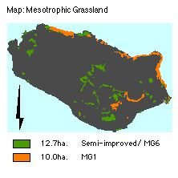

.. contents:: Table of Contents
   :depth: 1
.. sectnum::

Designation
===========

* Grade I SSSI, 
* Candidate SAC, UK BAP Key Habitat status (1995). 
* Identified in Annex 1 of the EC Habitats Directive as a priority habitat and will form part of the Natura 2000 Network.

Size: 

* 22.7 ha.

Description
===========
Mesotrophic grassland species prefer soils neither too basic nor too acidic. MG1 and MG6 are species rich semi-improved dry grasslands supporting flowering herbs, grasses and sedges and fungi. MG6 is relatively unmodified and occurs mainly on steep North-east facing slopes, and it is able to support a wide variety of fauna.

Current Condition and Status of Feature
=======================================

Mesotrophic grassland:

* Total Area: 22 .7 ha.
* Frequency of constant and frequent species: within LACs.
* Species indicative of change: within LAC

Current Status: 

* Favourable Maintained, as of December 2001. This assertion is based upon the 2000/2001 survey.

Attributes selected as performance indicators
=============================================
The Mesotrophic Grasslands and communities will be considered to be in favourable condition provided the following attributes are within LACs:

Extent
-----------------

All Mesotrophic Grasslands:

* Component plant communities are largely governed by edaphic and climatic conditions. These are relatively static factors and so no area limits need be set.

Quality/condition
-----------------

All sub-communities (NVC): These are likely to remain fairly consistent under continued grazing  pressures. Quality will be confirmed by presence of the range typical species within each sub-community type, which are: 

* MG1: Arrhenatherum elatius-Dactylis glomerat grassland, 10 ha.
* MG6	Lolium perenne-Cynosurus cristatus grassland, 13 ha
* A set of associated grasses and sedges as indicators of change:
* A set of associated vascular plants as indicators of change.

Attributes and Operational Limits
=================================

Objective statement(10):
------------------------
To maintain the Mesotrophic Grasslands in favourable condition, WHERE:

Extent
-----------------
All Mesotrophic Grasslands:

* Total area remains at the target level.
* Target level: 2.5 ha. of 323 ha
* Upper limit: None set
* Lower limit: target level.

Monitor/surveillance:

* Extent of Mesotrophic Grasslands

Condition
---------
All existing plant communities.

* Target: The following conditions are met in 95% 
    * Lower limit: 70%
    * Upper limit: none set.

MG1: Arrhenatherum elatius-Dactylis glomerat community
------------------------------------------------------
* Target level: None set
* Upper and lower limits: 	As stated in NVC floristic tables
* Monitor:	frequency of Arrhenatherum elatius-Dactylis glomerat.        
                                                                     

MG6	Lolium perenne-Cynosurus cristatus community
------------------------------------------------------
* Target level: No increase in extent of MG6 community.
* Upper and lower limits:   As stated in NVC floristic tables

Monitor:

* frequency of Lolium perenne-Cynosurus cristatus.
* A set of associated grasses and sedges as indicators of change:

     * Cocksfoot (Dactylis glomerata), Quaking grass (Briza media), Heath grass (Danthonia decumbens), Yellow oat-grass (Trisetum flavescens), Spring sedge (Carex caryophyllea)
     * Limits: non set.
     
* A set of associated vascular plants as indicators of change:

    * Cerastium fontanum (Common Mouse-Ear)and Bellis perennis (Daisy), Centaurea nigra,Plantago lanceolata (Ribwort Plantain),Hypochaeris radicata (Cat 's Ear),Rumex acetosa (Common Sorrel),and Rhinanthus minor (Yellow Rattle).Common spotted-orchid 	Dactylorhiza fuchsii
    * Limits: non set.                                                                                                                     

Management Rationale and Projects
=================================

All factors 1 to 9, their rationale and projects, of Management Rationale and Projects in the feature Calcicolous Grassland are relevant, and refer equally to Mesotrophic grassland; and Additionally,

Grazing
------------------
Continuously high levels of grazing can also prevent flowering herbs from setting seed. Absent grazing or infrequently grazed grassland is factor in the development of MG6. A increasing goat population grazing on these grasslands may pose a threat, whereas current declining sheep numbers remove a threat.

Current grazing levels will be allowed to continue and the effect upon sward height monitored throughout the year. MG1 grassland may benefit from mixed pony grazing restore improve structural and biodiversity. In the past some hay making may have maintained its nutrient-poor status. A trial restorative grazing, and trail hay-meadow programmes will be implemented. The more species-poor mesotrophic grasslands are particularly well developed in areas where visitor pressure is high in an area subject to soil compaction; trial resorative grazing will be implemented.

Operational limits: none set.

Monitoring and Projects:

* monitor grazing by feral goats
* monitor sward height each month.
* Identify species-poor areas of MG1
* Implement and monitor restoration trial in species-poor MG1 grassland with seasonal pony or cattle grazing; area = 2 ha.
* Implement and monitor restoration trial in species-poor MG1 grassland with seasonal mixed grazing; area = 2 ha.
* Implement a hay cutting area (2 ha) In MG1 grassland

Artificial fertilisers
---------------------------
Sedges, orchids and some fungi are poisoned by artificial fertilisers. Mesotrophic grassland supports Ballerina waxcap (Hygrocybe calyptriformis), of UK SAP L SAP designation.

Monitoring & Projects:

* Occurrence of Ballerina waxcap

Protected areas
---------------------------
The mesotrophic grasslands are valuable habitats for mammals and ground-nesting birds, eg. Skylark (Alauda arvensis),  and Brown hare *(Lepus europaeus)*, Lapwing (*Vanellus vanellus*) - all priority BAP/L BAP species.

Protected areas will deter disturbance, trampling of nests, and over -grazing.

Monitor/Surveillance Projects:

* Establish protected areas of fenced-off strips (post and rail) for ground-nesting birds, with limited seasonal grazing in suitable areas of MG1.
* Monitor effects of seasonal grazing
* Monitor sward height
* Monitor populations of nesting birds
* Monitor populations of brown hare

Management Options
==================

* A2		Limited intervention MG6
* A3		Active management to maintain MG1 mesotrophic grasslands, (grazing).
* B3		Enourage ground nesting birds and brown hare- PROTECTED STRIPS
* C		Research trials of hay-meadow, and restorative grazing, seaasonal grazing, MG1 sub-					community.
* E4 		Open access. Request walkers stay on paths.
* E2		Restricted Access, in protected strips, and restoration grazing trials.
