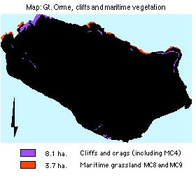

.. contents:: Table of Contents
   :depth: 1
.. sectnum::

Designation
=============
Heritage coast, Grade I SSSI, Candidate SAC. UKBAP priority habitat.

The Great Orme is a Regionally Important Geological Site (RIGS) and of national geological significance, included in the Geological Conservation Review (GCR).

Size:

* Heritage Coast,	  7 km
* Cliffs and crags   8.1 ha
* Shingle/boulders  4.2 ha.
* Scree:		  3.6 ha.
* Maritime grassland: 3.7 ha.

Description
===========
The Great Orme coastline is rugged and cliff-lined to the north characterised by a mosaic of vegetation habitats between the sea and cliff top in a transition from maritime communities and flushed grassland largely within the spray zone around the North and West shorelines, to terrestrial communities. A marine splash zone supports inter-tidal algae. Lichens cling to boulders laced with shingle, above high tide mark. Areas of scree are found.

The cliffs provide a suitable habitat for a variety of nesting birds and bird colonies and, rare vascular plants.
There are a number of caves, some inaccessible without ropes.

Current condition and status of feature
=======================================
The populations of the two breeding Auk species markedly declined in the past. This trend has shown signs of reversing, coincidental with climbing restrictions and a period without major oil pollution affecting the North Wales Coast. Recolonisation by Peregrines and by Choughs has met with varied success.

* Total Area maritime plant communities: 11.8 ha.
* Frequency of constant and frequent species: within LACs.
* Species indicative of change: within LAC
* There is an absence of visitor erosion
* There is an absence of pollution.
* There is an absence of disturbance
 

Current Status: 

* Favourable Maintained, as of April 2002. This assertion is based upon the 2000/2001 survey.

Attributes selected as performance indicators
=============================================
The limestone cliffs and maritime communities will be considered to be in favourable condition provided the following attributes are within LACs:

Extent
-----------------
Extent all maritime plant communities is likely to remain fairly consistent, being a self-perpetuating and largely governed by climatic conditions and gradual erosive processes, where existing grazing pressures remain constant.

Cliffs and slopes are neither threatened by development nor anthropogenic. Thus monitoring extent of cliffs or plant communities is not applicable.

Marine splash zone/inter-tidal algae and nesting bird populations may face problems with pollution or disturbances.

Quality
-------
Condition of the Maritime cliff communities and flushed grassland Sub-communities (NVC)

Quality will be confirmed by presence of the range typical species within each sub-community type, which are:

* MC4 Festuca rubra, Brassica oleracea, Dactylis glomerata, Daucus carota ssp.gummifer
* MC8	Festuca rubra- Armeria maritima grassland
* MC9 Festuca rubra- Holcus lanatus grassland

* Geology and geomorphology; absence of visitor erosion
* Supralittoral zone; absence of pollution.
* Sea bird colonies; absence of disturbance

Attributes and Operational Limits
=================================

Objective statement
-----------------------
To maintain the limestone cliffs and its communities of flora and fauna in a favourable condition, WHERE:

Extent
-----------------

Target 1
.................

Marine splash zone/intertidal algae remains unaffected by oil. This zone may be adversely affected by pollution such as oil, which must not be allowed to build up or remain because birds and invertebrates would be adversely affected.

* Limits: None set.

Monitor/surveillance:

* Extent of zone by aerial and fixed-point photography.

Target 2
.................

* Nesting bird populations remain at least at current levels.
* Limits: none set

Monitor/surveillance:

* The following birds are monitored, or have been noted in the recent past:
    * Guillemot, Razorbill, Kittiwake, Fulmar, Cormorant, Auks, Choughs, Peregrines.
* Birds are monitored according to nesting pairs, seasonally.
* The distribution of breeding pairs.
* The populations of breeding pairs.
* Sightings of visiting feeders.

Condition, All existing plant communities
=========================================

Target: The following conditions are met in 95% by extent:

* Lower limit: 70%
* Upper limit: none set.

MC4 Festuca rubra, Brassica oleracea, Dactylis glomerata, Daucus carota ssp.gummifer
-------------------------------------------------------------------------------------

* Extent=8.1 ha.
* Target level: None set
* Upper and lower limits: 	As stated in NVC floristic tables
* Monitor: frequency of *Festuca rubra, Brassica oleracea, Dactylis glomerata, Daucus carota ssp.gummifer*

MC8	Festuca rubra- Armeria maritima grassland and MC9 Festuca rubra- Holcus lanatus grassland
---------------------------------------------------------------------------------------------------

* Extent = 3.7 ha.
* Target level: None set
* Upper and lower limits: As stated in NVC floristic tables
* Monitor:	frequency of constant species,

    * Festuca rubra- Armeria maritima, Festuca rubra- Holcus lanatus, Plantago lanceolata, Armeria maritima.

A set of associated plants as indicators of changes
-------------------------------------------------------------------------------------
* Target level:	None set
* Upper limit:	None set
* Lower limits: 	Continued annual flowering.
* Monitor: Frequency of,

    * Brassica oleracea, Cotoneaster cambricus, silene vulgaris, Sedum maritimum, Silene nutans, Armeria maritima, Epipactis atrorubens, Helianthemum canum, Hypochoeris maculata.

Geology and geomorphology
--------------------------------------
There is an absence of visitor erosion

* Monitor: signs of erosion

Supralittoral zone
--------------------------------------
There is an absence of pollution.

* Monitor: for oil pollution

Sea bird colonies
--------------------------------------
There is an absence of disturbance

* Monitor: Populations, demographic factors, signs of disturbance.

Management Rationale and Projects
=================================

The plant communities are largely edaphic and soils are maintained in a state of immaturity by substrate instability thus, ungrazed, the plant communities are self-perpetuating, and bear no threat from succession. (*Brassica oleracea* may be associated with manurial enrichment by sea-birds roosting above). Little active management is needed but the management of generalist predators for sea birds and threats to natural functioning.

Grazing of maritime grassland
--------------------------------------
Maritime grasslands lies ungrazed on steep to moderate slopes, generally up to 50 m above sea level. Feral goats have greater access to these than sheep, and their increasing numbers may pose a threat to the maritime grasslands.

Monitoring:

* Monitor diet of goats by faecal analysis.
* Monitor grazing habits of goats, on rounds.

Non-native Invasive shrubs
--------------------------------------
 Cotoneaster integrifolius and Centranthus ruber have become locally dominant in places. Their spread will be controlled. Uprooting invasives may destabilise fragile soil deposits, so we will cut stems in preference.

Operational limit:

- Target : elimination of invasives
- Upper limit: As present
- Lower limit: Target level.
- Monitoring & Projects:

  - Monitor distribution of invasives.
  - Eradicate invasives by containment of dispersal and cutting stems, but not uprooting.

Breeding Success of Sea cliff birds
--------------------------------------
 Visitor disturbance and predators can have severe impacts on breeding success, or expansion of colonial nesting bird populations, which are predated upon by badgers, fox, grey squirrel, oyster catcher, kestrel, brown rats, cats, feral cats, ferret and mink. Their presence will be monitored and if necessary controlled.
 In order to minimise disturbance, controls must take place while birds and food are scarce; ie. winter. Rock climbing is controlled by British Mountaineering Council (BMC) voluntary restrictions; so disturbance should be minimal now. Walkers' access to colonies is restricted by the cliffs.

Monitoring & Projects:

* Monitor predator populations.
* Control predator populations if necessary.
* Climbing activities

Fishing
--------------------------------------
The abundance of food has an impact on breeding performance of all birds.

Discarded waste from commercial fisheries may be linked to population increases in some sea bird species. However, fishing for sandeels can have a negative impact on food availability, and entanglement with fishing equipment causes drowning. These threats can be curtailed by spreading awareness, especially amongst fishermen and future fishermen.

Projects:

* Liaise with local fishermen

Pollution
--------------------------------------
Contaminants from illegal oil discharges, and other toxic chemicals, can reduce condition and survival of birds and intertidal species. Plans have been floated to contain future spillages at sea, and bring them to shore, at the foot of the Gt. Orme. These methods will be resisted, and better alternatives sought.

Projects:

* Liaise with Coastal Services

Egg collecting and hunting
--------------------------------------
Are controlled through legislation.

Monitoring & Projects:

* Monitor activity on cliffs by inspection on rounds.
* Enforce prohibition by prosecution.

Recreational pressure
--------------------------------------
The cliffs, which are dangerous to visitors, are not under great pressure from passive activities. Climbing may cause degradation of any fragile plant communities and disturb cliff-nesting birds. Rock climbing in sensitive areas is limited by agreement and will be monitored. Scuba diving for food or sea urchins has an effect on the food resources of sea birds, and so local scuba clubs will be informed.

Monitoring and Projects:

* Monitor climbing activities by inspection on rounds.
* Monitor climbing erosion
* Liaise with local scuba diving clubs
* Path Erosion

Geology, geomorphology/coastal processes and fossils
----------------------------------------------------
Whilst the southern part of Wales is sinking as a result of isostatic factors resulting from the end of the last glaciation, the north is static. Erosive reformation is probably not taking place through slippage. The exposed hard limestone is irreplaceable and internationally rare. Geological forms are susceptible to erosion or damage by specimen collecting. Fossil collection is illegal, according to Bylaw. The removal of geological specimens (including fossils) is a Potentially Damaging Operation (SSSI) and may result in a reduction in the value of the quarries as an educational asset.

Monitoring and Projects:

* Prepare leaflet for visiting geological societies/groups, outlining bylaws and responsibilities.
* Enforce prohibition

Management Options
==================
* A2 		Passive management of the Limestone Sea cliffs and maritime communities.
* E4: 		Open access. Request walkers stay on paths.
* MS00/01	Manage species, invasives- Control Exotic Cotoneaster/Red Valerian.

